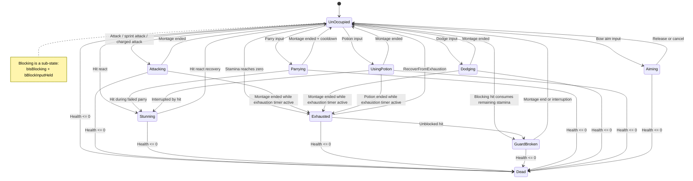
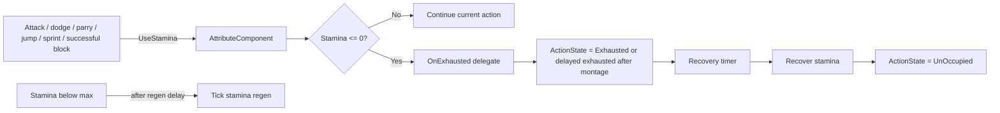
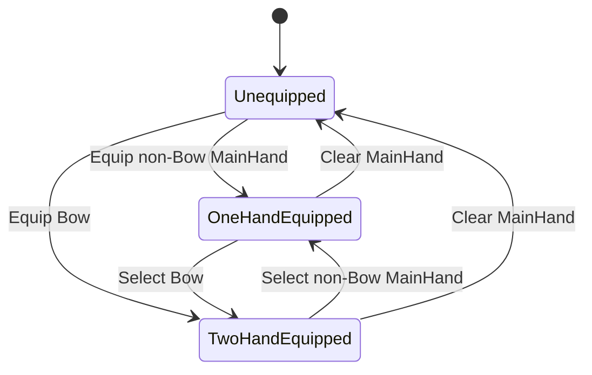
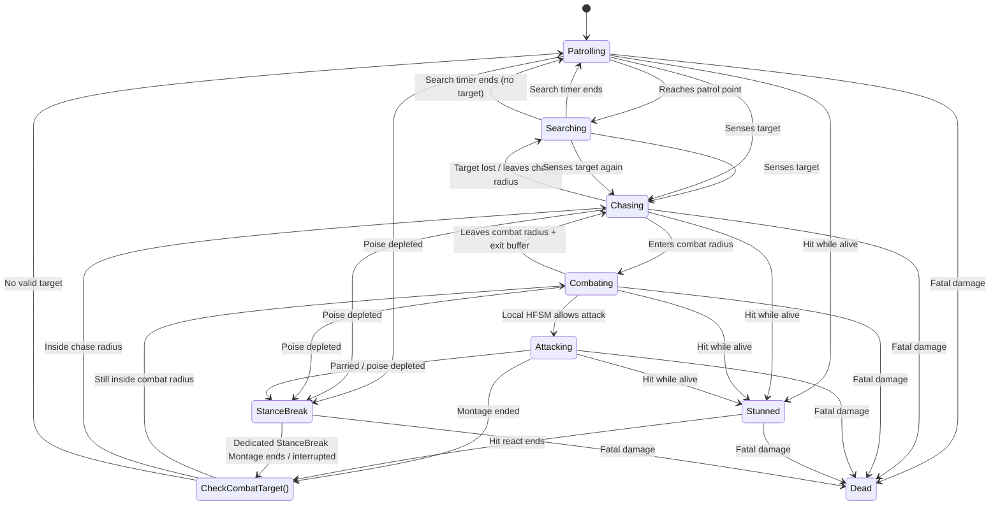
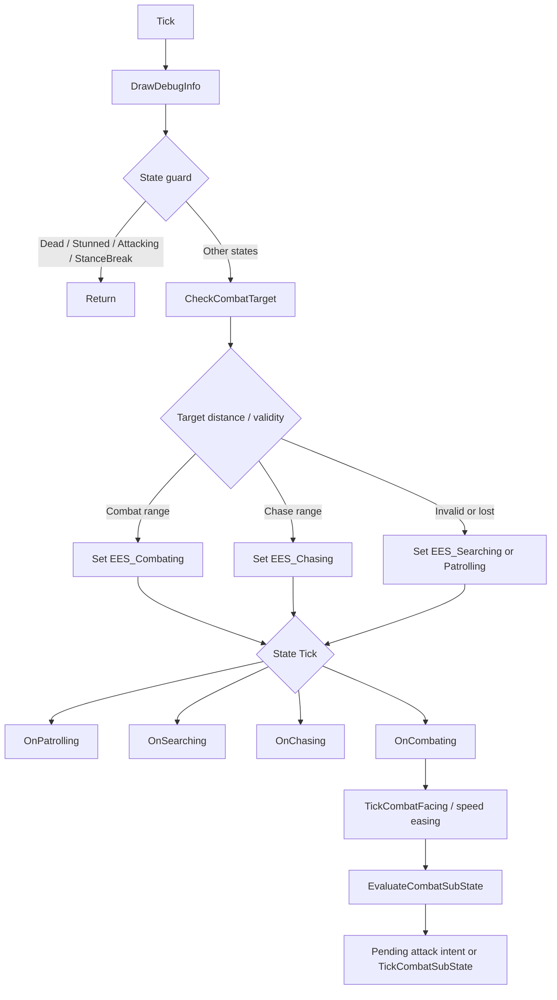
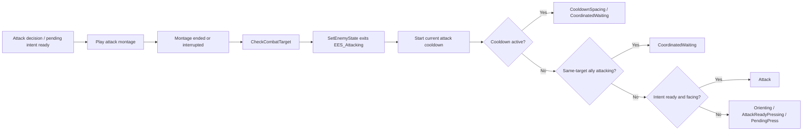
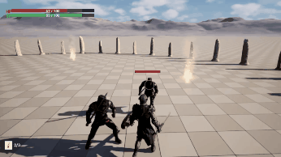
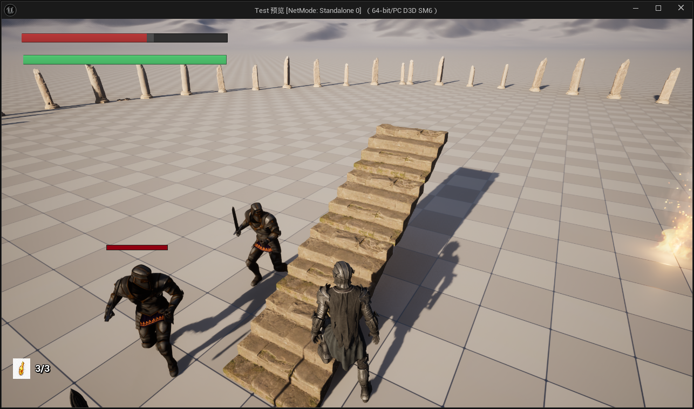
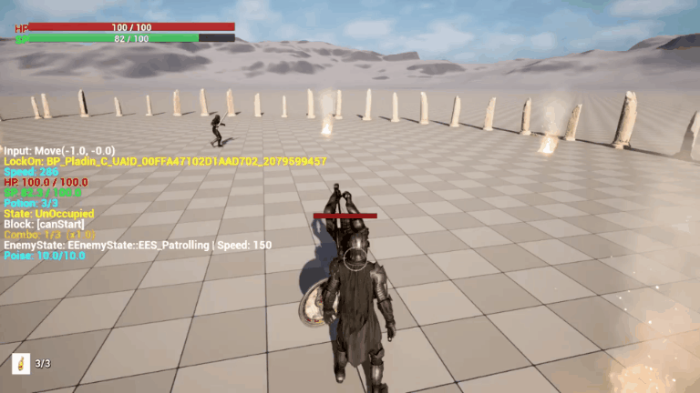

# ARCHITECTURE.md

**Shared architectural knowledge for all AI agents (Codex, Claude, Gemini) working in this repository.**

This file is the single source of truth for:
- State machine enums and transitions
- Class hierarchy and inheritance
- Combat pipeline and system interactions
- Key gameplay system boundaries

For agent-specific collaboration rules, see:
- `AGENTS.md` — Codex and general agent guidelines
- `CLAUDE.md` — Claude Code specific rules
- `GEMINI.md` — Gemini specific rules (if exists)

This file stores stable project architecture only. Agent workflow and documentation update rules belong in `AGENTS.md` / `CLAUDE.md` / `GEMINI.md`.

Stable HTML anchors are used by `README.md` deep links. When renaming or moving major sections, preserve existing anchors or update the README links in the same change.

Language policy: keep stable section titles and HTML anchors in English; use Chinese for detailed explanations unless the content is primarily code/API terminology; keep C++ symbols, Unreal types, asset class names, enum values, function names, and config fields in English exactly as they appear in source; bilingual headings are allowed for major gameplay systems; do not split English/Chinese architecture files until the architecture stabilizes or the project is prepared for external presentation.

---

<a name="project-overview"></a>
## Project Overview

- **Unreal Engine 5.7** project, **Windows only**, **Visual Studio 2022** required
- Runtime module: `Test`
- Local editor plugins in this checkout: `SmartBPCreator`, `UnrealBridge`
- Targets: `TestEditor` (Editor), `SoulslikeCombat` (Game)
- Build.cs dependencies: `Core`, `CoreUObject`, `Engine`, `InputCore`, `EnhancedInput`, `AnimGraphRuntime`, `Niagara`, `GeometryCollectionEngine`, `PCG`, `UMG`, `AIModule`, `NavigationSystem`, `Slate`, `SlateCore`, `MotionWarping`

<a name="game-flow-foundation"></a>
## Game Flow Foundation

- `UTestSaveGame` owns durable single-slot data. Save v2 separates a valid writable record (`IsPersistable()`) from a usable respawn anchor (`HasRespawnAnchor()`): the latter additionally requires a non-empty `LastCheckpointId` contained in `ActivatedCheckpointIds`.
- `USoulslikeGameInstance` owns slot I/O and carries the target gameplay map plus pending checkpoint ID across level transitions. `StartNewGame()` writes a candidate v2 record before replacing the current in-memory session and restores the previous session/map context when the write fails; callers must handle its `false` result rather than leave a menu transition in progress.
- `ATestGameMode` owns player spawn selection, checkpoint resource recovery and same-map reload. Pawn-dependent initialization happens only after `RestartPlayer()` completes, not in `HandleStartingNewPlayer`, because the latter can run before the Pawn exists.
- `ACheckpointActor` is a map-authored interaction and respawn anchor. First valid `E` use writes/activates the anchor and immediately rests; later valid `E` use asks the Controller to open the bonfire service menu. Its `PersistentId` is a stable level-authoring ID, never an actor name, pointer or runtime GUID. A checkpoint that can be used as an initial or reload spawn must be unique within its map and be marked `Is Spatially Loaded = false` in a World Partition map, so GameMode can resolve it before a player-created streaming source exists.
- `TestMap` uses `StartBonfireCheckpoint` with `PersistentId = StartBonfire`. A `New Game` begins at the map's `PlayerStart` with `LastCheckpointId = None` and no activated checkpoint, so `Continue` is disabled and pre-bonfire death reloads at `PlayerStart`; Gold and owned fixed items still restore from the writable progress record. After the first rest, death and `Continue` use the saved checkpoint. The visual `BP_MediumFire` remains presentation only; it does not participate in save, interaction or spawn selection.
- `WBP_BonfireMenu` derives from `UBonfireMenuWidget` and currently exposes only Rest and Leave. It uses `UIOnly` input without pausing the world; `AMyCharacter` owns the temporary service protection that rejects damage, hit reactions and world interaction until the menu or map transition closes.
- A real Rest routes `ATestGameMode -> AMyCharacter -> UItemOwnershipComponent -> USoulslikeGameInstance::ActivateCheckpointAndRefillAmmo()`. The one durable transaction can update the checkpoint and transfer validated reserve ammo into loaded containers before map reload; death, Continue, menu Leave, equipment switching, and ordinary map restoration only restore saved quantities and never refill them.

<a name="current-player-asset-topology"></a>
## Current Player Asset Topology

- `BP_DarkKnight` is the current playable-character Blueprint and derives from `AMyCharacter`. It owns the current character-specific visual and authored configuration; `AMyCharacter` owns reusable player gameplay behavior, including attributes, action state, lock-on, combat entry points, and `UItemOwnershipComponent`.
- `BP_Weapon` is the current DarkKnight sword world-pickup and runtime weapon Blueprint. It derives from `AWeapon` and uses `SM_DKM_Sword` from the Dark Knight asset set.
- `BP_Weapon_Paladin` is a separate `BP_Weapon` child used for an alternate Medieval Sword presentation (`SM_Sword_08`). It is not the current DarkKnight sword and must not be selected as that item's `RuntimeItemActorClass` merely because it is another `AWeapon`-derived Blueprint.
- `BP_Shield` is the current DarkKnight shield world-pickup and runtime shield Blueprint.
- The two fixed `TestMap` pickup instances use author-authored stable pairs: sword `TestMap_DarkKnightSwordPickup -> Item_DarkKnightSword`, shield `TestMap_DarkKnightShieldPickup -> Item_DarkKnightShield`. These are instance properties, not Actor names, labels, pointers, runtime GUIDs, or External Actor package paths.
- Durable item identity is independent of its presentation class: a `DefinitionId` records what the player owns, while a definition's `RuntimeItemActorClass` chooses the actor created by the later equipment-materialization stage. Do not derive a `DefinitionId` from an Actor name, mesh origin, or temporary presentation Blueprint.

<a name="item-ownership-persistence"></a>
## Item Ownership And Persistence

- `UItemDefinitionDataAsset` is the static item contract: a stable author-authored `DefinitionId`, display text, `EItemEquipmentSlot`, runtime `RuntimeItemActorClass`, optional definition-owned `PickupSound`, and optional ammo-container configuration. Equippable MainHand definitions must resolve to `AWeapon`; OffHand definitions must resolve to `AShield`. A definition that uses an ammo container must be `None` slot and author positive loaded-capacity and reserve-stack-limit values. `PickupSound` is for a successful world collection only; `AWeapon` / `AShield` retain their actor-owned `EquipSound` for an active bonfire loadout change.
- `BP_DarkKnight` owns the active player catalog through `UItemOwnershipComponent.DefinitionCatalog`. The current authored definitions are `DA_Item_DarkKnightSword` (`Item_DarkKnightSword`, MainHand, `BP_Weapon`), `DA_Item_DarkKnightShield` (`Item_DarkKnightShield`, OffHand, `BP_Shield`), `DA_Item_DarkKnightBow` (`Item_DarkKnightBow`, MainHand, `BP_DarkKnightBow : ABow`), and `DA_Item_DarkKnightArrow` (`Item_DarkKnightArrow`, `None`, no runtime Actor, loaded capacity `20`, reserve-stack limit `99`). The Bow Definition must resolve `RuntimeItemActorClass` to `ABow`; otherwise it is not a valid MainHand definition and is rejected before it can enter the catalog or be materialized. The catalog rejects invalid or duplicate `DefinitionId` values locally before a Pawn accepts saved records.
- `FTestItemInstanceRecord` is an owned runtime instance record: its `InstanceId` is a generated stable save identity, separate from `DefinitionId`, world Actor names, pointers, Actor GUIDs, and presentation classes. For an ammo definition, its `Quantity` is reserve quantity and each reserve stack retains that stable identity. `FTestAmmoContainerRecord` persistently stores loaded quantity per ammo Definition; `FTestEquipmentSlotRecord` maps the semantic MainHand/OffHand slot to an owned instance ID. All three arrays live durably in `UTestSaveGame`.
- `UItemOwnershipComponent` is the spawned Pawn's validated cache. It restores only records whose definition, instance ID, quantity, upgrade level, loaded-container type/capacity, and slot compatibility are valid; malformed, duplicate, unknown, or incompatible records emit warnings and are ignored for that Pawn without rewriting the original save. It keeps source-index and expected-quantity snapshots private for a single GameInstance transaction, so a malformed raw record cannot be selected merely because it shares a Definition or ID. It exposes reserve, loaded, total, and capacity queries plus presentation-only owned/loaded quantity delegates; no delegate exposes mutable SaveGame state.
- `USoulslikeGameInstance` is the only authority that mutates durable item arrays. `AddOwnedItemInstance()`, `ConsumeOwnedItemQuantity()`, `GrantAmmoReserve()`, `ConsumeLoadedAmmo()`, `SetEquippedItemSlot()`, the checkpoint-refill transaction, and fixed-world item/ammo claims write through `SaveNow()`. A checkpoint refill snapshots and rolls back `MapName`, `LastCheckpointId`, `ActivatedCheckpointIds`, `ItemInstances`, and `LoadedAmmoContainers` together; it prepares no gameplay transition until that write succeeds. Fixed weapon/shield claims snapshot `ItemInstances`, `ClaimedRewardIds`, and `EquippedSlots`; an ammo-bundle claim snapshots its Reserve stack mutation and `ClaimedRewardIds` in the same write, then rolls both back on failure. Development failure injection is separately scoped to fixed claims, loaded-ammo consumption, or a rest that actually transfers ammo. Components never access mutable `CurrentSaveGame` state directly, then update their local cache only after GameInstance success.
- `Aitem` owns presentation-side fixed-world-pickup validation and the final success feedback. `AWeapon`, `AShield`, and narrow `AAmmoPickup` opt into the persistent-claim path: each requires a non-empty, map-unique `PersistentId` and `ItemDefinitionId`; `AAmmoPickup` additionally accepts only an ammo-container Definition with a positive `PickupQuantity`. On map load a claimed reward destroys its world Actor. Any transient player or enemy equipment must set its Owner, and where applicable its Instigator, in `FActorSpawnParameters` before `BeginPlay`; that deliberately bypasses fixed-world-pickup validation. On `E`, successful GameInstance persistence precedes pickup sound playback, collision cleanup and Actor destruction. Invalid, duplicate, unknown, failed writes, or failed required candidate materialization leave the Actor visible and interactable with a warning. `ATreasure` remains a separate overlap-driven Gold pickup.
- `ATestGameMode::RestorePlayerFromSave()` restores resources and Gold first, then asks `AMyCharacter` to rebuild its item-ownership cache. This makes rest reload, death reload, and `Continue` independent of a previous Pawn instance.
- `TODO-03A` established data-only ownership, `TODO-03B-A` converts the two fixed world pickups into owned records, `TODO-03B-B1` establishes the activation/rest/menu boundary, and `TODO-03B-B2` completes the fire-only loadout loop: `UItemOwnershipComponent` exposes compatible owned instances by semantic slot, `UBonfireMenuWidget` maps UI labels back to stable `InstanceId` values, and `ACharacterController` only coordinates the request. `TODO-03B-C2` adds the narrow first-equip exception: a fixed pickup may fill only an empty compatible persistent slot.
- `AMyCharacter` owns transient visual/combat materialization, not durable item data. For a bonfire selection it validates an owned instance, spawns and silently attaches a hidden candidate, commits the equipment-slot transaction through `UItemOwnershipComponent` and `USoulslikeGameInstance`, then replaces the old visible Actor only after persistence succeeds. For an empty-slot fixed world pickup it prepares the same Definition-based candidate before the three-array claim transaction; a candidate, class, socket, attach, or save failure aborts the full pickup. An occupied slot produces no candidate and never replaces the current visible equipment. Restored loadouts and automatic first-equips are silent; only active fire-menu changes play the existing actor-owned equip sound. Empty-slot selection writes first, then destroys the matching transient Actor. `EndPlay` destroys both materialized slots.
- The B-B `TestMap` fixtures are `TestMap_DarkKnightBowPickup -> Item_DarkKnightBow` and `TestMap_DarkKnightArrowBundlePickup -> Item_DarkKnightArrow x20`. Bow follows the existing candidate-first fixed-item path and may auto-equip only into an empty MainHand; the arrow bundle only grants Reserve. A real Rest is still the sole Reserve-to-Loaded transfer, so a newly claimed `20`-arrow bundle displays `0 / 20` until Rest fills the loaded container.
- `ItemDebugGrant`, `ItemDebugEquip`, `ItemDebugGrantQuantity`, and `ItemDebugDump` are non-Shipping console validation commands. Ammo quantity grants add reserve only; the Dump reports both runtime and saved loaded-container data. `BowDebugFailNextProjectilePrepare`, `BowDebugFailNextAmmoConsumeSave`, `BowDebugFailNextAmmoRefillSave`, and `ItemDebugVerifyAmmoRefillFixture` are scoped development evidence hooks, not player-facing inventory UI.

<a name="player-bow-core"></a>
## Player Bow Core

- `AWeapon -> ABowBase (abstract) -> ABow` is the Bow class hierarchy. `ABowBase` owns only the shared physical Bow identity and its default left-hand attachment; `ABow` remains the player MainHand ranged-delivery configuration owner for the arrow Definition ID, projectile class and immutable delivery defaults, authored projectile spawn point, aim movement multiplier, optional `AimRaiseMontage`, required `DrawMontage` / `ReleaseMontage` / `LoadMontage`, and the loaded-arrow presentation components. `BP_ErikaBow` derives from `ABowBase` for enemy visual identity, while enemy attack selection, LOS and Projectile release remain owned by the Enemy DataAsset/HFSM path. `AimMoveSpeedMultiplier` is relative to `AMyCharacter::WalkSpeed` and defaults to `1.0`, so default bow aim uses the same base speed as player walking. `ABow` does not own inventory state, firing input, SaveGame writes, HUD, or world pickups.
- `AWeapon::DefaultEquipSocketName` is the single runtime MainHand attachment contract for players and enemies. Ordinary weapons default to `RightHandSocket`; `ABowBase` changes that CDO default to `LeftHandSocket`. The property rename from `PlayerEquipSocketName` is preserved through a Core Redirect. `AMyCharacter` MainHand materialization and `AEnemy::WeaponInit()` both read the weapon default directly; no `AEnemy` character-level Socket override or second resolution path exists. A missing Socket or attachment failure rejects the candidate before a player equipment-slot write, or destroys the enemy candidate without retaining an invalid `EquippedWeapon`. DarkKnight authors that existing `LeftHandSocket` as the common left-palm weapon grip; `LeftHandShieldSocket` is its dedicated `hand_l` shield-back socket, and `AShield` / `BP_Shield` use it through the separate OffHand contract. `AShield` cannot enter `AEnemy::WeaponClass`.
- Bow remains a durable MainHand selection only. While a live `ABow` is the current MainHand, `AMyCharacter` suppresses only the transient `EquippedShield` Actor; the selected OffHand shield `InstanceId` remains durable. Selecting a non-Bow MainHand or clearing Bow restores that selected shield through normal materialization.
- `EWS_TwoHandEquipped` is passive animation input only. Gameplay legality is based on a live `ABow`: entering Bow occupancy clears held Block, active Block, Parry state and its timer; block resolution, Parry entry and late Parry Notify activation each reject Bow independently.
- `AMyCharacter::TryStartAction()` remains the sole player-action arbiter. When a live MainHand `ABow` is present, right-click maps to `EAS_Aiming` / `RangedAim`; left-click press starts a Bow charge and left-click release can enter `RangedRelease` only after the required Draw Montage has ended naturally. Normal sword attack, charged attack, and shield block gates remain unavailable while that bow is equipped. `RangedAim` reuses the Block priority and `RangedRelease` reuses the Attack priority, so there is no independent ranged-priority source to tune.
- Aiming uses `WalkSpeed * ABow::AimMoveSpeedMultiplier` as its base speed, then retains the existing lock-on forward/strafe/back directional multiplier. It neither re-enables sprint nor enters the sprint-stamina debit path. Normal right-button release exits aiming and cancels a pending draw. Focus-loss cancellation, death, bonfire protection, main-hand replacement, map teardown, a dodge/parry interruption, and receiving a hit all clear the pending draw; forced interruptions also clear the held right-button intent, so recovery cannot silently re-enter aim until the player releases and presses right-click again.
- `BP_DarkKnightBow` is the player presentation child of `ABow`: it authors the shared physical Bow Mesh, `LoadedArrowAnchor`, collision-free `LoadedArrowVisual`, `ProjectileSpawnPoint`, AimRaise/Draw/Release/Load Montages and shot/empty audio. `LoadedArrowVisual` is only an Aim-ready fallback: it exists while the player has valid Loaded ammo, no prepared candidate is nocked and no Release/Load presentation is active. `USlashAnimInstance::bIsBowAiming` reads only `AMyCharacter::IsBowAiming()`; the authored non-Aim and Aim Bow locomotion BlendSpaces are therefore presentation consumers, not a second action-state source.
- Successful `EAS_Aiming` has facing priority: `AMyCharacter` caches the pre-Aim movement rotation mode, disables movement-facing and enables controller-yaw facing so the body follows the reticle. A locked Aim keeps the lock target, marker, validity checks, death retargeting and screen-side switching, but suspends only Lock-On's ControlRotation and ActorFacing writes; mouse Look remains free. Aim and Lock-On use separate caches, so entering or clearing Lock-On during Aim cannot restore the temporary Aim rotation mode as the player's normal state. Aim entry also stops a stale failed-lock camera recenter, and normal Aim cancellation restores the retained Lock-On mode before its existing smooth target recenter resumes.
- Bow Aim owns one absolute right-shoulder SpringArm target and its existing `VInterpTo` / `FInterpTo` interpolation. It never adds to a Lock-On offset, so a locked Aim cannot double-shift the camera; cancellation interpolates back to the retained Lock-On target or normal free-camera target. `USlashAnimInstance` exposes read-only `bIsBowAiming`, local `BowAimYaw` and `BowAimPitch`; the authored DarkKnight Aim Offset layers the upper body over Bow Aim locomotion and remains a presentation consumer of those native values.
- `UPlayerHUDWidget` owns presentation-only `Loaded / Capacity`, a viewport-centered hollow-cross reticle, the Bow-charge reticle scalar, and a short confirmed-hit marker. `AMyCharacter` pushes the effective `IsBowAiming()`, arrow quantity and charge scalar after relevant lifecycle changes; only the resolved result of a player arrow may request the marker. The HUD does not infer or mutate aim state, projectile trajectory, target selection, ammo, damage, input, or SaveGame state.
- LMB press first validates the equipped Bow, Loaded ammo, physical Release/Load gate, Socket, AnimInstance and Draw Montage, then creates exactly one collision-disabled prepared `ACombatProjectile` and lets `ABow` Snap its native collision root to `BowArrowSocket`. That Actor owns the nocked-arrow visual while attached; the static `LoadedArrowVisual` hides. `DrawMontage` natural end is the only full-draw condition. Early LMB release, missing Draw/Release/Load configuration, prepare failure, Socket failure, hit, Guard Break, death, equipment replacement and teardown all destroy the uncommitted candidate, restore the valid Aim-ready visual and never consume Loaded ammo.
- Full-draw LMB release resolves the current `ECC_Visibility` camera aim point, refreshes that prepared Actor's launch context, then must start `ReleaseMontage` before `UItemOwnershipComponent` asks `USoulslikeGameInstance` to consume one loaded arrow. Only a successful consume detaches that same Actor, places it at `BP_DarkKnightBow.ProjectileSpawnPoint`, calls `CommitPreparedLaunch()` and plays the shot sound. A durable consume failure destroys the candidate, stops only the active Release Montage with the short blend-out, restores the nocked-arrow visual and preserves `EAS_Aiming`.
- The actual `ReleaseMontage` and, after a successful shot while RMB remains held, `LoadMontage` are the sole re-fire gate: either Montage's physical playback or cancellation blend-out reported by `Montage_IsPlaying()` blocks a new candidate. Natural Load completion returns Bow presentation to Aim but does not create a projectile or consume ammo. There is no numeric `ShotCooldown`, field reload, backpack UI, AnimNotify-driven fire timing, or second gameplay firing route. Reserve remains in `FTestItemInstanceRecord.Quantity`; only a real bonfire Rest transfers reserve into `FTestAmmoContainerRecord` up to the authored capacity.
- `ItemDebugGrantQuantity <DefinitionId> <Quantity>` grants reserve arrows only. `BowDebugFailNextProjectilePrepare`, `BowDebugFailNextAmmoConsumeSave`, `BowDebugFailNextAmmoRefillSave`, and `ItemDebugVerifyAmmoRefillFixture <DefinitionId>` are non-Shipping validation-only commands for the prepared-candidate, loaded-consume, rest-refill, and malformed-raw-record boundaries.
- `TODO-04B-B` completed the visible player Bow Mesh, player arrow visual, proper Bow locomotion BlendSpaces and Draw/AimHold/Release authoring. Persistent locomotion remains AnimBP-owned; the Release Montage is only the required one-shot firing gate, not a substitute for AimHold or locomotion.
- `TODO-04B-C0` upgrades only the player Bow render layer. `ABow` retains inherited static `Mesh` as the non-rendering attachment, BoxTrace and compatibility anchor, while its collision-free `BowSkeletalVisual` child renders `SK_Bow`. `SK_Bow` owns the Mesh-only `BowArrowSocket` on `Bow_Arrow_Slot`; `LoadedArrowAnchor` attaches to that Socket, and the collision-free `LoadedArrowVisual` plus authored `ProjectileSpawnPoint` remain Anchor children. String deformation, nocked-arrow placement and launch origin therefore share the Bow Skeleton without moving projectile collision, movement, damage or launch authority into the visual layer.
- `EBowPresentationState` (`Relaxed`, `Aiming`, `Charging`, `Releasing`, `Loading`) is transient Bow-owned presentation state, not an `EActionState` or a SaveGame value. `AMyCharacter` writes it only after existing Aim/Draw/Release/Load presentation gates succeed, restores it after abort/end, and sets `Relaxed` before unified cancellation stops Montages. `UBowAnimInstance` reads only its owning `ABow`; `ABP_DarkKnightBow` consumes that value for its `Relaxed -> Aim -> Pull -> FullDrawHold -> Release -> Loading -> Aim` state machine. Neither the Bow AnimBP nor an AnimNotify can consume ammo, spawn/commit a projectile, change input or recover player gameplay state.
- `BP_DarkKnightBow` and `ABP_DarkKnightBow` live under `/Game/_GAME/BP/Items/Weapons/Bow/`. `DA_Item_DarkKnightBow` and the placed TestMap Bow Pickup directly reference that runtime Blueprint after Redirector fix-up. The root `ABP_DarkKnight` keeps the full-body `DefaultSlot` after its layered pose and before the Parry layer, so Dodge and player Bow one-shot Montages have a real consumer without becoming locomotion or action-state owners.

<a name="encounter-system"></a>
## Encounter System

- `AEncounterController` 是当前地图内一场封闭遭遇的原生摆放 Owner。它拥有 `EncounterId`、预放置 `AEnemy` 参与者、激活条件、`Idle -> Active -> Cleared` 生命周期、运行时边界碰撞/视觉段和参与者死亡订阅；它不拥有波次定义或生成、奖励/掉落、SaveGame 读写、可互动门或地图重载。
- Controller 在领取参与者前验证配置。空或同地图重复的 `EncounterId`、无效参与者列表、无效边界参数或不可用的 Spline 安全区域都会输出 warning，保持边界开放，并保留所有敌人的普通 AI 行为。
- `Idle` 领取有效预放置参与者并使其进入遭遇待命。有效玩家必须先被观察到离开安全内区，再走入该内区才可激活，因此 PIE 出生在安全内区不会立即封锁场地。`Active` 先通过既有本地 HFSM 激活所有参与者，再关闭边界；最后一名已登记的 Active 参与者死亡后只会一次性进入 `Cleared`，打开边界并释放所有权。
- `Rectangle`、`Radial` 和 `Spline` 都是 Controller 内部的边界作者模式。Rectangle 与 Radial 使用各自配置的内部尺寸；Spline 是可编辑、平面、Linear、无自交的简单闭环。所有模式都要求玩家胶囊中心位于作者区域内，且到每一面未来墙体的距离大于 `PlayerCapsuleRadius + SealClearance`，避免边界在玩家贴边时穿过角色封锁。
- 每条作者边界都会生成一对运行时段：`UBoxComponent` 只在 `Active` 时阻挡 `Pawn`，无碰撞 Engine Cube 视觉段与其保持同一变换。`Idle`、`Cleared`、无效配置和 `EndPlay` 时视觉隐藏且碰撞为 `NoCollision`。`M_EncounterBoundary` 是当前灰白雾幕材质原型，不是最终 Boss 雾墙美术、开关动画、音频或 Niagara 行为。
- `AEnemy::ClaimEncounterOwner()` / `ReleaseEncounterOwner()` 防止同一参与者被多个 Controller 管理。`SetEncounterDormant()` 是遭遇层的状态屏障，不是第二套 AI：它停止移动、Montage/Timer 驱动的后续路径、战斗瞬态和陈旧导航路径。`ActivateForEncounter()` 以触发玩家为目标恢复既有 `EES_Chasing -> EES_Combating` 路径。`Die()` 只广播一次原生死亡通知；Controller 只在 `Active` 消费该通知，并在 `EndPlay` 解除回调和所有权。
- `AEncounterSpawnPoint` 当前只提供作者填写的 `SpawnPointId`、编辑器 Arrow 和 `GetSpawnTransform()`。在后续波次阶段前，它不包含波次成员、敌人类、Controller 引用或生成逻辑。
- `EncounterId` 是作者填写的 `FName` 持久化契约，绝不能使用 Actor object name/label、指针、运行时 GUID 或 External Actor package path。Controller 目前不会读写 `UTestSaveGame::ClearedEncounterIds` 或调用 `USoulslikeGameInstance::MarkEncounterCleared()`。该存档集合目前是全局集合，因此当持久化真正接入时，首个 Demo 要采用全局命名空间 ID，例如 `TestMap_CryptEliteEncounter`；多地图迁移决策记录在 `ROADMAP.md`。

<a name="state-machine-system"></a>
## State Machine System (`CharacterTypes.h`)

Core character/combat state-machine enums and small shared combat-flow enums are defined as `UENUM` enums in `CharacterTypes.h`. This is the single source of truth for player, weapon, enemy outer state flow, and shared character combat helpers. System-local enums such as `EItemState` (`Items/item.h`) and `ESpecialAttackType` (`AttackConfigDataAsset.h`) stay near their owning systems.

| Enum | States | Used By |
|------|--------|---------|
| `EWeaponState` | `EWS_Unequipped`, `EWS_OneHandEquipped`, `EWS_TwoHandEquipped` | `AMyCharacter`, `USlashAnimInstance` |
| `EActionState` | `EAS_UnOccupied`, `EAS_Attacking`, `EAS_Stunning`, `EAS_Exhausted`, `EAS_Parrying`, `EAS_Dodging`, `EAS_UsingPotion`, `EAS_Dead`, `EAS_Aiming`, `EAS_GuardBroken` | `AMyCharacter` |
| `EComboPlaybackMode` | `NewPlayback`, `Continuation` | `AMyCharacter` light combo playback helper |
| `EPlayerActionType` | `None`, `Attack`, `Dodge`, `Block`, `Parry`, `Potion`, `HitReact`, `Death`, `RangedAim`, `RangedRelease` | `AMyCharacter::TryStartAction` player action entry plus priority/cancel windows |
| `EEnemyState` | `EES_UnOccupied`, `EES_Patrolling`, `EES_Searching`, `EES_Chasing`, `EES_Attacking`, `EES_Combating`, `EES_Stunned`, `EES_StanceBreak`, `EES_Dead` | `AEnemy` |

**State transition pattern**: Mixed C++ + AnimNotify driven. Entry states are set directly in C++ (`Attack()`, `GetHit_Implementation()`, `Die()`). Recovery transitions use `FOnMontageEnded` delegates with state guards as the primary path. `UAnimNotify_CharacterHitReactEnd` is the deliberate exception for ordinary player `EAS_Stunning`, so designers can tune HitReact duration in the animation editor. `EAS_GuardBroken` does not reuse that Notify: its dedicated Montage End Delegate must also handle interruption, clear the exhaustion gate, and restore at least one stamina. Enemy ordinary `EES_Stunned` retains its existing delegate + `UAnimNotify_EnemyHitReactEnd` state-guarded coverage; enemy `EES_StanceBreak` is separate and recovers only through its dedicated Montage End Delegate. Because `EActionState` is serialized by existing Blueprint and AnimNotify assets, new values must be appended rather than inserted so historical enum values remain stable.

<a name="player-state-machine-flow"></a>
## Player State Machine Flow

### Action States (`EActionState`)

| State | Meaning |
|------|---------|
| `EAS_UnOccupied` | Normal state. Movement, attack, jump, sprint, block, parry, dodge, and potion entry are handled through guards. Blocking is a sub-state via `bIsBlocking`. |
| `EAS_Attacking` | Attack montage is playing. Used by normal combo, sprint attack, and charged attack. |
| `EAS_Stunning` | Player hit react / short stun. |
| `EAS_Exhausted` | Stamina exhausted. Normal movement still uses `RunSpeed`, but sprint, jump, attack, dodge, block, parry, and bow aiming cannot start until the guarded `3 s` recovery completes. |
| `EAS_GuardBroken` | Dedicated player guard-break stun. It shares HitReact input-lock semantics but has its own Montage End Delegate, exhaustion cleanup, and minimum-stamina recovery; repeated nonlethal hits cannot replace or extend it. |
| `EAS_Parrying` | Parry montage is playing. `bParryActive` marks the active parry window. |
| `EAS_Dodging` | Dodge montage is playing. Invulnerability is driven by `UAnimNotifyState_DodgeInvulnerable`. |
| `EAS_UsingPotion` | Potion montage is playing. Movement remains allowed at walk speed. |
| `EAS_Dead` | Death state. Collision and movement are disabled. |
| `EAS_Aiming` | Bow aim hold. Right-click held intent may transition to a ranged release; a hit, Guard Break, death, or explicit cancel clears the aim state. |



### Stamina / Exhaustion Flow



- The project intentionally allows a final committed action to overdraw stamina before the public value clamps to zero.
- Positive-cost successful blocks and jumps reset `StaminaRegenDelay`; sprint resets it continuously only while its normal movement-consumption gate and Combat Presence are both active. Attacks and dodges additionally pause regeneration during their committed montage and reset the delay when they recover.
- Montage end handlers must check the exhaustion timer before restoring `EAS_UnOccupied`. The current `EAS_Exhausted` recovery duration is `3 s`.
- Attack recovery uses `ShouldRecoverToExhausted_Attack()` because attack has the extra `bPendingExhaustedAfterAttack` flag. Dodge / parry / potion use `RecoverActionStateAfterMontage(...)` and the generic exhaustion check.
- Guard Break clears the ordinary exhaustion timer, then recovers only through its state-guarded Montage End Delegate. It resets the exhaustion flag and restores at least one stamina instead of stacking a second timed Exhausted penalty.

### Combat-Aware Sprint Presence

- `AMyCharacter` owns Combat Presence as one runtime-only timestamp, `LastCombatPresenceTime`, with editable `CombatPresenceExitDelay` (default `4 s`). It is not an `EActionState`, component, SaveGame field, HUD state, or cross-Pawn timer.
- Presence refreshes from either the existing `ATestGameMode::IsPlayerEngagedByEnemy()` query or a confirmed shared-resolver `AMyCharacter <-> AEnemy` hostile hit. The former requires an alive, non-Dormant enemy to retain the player as `ChasingTarget` while in `Chasing`, `Combating`, `Attacking`, `Stunned`, or `StanceBreak`; the latter excludes invalid, same-team, suppressed and Dormant interactions while preserving valid blocks, parries and zero-damage combat hits.
- `TickSprintStamina()` is the sole consumer. While Presence is active, the existing valid Shift sprint path still debits `12/s` and resets stamina recovery delay. Outside Presence, Shift retains its speed, input, Free-Run and hearing-noise behavior but neither debits stamina nor prolongs the recovery delay.
- Death, bonfire-service protection and `EndPlay()` clear the timestamp. The checkpoint gate deliberately keeps querying only current enemy engagement, not the player's four-second Presence tail.

### Weapon State (`EWeaponState`)



<a name="enemy-state-machine-flow"></a>
## Enemy State Machine Flow

### Enemy States (`EEnemyState`)

| State | Meaning |
|------|---------|
| `EES_UnOccupied` | Initial state, quickly transitions into patrol behavior. |
| `EES_Patrolling` | Moves between patrol targets. |
| `EES_Searching` | Looks around at patrol points or at the last known target position. |
| `EES_Chasing` | Chases a valid combat target. |
| `EES_Combating` | Target is inside combat range. Local combat substate controls facing, pressing, waiting, and spacing. |
| `EES_Attacking` | Attack montage is playing. Movement is locked. |
| `EES_Stunned` | Normal hit react / short stun. |
| `EES_StanceBreak` | Dedicated full-body poise-break stun from parry or poise depletion. |
| `EES_Dead` | Death state. Timers, movement, collision, and combat state are cleared. |



<a name="enemy-tick-flow"></a>
### Enemy Tick Flow



<a name="combat-cooldown-coordination-flow"></a>
### Combat Cooldown / Coordination Flow



<a name="key-enemy-method-responsibilities"></a>
### Key Enemy Method Responsibilities

| Method | Called From | Responsibility |
|--------|-------------|----------------|
| `Tick()` | Every frame | Calls debug info, applies state guard, target recheck, and state tick dispatch. |
| `CheckCombatTarget()` | Tick / montage recovery | Validates target and chooses patrol/chase/combat state by distance. |
| `SetEnemyState()` | State transition | Old-state cleanup and new-state initialization. |
| `EvaluateCombatSubState(...)` | `OnCombating()` | Chooses local combat substate. |
| `SetCombatSubState(...)` | Combat substate transition | One-shot entry / exit behavior, including coordinated wait cooldown. |
| `TickCombatFacing(...)` | Combat tick | Smoothly faces the target. |
| `TickCombatSubState(...)` | Combat tick | Dispatches orienting, pressing, coordinated wait, and cooldown spacing behavior. |
| `Attack()` | Combat substate / fallback attack decision | Executes DataAsset-driven attack selection, switches to attacking, and plays attack montage. Cooldown starts when `SetEnemyState()` exits `EES_Attacking`. |
| `DrawDebugInfo()` | Tick | Assembles enemy debug text/shapes before AI state work, keeping debug output out of gameplay decision branches. |
| `TakeDamage()` | Damage pipeline | Applies health damage and enters death if needed. |
| `ApplyPoiseDamage()` | Weapon hit feedback | Reduces poise and sets `bPendingStanceBreak` when poise reaches zero; while already StanceBreak it resets poise without replaying or extending the window. |
| `ApplyStanceBreak()` | Resolver checks pending flag after `GetHit()` | Plays the configured enemy-only `StanceBreak.Montage` first, then commits `EES_StanceBreak`; missing configuration warns, clears pending poise and preserves ordinary hit/parry behavior. |
| `OnStanceBreakMontageEnded()` / `RecoverFromStanceBreak()` | Dedicated StanceBreak Montage End Delegate | State/life/Dormant-guarded recovery through `CheckCombatTarget()`; no Timer or normal HitReact recovery path. |
| `Die()` | Fatal damage | Clears timers, movement, collision, poise state, and combat substate. |

<a name="class-hierarchy"></a>
## Class Hierarchy

```
AActor
├── Aitem + IPickupInterface (base: parabolic spawning, floating animation, overlap events)
│   ├── AWeapon (box-trace sweep collision, hit-stop, camera shake)
│   │   └── ABowBase (abstract Bow identity and default left-hand attachment)
│   │       └── ABow (player MainHand ranged delivery and presentation configuration)
│   ├── AShield (off-hand equip, block parameters: angle/damage/stamina/speed)
│   ├── AAmmoPickup (persistent ammo-bundle interaction)
│   └── ATreasure (gold value, initialized from UTreasureData asset)
├── ABreakAbleActor + IHitInterface (static mesh → GeometryCollection swap on hit)
├── AEncounterController (placed encounter lifecycle, safe activation, and runtime boundary segments)
├── AEncounterSpawnPoint (future wave placement transform only)
├── Interfaces: IHitInterface (GetHit — hit reaction), IBlockableInterface (TryBlockHit — angle/stamina block check), IPickupInterface (pickup overlap callbacks)
└── AArenaGenerator (USplineComponent + UPCGComponent for PCG-based arena spawning)

ACharacter
└── ABaseCharacter + IHitInterface (shared: UAttributeComponent, weapon equipping, hit reaction, knockback, FPendingHitContext, GroundSpeed/Direction anim variables)
    ├── AMyCharacter + IBlockableInterface (spring arm + camera, lock-on targeting, player action system, dodge/parry/potion)
    └── AEnemy (AI patrol/search/chase/combat state machine, directional HitReact, dedicated enemy stance-break Montage lifecycle)

APlayerController → ACharacterController (Enhanced Input actions for movement, combat, lock-on, pause, and potion)
UActorComponent → UAttributeComponent (health, stamina, gold; OnHealthChanged, OnStaminaChanged, OnGoldChanged delegates)
UActorComponent → UPlayerLockOnComponent (lock-on state, target search/scoring, lock-on parameters)
UWidgetComponent → UHealthBarComponent
UUserWidget → UBaseHealthBarWidget (PB_Health + PB_Buffer progress bars, buffer delay logic)
UUserWidget → UPlayerHUDWidget (health/stamina/gold/potion HUD, damage vignette, debug text paint)
UUserWidget → UPauseMenuWidget (resume delegate, pause keyboard handling, debug checkbox controls)
UUserWidget → UBonfireMenuWidget (Rest / Leave presentation delegates; gameplay flow remains in Controller and GameMode)
UAnimInstance → UBaseCharacterAnimInstance (根 AnimBP 共享：从 ABaseCharacter 读取 GroundSpeed/Direction，并从 CharacterMovement 读取 IsFalling/ZSpeed；不持有 Skeleton 资产或死亡/受击/AI 状态)
UBaseCharacterAnimInstance → USlashAnimInstance (玩家专属：WeaponState、bIsBlocking、bIsStunning)
UBaseCharacterAnimInstance → ABP_Paladin / ABP_ErikaArcher (敌人根 AnimBP；攻击、受击、死亡仍由 C++ 发起的 Montage 经 DefaultSlot 覆盖)
ABP_DarkKnight_MainState / ABP_DarkKnight_IkTrace → UAnimInstance (Linked AnimGraph；继续由根 ABP_DarkKnight 的 Exposable Properties 显式接收动画数据)
Anim Blueprint / Control Rig assets → `ABP_DarkKnight_IkTrace` + `CR_Slash_foot_ik` (post locomotion foot IK trace and pelvis offset for uneven ground)
UAnimNotifyState → UAnimNotifyState_ParryActive (marks parry active window in animation)
UAnimNotifyState → UAnimNotifyState_ComboWindow (marks combo input window in animation)
UAnimNotifyState → UAnimNotifyState_DodgeInvulnerable (marks dodge invulnerability window)
UAnimNotifyState → UAnimNotifyState_WeaponCollision (drives weapon trace window)
UAnimNotifyState → UAnimNotifyState_HyperArmor (drives universal attack hyper armor with stance-break vulnerability)
UAnimNotifyState → UAnimNotifyState_PlayerActionCancelWindow (opens/closes bActionCancelWindowOpen for action cancel)
UAnimNotify → UAnimNotify_ComboBranchPoint (consumes buffered combo input and branches to next attack section)
UAnimNotify → UAnimNotify_PotionHeal (montage-driven partial potion healing)
UAnimNotify → UAnimNotify_SetActionState (sets EActionState from AnimNotify)
UAnimNotify → UAnimNotify_EnemyHitReactEnd (enemy hit react recovery)
UAnimNotify → UAnimNotify_EnemyAttackEnd (enemy attack end)
UAnimNotify → UAnimNotify_CharacterHitReactEnd (player hit react recovery)
UAnimNotify → UAnimNotify_AttachWeapon (attach/detach weapon mesh during montage)
UDataAsset → UTreasureData (static mesh, gold value, pickup sound, scale)
UDataAsset → UPlayerCharacterProfileDataAsset (single player character config entry: AttackConfig + ActionConfig + ReactionConfig)
UDataAsset → UPlayerActionConfigDataAsset (player-only action structs: Dodge, Block, Parry, Potion, plus SharedPriority for Attack/HitReact/Death priority)
UDataAsset → UHitReactionConfigDataAsset (shared HitReact / Death config; enemy-only `StanceBreak.Montage` is separate from player GuardBreak)
UDataAsset → UComboDataAsset (combo chain: SectionName, DamageMultiplier, StaminaCost, PoiseDamageMultiplier per segment)
UDataAsset → UAttackConfigDataAsset (LightAttackCombo + SpecialAttacks for sprint/jump-style specials + ChargedAttack)
UDataAsset → UEnemyAttackConfigDataAsset (Enemy attacks: montage, section, post-attack cooldown (v1.5: excludes montage duration and starts after attack end/interruption), MinDistance/MaxDistance, weight, damage/block-stamina multipliers, optional Motion Warping target config)
FCombatTeamHelper (static helper: ShareTeamTag for same-team detection via Actor Tags whitelist — Player / Enemy)
```

<a name="debug-output-system"></a>
## Debug Output System

- `FDebugDrawHelper` is the shared debug output channel for runtime text entries and simple world shapes. It owns collection/gating, not gameplay state.
- CVar gates: `test.Debug.Enable` controls project debug output routed through `FDebugDrawHelper`; `test.Debug.Player` controls player text; `test.Debug.Enemy` controls enemy text; `test.Debug.Ranges` controls range/world shapes. `IsShapesEnabled()` remains a C++ compatibility wrapper for `IsRangesEnabled()`.
- `UPauseMenuWidget` exposes a Debug Settings subpage that controls those CVars through `FDebugDrawHelper` raw getters/setters. UI checkbox state reads raw CVar values, while actual output still uses effective gated checks such as `IsPlayerEnabled()`, `IsEnemyEnabled()`, and `IsRangesEnabled()`.
- `UPlayerHUDWidget::NativePaint()` renders `FDebugDrawEntry` text from `FDebugDrawHelper::GetEntries()`.
- `WBP_PlayerHUD` can optionally bind `Text_HealthValue` and `Text_StaminaValue` to display rounded `Current / Max` values, and `Text_GoldCount` to display `Gold: <CurrentGold>`. `UPlayerHUDWidget` initializes these values from the bound `UAttributeComponent` and subscribes to `OnHealthChanged`, `OnStaminaChanged`, and `OnGoldChanged`; static `HP` / `SP` labels and bar sizing remain pure UMG layout.
- Actor/system classes own debug content assembly: current examples are `AMyCharacter::DrawDebugInfo()` and `AEnemy::DrawDebugInfo()`. Keep gameplay-specific strings and field choices in the owning class, then emit through `FDebugDrawHelper`.
- Do not move gameplay knowledge into `FDebugDrawHelper`; it should not depend on `AEnemy`, `AMyCharacter`, combat state enums, or asset classes.
- Temporary direct `DrawDebug*` / `GEngine->AddOnScreenDebugMessage(...)` calls are outside the CVar gate until promoted into UI or wrapped by the helper.

<a name="combat-pipeline"></a>
## Combat Pipeline

1. `ACharacterController` splits attack input: `Started` → `Input_AttackPressed()`, `Completed` / `Canceled` → `Input_AttackReleased()`
2. **Attack Priority**: combo window buffer first → sprint attack (if sprinting + moving + weapon equipped) → charged decision timer → short release falls back to combo/normal `Attack()`
3. **Sprint Attack**: Independent system, triggers when sprinting + moving + weapon equipped + grounded. Uses `AttackConfig->FindSpecialAttack(ESpecialAttackType::SprintAttack)`, faces movement direction, stops sprinting after attack, does not use ComboWindow, and reuses `OnAttackMontageEnded`.
4. **Charged Attack**: Holding past `ChargeInputThreshold` enters `ChargedAttack.Montage` section `Default`; releasing while charging jumps to section `Release` and applies charged damage/poise multipliers.
5. **Combo System**: `Attack()` queries `UComboDataAsset` for current segment config (SectionName, DamageMultiplier, StaminaCost); `UAnimNotify_ComboBranchPoint` increments `ComboCounter` only when buffered input successfully branches to the next segment
6. `PlayAttackMontage(SectionName)` plays normal/combo attack animation from `AttackConfig->LightAttackCombo->ComboMontage` with `UAnimNotifyState_WeaponCollision` + `UAnimNotifyState_ComboWindow` baked in
7. **NotifyBegin** → `AWeapon::StartWeaponTrace()` (records old box positions)
8. **NotifyTick** → `AWeapon::ExecuteWeaponTrace()` (sweeps from old→new center to prevent ghost swings)
9. A confirmed weapon sweep builds an `FCombatHitRequest` and calls the shared `FCombatHitResolver::ResolveAndApply()`.
   - **Encounter dormancy barrier**: 待命敌人作为攻击方或受击方时，resolver 在正常结算前抑制本次命中。因此待命参与者不会在遭遇激活前承受伤害、韧性伤害、受击、破防或命中反馈。
   - `FCombatHitResolver` owns the common order: team filter → `IBlockableInterface::TryBlockHit(Request)` → `ApplyDamage` → enemy poise → parry attacker poise → `FPendingHitContext` → `GetHit()` → stance-break check. `FCombatHitRequest` carries the resolved damage, poise, block-stamina multiplier, parry eligibility and hit context for this one delivery.
   - 同阵营命中：不 `ApplyDamage`，不造成韧性伤害，但仍写入 context 并派发 `GetHit()`。同阵营判定通过 `FCombatTeamHelper::ShareTeamTag()`，当前只认 `Player` / `Enemy` 阵营 Tag 白名单，避免功能 Tag 误判同队。
   - 跨阵营命中：格挡成功时减伤并跳过普通硬直；弹反成功时清空攻击方敌人韧性，再在 `GetHit()` 后检查破防。
   - `ABaseCharacter::GetHit_Implementation()` 消费 context 驱动击退/受击反应，子类（`AMyCharacter`、`AEnemy`）在各自硬直逻辑后清空 context。
   - **Damage / Block Stamina Multipliers**: 近战在创建 request 时将 `BaseCharacter->GetAttackDamageMultiplier()`、`GetBlockStaminaDamageMultiplier()`、当前韧性伤害和不可弹反标记快照进去；格挡耗体由 `AShield::BlockStaminaCost × Request.BlockStaminaDamageMultiplier` 决定。
   - **Poise / stance break**: the resolver applies target poise before `GetHit()`; parry clears the attacker enemy's poise, then the resolver checks `ShouldTriggerStanceBreak()` after `GetHit()` so `EES_StanceBreak` is not overwritten by ordinary stun.
10. `AWeapon` retains only melee-specific post-resolution behavior: CameraShake, HitStop and the per-swing `IgnoreActors` blacklist. These do not belong to the resolver or projectile delivery.
11. **NotifyEnd** → clears `IgnoreActors` blacklist
12. **Combo Window**: `AnimNotifyState_ComboWindow` marks input-buffer timing; `Input_AttackPressed()` sets `bComboInputReceived` during the window before any charged timer starts
13. **Combo Branch Point**: `UAnimNotify_ComboBranchPoint` is the single normal continuation point. It closes the current combo window, consumes `bComboInputReceived`, and if a next segment exists and the player is not entering exhaustion, jumps to the next attack section without restarting the montage. If no input is buffered, the montage continues into the current section's `end` recovery.
14. `OnAttackMontageEnded` delegate fires → recovery helpers clear charged input / restore rotation / handle delayed exhaustion → `ResetCombo()`, restore `EAS_UnOccupied` or `EAS_Exhausted`, resume stamina regen

<a name="projectile-delivery-core"></a>
## Projectile Delivery Core

- `FCombatHitRequest` / `FCombatHitResult` and the pure C++ `FCombatHitResolver` are the shared confirmed-hit boundary for melee and projectile delivery. Delivery code owns collision, one-hit policy and delivery-specific presentation; the resolver owns the common combat result and must not acquire weapon input, AI, save, UI or map ownership.
- `ACombatProjectile` is a zero-gravity, non-homing, non-bouncing `USphereComponent` + `UProjectileMovementComponent` delivery Actor. Its `Projectile` Object Channel is configured in `DefaultEngine.ini`; active projectiles ignore that channel and therefore pass through each other, while their query-only sphere blocks `WorldStatic`, `WorldDynamic`, `Pawn`, `PhysicsBody` and `Destructible`. The first blocking sweep stops the projectile, so a wall naturally resolves before a target behind it.
- `ACombatProjectile::BeginPlay()` installs reciprocal movement ignores only between the projectile and its launch Owner/Instigator root collision components. Projectile-side ignore alone is insufficient because a moving source capsule can otherwise sweep into its own arrow; this narrow reciprocal rule prevents self-blocking without changing world, target-Pawn, or other-projectile collision responses.
- `FProjectileDeliveryConfig` is copied to `ActiveDeliveryConfig` before flight begins. Damage, poise damage, block-stamina multiplier, parry eligibility, speed, radius and lifetime are immutable for that projectile instance; the default is 3000 cm/s with a 3 s lifetime. Expiry destroys the projectile without damage or hit feedback.
- `SpawnConfiguredProjectile()` and `SpawnPreparedProjectile()` both use deferred spawn and set Owner/Instigator before `BeginPlay`. `BeginPlay` binds `ProjectileMovement` back to the native `CollisionSphere` root, installs its stop delegate, and completes native readiness. A Prepared candidate must have valid immutable launch data, a live native root/movement pair, no collision, no active movement, and no prior impact before `CommitPreparedLaunch()` may run. Commit is non-BlueprintCallable and has no failure return: it only enables native collision, movement and lifespan after the caller's durable transaction has succeeded. `SpawnConfiguredProjectile()` invokes that same Commit path immediately. `UpdatePreparedLaunchContext()` is callable only while the actor remains prepared and may refresh only that instance's launch location and direction; it cannot rewrite attacker, immutable delivery snapshot, collision or movement state. `OnProjectileStopped()` closes collision, guards against a second resolution, then destroys the Actor after its one outcome; `EndPlay` removes the stop delegate.
- `AArrowProjectile : ACombatProjectile` remains the native presentation-only arrow layer. `BP_DarkKnightArrow` is the player Bow visual child and `BP_ErikaArrow` remains the enemy visual child; both select mesh and relative transform only, while player and enemy delivery snapshots remain separately owned. A native resolved-impact delegate fires only after the shared resolver returns. Only the player Bow path binds it to `AMyCharacter`, which filters out world, same-team, Dormant and parried results before requesting the HUD hit marker; the projectile does not know about HUD and enemy arrows never request player UI.
- A projectile enters `FCombatHitResolver` only when its blocking `HitActor` implements `IHitInterface`. World geometry and non-combat Actors still stop and destroy the projectile but cannot receive `ApplyDamage`, poise, hit context or `GetHit` side effects. `AEnemy`, `AMyCharacter` and `ABreakAbleActor` remain valid recipients through their existing hit-interface path.
- `ProjectileDebugFire` and `ProjectileDebugFireSelf <Enemy|Player>` are non-Shipping C++ validation commands only. They do not replace the player Bow path, map Actor, visual asset, or ranged AI. The normal debug command derives direction from control rotation but starts outside the controlled capsule; `ABow` uses its own authored spawn-point component instead.
- `AEnemy` projectile attacks use the immediate `SpawnConfiguredProjectile()` route: there is no player-ammo transaction, prepared-candidate refund path, or SaveGame mutation. The attack-side `FActiveProjectileAttack` copies the Projectile class, delivery configuration, effective `Min(Entry.MaxDistance, CombatAttackMaxRadius)` range, socket name, target-height offset and cooldown values before its Montage starts; entry damage and block-stamina multipliers are folded into this immutable delivery snapshot, and `bCannotBeParried` can only reduce the delivery config's parry permission. `ResolveProjectileTargetLocation()` is the single target-point source for both `ECC_Visibility` LOS and the final launch direction, so authored chest/torso offsets cannot make validation and release disagree. During a valid Projectile attack only, `AEnemy` continues its existing horizontal combat-facing interpolation; melee attacks retain their former attack-period facing lock.
<a name="player-action-recovery-helpers"></a>
## Player Action Recovery Helpers

- `AMyCharacter` keeps `EActionState` as the public action state and uses private recovery helpers instead of a full HFSM.
- **架构目标**：收敛重复的蒙太奇结束恢复逻辑，降低后续处决/背刺等新动作的接入成本。不引入完整 HFSM，保持现有 `EActionState` + delegate + AnimNotify 边界。
- **体力耗尽判断分离**：
  - `ShouldRecoverToExhausted_Generic() const` — 只检查 `IsExhaustionTimerActive()`，用于 dodge/parry/potion 等非攻击动作
  - `ShouldRecoverToExhausted_Attack() const` — 额外检查 `bPendingExhaustedAfterAttack`，攻击路径专用，防止延迟耗尽 flag 被通用恢复逻辑误消费
  - `EnsureExhaustionRecoveryTimer()` — 统一启动疲惫恢复计时器的 helper
- **通用恢复路径**：`RecoverActionStateAfterMontage(ExpectedState, bResumeStaminaRegen)` 处理 parry/dodge/potion 的蒙太奇结束恢复，返回最终 `EActionState`。调用方如有动作专属尾部逻辑必须使用返回值；`OnDodgeMontageEnded()` 在恢复到 `EAS_Exhausted` 时提前 return，保持旧版"耗尽后不重启移动噪音"行为。
- **攻击专属恢复**：`RecoverFromAttackMontageEnd()` 处理攻击自然结束和打断后的共同恢复：恢复旋转、取消蓄力输入、重置连招、解决攻击耗尽、清除 `bPendingExhaustedAfterAttack`、恢复体力恢复。`CleanupInterruptedAttack()` 保留为打断语义入口并转发到该 helper；攻击恢复保持独立，不与通用恢复路径混用。
- **受击恢复入口**：`AMyCharacter::OnHitReactEnd()` 由 `UAnimNotify_CharacterHitReactEnd` 转发调用，内部复用 `RecoverActionStateAfterMontage(EAS_Stunning, false)`。Notify 不直接修改玩家 `ActionState`，避免恢复逻辑漂移。
- **破防恢复入口**：`StartGuardBreak()` 进入独立 `EAS_GuardBroken`，清理连招、举盾 held、弹反、蓄力、弓瞄准、冲刺、移动噪音与旧 Exhaustion Timer。它播放 `UPlayerActionConfigDataAsset::GuardBreak.Montage` 并绑定专用 End Delegate；自然结束或非死亡中断只在状态仍为 `EAS_GuardBroken` 时调用 `RecoverFromGuardBreak()`，重置耗尽门卫、补至少 `1` 点体力并恢复 `UnOccupied`。普通 HitReact Notify 不参与该路径。
- **扩展指引**：添加新的蒙太奇驱动动作时，优先复用这些 helper，再考虑新增 `EActionState` 或更广 HFSM。

<a name="player-action-start-entry"></a>
## Player Action Start Entry

- **统一入口**：`AMyCharacter::TryStartAction(EPlayerActionType)` 是 Attack / Dodge / Block / Parry / Potion 的统一启动入口；公开输入函数 `Attack()`、`Dodge()`、`Input_Parry()`、`UsePotion()` 只转发到该入口，`TryResumeBlock()` 也通过该入口恢复举盾。
- **当前范围**：`TryStartAction()` 启动 Attack / Dodge / Block / Parry / Potion，并通过 `GetCurrentPlayerActionType()` 将 `ActionState` 与 `bIsBlocking` 映射为当前动作类型，用同一套取消判断处理攻击后摇、蒙太奇动作后摇和举盾姿态。`HitReact` / `Death` 仍不通过该入口真实启动；蓄力攻击继续保留按下/松开计时流程，普通攻击和冲刺攻击最终落到 `Attack -> TryStartAction(Attack)`。
- **分发结构**：`TryStartAction()` 分发到 `StartAttackAction()`、`StartDodgeAction()`、`StartBlockAction()`、`StartParryAction()`、`StartPotionAction()`，并继续调用现有 `CanAttack()` / `CanDodge()` / `CanStartBlock()` / `CanStartParry()` / `CanUsePotion()` 保护资源和状态。普通轻攻击、冲刺攻击、蓄力攻击都归为 `Attack` 的内部变体，不拆额外 `EPlayerActionType`。
- **Block 语义**：Block 是按住型动作。`TryStartAction(Block)` 内部同时检查 `bIsBlocking` 幂等和 `bBlockInputHeld` 输入意图；`ReleaseBlockInput()` 保持独立，负责松开、清理 `bIsBlocking` 和停止防御蒙太奇。
- **副作用顺序**：消耗体力、消耗药瓶、设置状态、绑定 montage delegate 都必须发生在资源检查之后。`StartPotionAction()` 在 `Attributes->UsePotion()` 后没有失败返回路径；`StartBlockAction()` 先确认 `ActionConfig->Block.Montage` / `AnimInstance` 可用，再设置 `bIsBlocking = true`。
- **优先级数据**：`UPlayerActionConfigDataAsset` 使用 per-action struct 保存 `Dodge.Priority`、`Block.Priority`、`Parry.Priority`、`Potion.Priority`；`SharedPriority` 保存 `Attack` / `HitReact` / `Death` 的共享优先级。`Attack` 的蒙太奇和连招配置仍归 `UAttackConfigDataAsset`，这里只保存取消判断需要的 priority。数值越大优先级越高；`None` 不在 struct 字段中，由 `GetActionPriority(None)` 返回 `MIN_int32`。
- **优先级查询**：`GetActionPriority()` 是唯一 priority switch 源，故意不写 `default` 以保留枚举新增时的 `-Wswitch` 漂移提示；`IsStrictlyHigherPriority()` 使用 `>`，`IsAtLeastSamePriority()` 使用 `>=`。`AMyCharacter` 只 forward 到 `ActionConfig`，不复制 switch。
- **CancelWindow**：`UAnimNotifyState_PlayerActionCancelWindow` 只负责开关 `AMyCharacter::bActionCancelWindowOpen`；取消决策集中在 `CanCancelCurrentActionWith()`，要求目标动作是 Attack / Dodge / Block / Parry / Potion、目标 priority 严格高于当前动作 priority，且当前动作不是 `HitReact` / `Death`。除 Block 外，当前动作必须处于 CancelWindow；Block 是按住型常驻姿态，可被更高优先级动作立即打断。
- **取消清理**：`TryStartAction()` 在启动目标动作前通过 `CleanupInterruptedAction()` 统一清理被打断动作；攻击转发到 `CleanupInterruptedAttack()`，弹反/翻滚/喝药各自清理状态。Block 例外：目标动作在资源校验通过后才调用 `InterruptBlock()`，避免目标蒙太奇缺失时提前丢失举盾。
- **CancelWindow 清理**：`ResetCombo()` 会清 `bActionCancelWindowOpen`；受击进入 `EAS_Stunning` 前也会主动关闭 CancelWindow。按住 Block 时，`OpenActionCancelWindow()` 会在窗口开启瞬间主动尝试 `TryStartAction(Block)`，因为按住型输入不会产生新的 Started 事件。
- **占位类型**：`HitReact` / `Death` 已在 `EPlayerActionType` 中占位，但 `TryStartAction()` 当前明确返回 `false`。`ActionConfig == nullptr` 时 player-side priority helper 返回安全 fallback（`MIN_int32` / false）。

## Hit Knockback（受击后退）

- `ABaseCharacter` 通过 `FPendingHitContext` + `BaseHitKnockbackDistance` + `HitKnockbackDuration` + `TickHitKnockback()` 共享短距离战斗命中击退。
- 击退是 **resolver 派发的战斗命中反馈**，非通用 `TakeDamage()` 反馈：投射物和武器命中会写入 context，陷阱/DOT 不自动触发。
- 默认值：`AMyCharacter` 10cm，`AEnemy` 5cm。
- 运动曲线：quadratic ease-out，通过 `AddActorWorldOffset(..., true, &Hit)` sweep 位移，可被墙挡住。
- 新命中覆盖旧击退；零缩放命中（如满格挡）清除进行中的击退。
- 格挡成功按减伤比例缩放击退距离（`DamageAfterBlock / Damage`）。
- 友方武器命中也触发击退和命中反馈，但不造成伤害。

## Hit Reaction & Death Config

- `UHitReactionConfigDataAsset` 保存共享角色受击反应和死亡蒙太奇配置：`HitReact.Montage`、四方向 section name、`HitReact.HitSound`、`HitReact.HitParticle`、`Death.Montage`、可选 `Death.Sections`。
- 入口分工：主角从 `PlayerProfile->ReactionConfig` 读取；敌人从 `AEnemy::HitReactionConfig` 读取。`ABaseCharacter::GetReactionConfig()` 是虚拟读取入口（默认返回 `nullptr`），`AMyCharacter` override 返回 `PlayerProfile->ReactionConfig`，`AEnemy` override 返回自身 `HitReactionConfig` 字段。
- `ABaseCharacter::DirectionalHitReact()` 继续负责方向判定，再通过 `GetHitReactSection()` 将旧默认方向 section 映射到 config section。未配置有效 ReactionConfig 时返回默认方向 section name，但因 Montage 为 `nullptr` 不会实际播放。
- `ABaseCharacter::PlayHitEffects()` 从 `GetReactionConfig()->HitReact.HitSound / HitParticle` 读取普通受击音效和粒子。只在 `!PendingHitContext.bWasBlocked` 时调用（格挡成功不播放普通受击表现）。
- 格挡成功时 `AMyCharacter::TryBlockHit()` 播放 `EquippedShield->GetBlockSound() / GetBlockParticle()`，格挡反馈由盾牌决定，不使用 ReactionConfig。
- `AMyCharacter::Die()` 使用 `GetDeathMontage()`；若 `PlayerProfile->ReactionConfig.Death.Sections` 非空，则随机选择数组 section；若 sections 为空，则直接播放死亡 montage。
- `AEnemy::Die()` 使用 `GetDeathMontage()`；若 `HitReactionConfig.Death.Sections` 非空，则随机选择数组 section；若 sections 为空，则直接播放死亡 montage。
- Legacy `HitReactMontage` / `DeathMontage` / `HitSound` / `HitParticle` 字段和 fallback 已删除。未配置 ReactionConfig 时角色受击/死亡不播放蒙太奇和音效/粒子。

<a name="hyper-armor-system"></a>
## Hyper Armor System (霸体系统)

- **架构**：通用底层支持（玩家与敌人均可享用），通过将独立的 `UAnimNotifyState_HyperArmor` 置于动画蒙太奇时间轴上来划分霸体保护区间。
- **生命周期**：`NotifyBegin` / `NotifyEnd` 会对基类 `ABaseCharacter` 的 `HyperArmorCount` 计数器进行加减。使用计数而非单一布尔值可安全处理多蒙太奇混合时状态生命周期重叠的问题。
- **霸体效果**：处于霸体状态的角色在受击时，照常被扣减韧性（Poise）、受到伤害、触发击退、相机震动及特效音效，但**免疫常规硬直，动作不会被打断**（在 `GetHit_Implementation` 底层强制重置 `PendingHitContext.bApplyStun = false` 实现，同时跳过了 `DirectionalHitReact` 的播放）。
- **优先级与特权（破霸体）**：
  - **韧性破防（Stance Break）无视霸体**：霸体不免疫削韧。如果敌人在霸体出招时黄条（韧性）被打空，底层的 `ApplyStanceBreak` 会直接通过 `Montage_Stop` 强制掐断霸体动画并进入破防处决态。
  - **弹反（Parry）无视霸体**：弹反成功瞬间清空韧性的机制，天然无视霸体。
  - **正交性**：霸体（防守端抗硬直属性）与不可弹反机制（招式端无法被防守方弹开属性）完全正交，红光大招=不可弹反+霸体。

<a name="enemy-ai"></a>
## Enemy AI (`AEnemy` And `ARangedEnemy`)

- **Class boundary**: `AEnemy` is the shared C++ enemy core and remains controlled by `AAIController` through the `EEnemyState` FSM. It owns perception, target validity, hit/death and encounter lifecycle, common navigation, generic combat movement, melee/projectile attack-entry execution, projectile delivery, and the non-Shipping ranged debug probe. `ARangedEnemy : AEnemy` is an abstract specialization for one shared pure-ranged tactical contract; it owns only ranged spacing defaults, Escape, pre-release LOS cancellation, and their debug/cleanup state. `BP_Paladin` remains on `AEnemy`; `BP_ErikaArcher` derives from `ARangedEnemy`. Do not introduce `ABaseEnemy` or `AMeleeEnemy` merely for hierarchy symmetry.
- **Encounter dormancy**: `bEncounterDormant` 是窄的遭遇状态屏障，而不是第二套 AI 框架。待命时 AI 决策、感知/目标驱动推进、移动/导航后续、Montage/Timer 回调和武器命中入口都会被拒绝；激活后回到既有本地 HFSM，而不引入 Behavior Tree 或 StateTree Owner。
- **Perception (Sight & Hearing)**: Uses `UAIPerceptionComponent` for target detection. Sight configures `DetectionByAffiliation` for enemies, neutrals, and friendlies to bypass the need for `IGenericTeamAgentInterface`. Hearing relies on `UPawnNoiseEmitterComponent` on the player and `UAISense_Hearing::ReportNoiseEvent`. *Note: Blueprint instances must explicitly configure their Senses Config in the editor (Sight and Hearing) with `Detect Neutrals` enabled, as Blueprint CDO serialization overrides C++ `CreateDefaultSubobject` defaults.*
- `CheckCombatTarget()` runs before per-state Tick logic: invalid **or dead** targets return to `EES_Patrolling`（via `IsValidCombatTarget()` helper）。**战斗退出滞后**：已在战斗族状态（`EES_Combating`/`EES_Attacking`/`EES_Stunned`）时，退出半径使用 `CombatingRadius + CombatExitBuffer`（默认 350），防止边界每帧在 Chasing/Combating 间抖动。
- **Patrolling / Searching**: `OnPatrolling()` moves between `PatrolTargets`; once inside `PatrolRadius`, the enemy switches to `EES_Searching`. `OnSearching()` stops movement, starts `PatrolTimer` plus repeating `LookTimer`, and rotates toward `GenerateNewLookRotation()`.
- **Chasing / Combating**: `OnChasing()` is `virtual`，派生类可覆写追逐行为。`OnCombating()` 保留公共流程（距离/朝向计算、转身、速度缓动更新），战斗决策委托给局部 Combat 子状态和受保护的原型钩子。
- **Combat Local HFSM**: `EES_Combating` 拥有私有 `AEnemy::EEnemyCombatSubState` 枚举（`None`, `Orienting`, `AttackReadyPressing`, `CoordinatedWaiting`, `CooldownSpacing`），显式化原先隐藏在 `OnCombating()` 中的通用战斗子状态。
  - **作用域**：私有 `enum class`，不放入 `CharacterTypes.h`，不暴露 Blueprint/AnimBP
  - **子状态语义**：
    - `None` — 非 `EES_Combating` 或刚进入时的默认值
    - `Orienting` — 已在攻击距离内但未转正，停止移动等待朝向满足攻击阈值
    - `AttackReadyPressing` — 攻击未冷却但距离未进 `CombatAttackMaxRadius`，使用 `MoveToCombatTarget()` 动态追踪
    - `CoordinatedWaiting` — 因附近友军正在攻击而主动等待，复用 attack cooldown timer
    - `CooldownSpacing` — 攻击冷却中，执行后撤/侧移/前压的 spacing 行为
  - **方法职责**：`EvaluateCombatSubState(...)` 判定应进入的子状态，`SetCombatSubState(...)` 执行一次性进入/退出清理，`TickCombatFacing(...)` 处理平滑面向，`TickCombatSubState(...)` 分发到各子状态 Tick 行为
  - **转换模型**：当前局部 HFSM 有意采用“每帧轻量评估 + 集中切换 + 少量事件入口”的混合模式，而不是纯事件驱动。距离、朝向、导航和目标移动属于连续变化条件，适合在 `OnCombating()` 中通过 `EvaluateCombatSubState(...)` 评估；`SetCombatSubState(...)` 收敛进入/退出副作用；`OnAttackCooldownEnd()` 等 timer 回调处理事件型入口。除非敌人数量或行为复杂度让轮询成本变成可测问题，否则不要为了形式纯事件化引入事件总线。
  - **Pure Projectile Escape**：这是 `ARangedEnemy` 的私有战术运行时状态，不是新的外层 `EEnemyState`，也不位于 `AEnemy::EEnemyCombatSubState`。仅当攻击配置至少有一条可选 Projectile 且不存在可选 Melee 条目时，Escape 才会在其 Enter/Exit 滞后范围内抢占普通战斗。其固定优先级是：已承诺的 `EES_Attacking` 蒙太奇，随后 Escape，随后 pending AttackIntent，最后普通 MovementIntent；冷却和攻击协调只是 AttackIntent 的合法性 gate。一次 Escape 使用带独立 `FAIRequestID` 的固定导航腿，不随目标移动反复取消；仅真实导航失败或未抵达请求点时退化为 BackDiag，并在状态离开、受击、破防、死亡、Dormant 与 `EndPlay()` 清理瞬态。
- **战斗决策钩子（Virtual Seam）**：`AEnemy` 提供 `ShouldTriggerAttack()`、`HandleAttackReadyPositioning()`、`HandleCooldownPositioning()` 的通用战斗决策钩子，以及 `HandleArchetypeCombatPriority()`、`TickArchetypeAttack()`、攻击冷却/导航完成分派、战斗瞬态清理、配置验证与调试附加钩子。默认实现不改变基类行为；`ARangedEnemy` 只通过这些窄入口承接 Escape 与 LOS 取消，不复制完整 Combat HFSM。所有原型差异必须保持在这一边界内。
- **Movement Roles And Defaults**: `AEnemy` 的原生 CDO 默认 Patrol / CombatManeuver / Chase 为 `200 / 290 / 330 cm/s`，对应 Paladin 的非战斗、普通战斗机动、追击/前压速度。`ARangedEnemy` 在构造阶段覆盖为 `220 / 300 / 330 cm/s`；其 Escape 复用 Chase 速度，Retreat、BackDiag、Strafe 与 LOS 重定位使用 CombatManeuver。`ARangedEnemy` 还提供纯远程 CDO 距离基线：Escape `600 -> 1000`、Retreat `<900`、安全环 `1000-1100`、攻击上限 `1100`、Press Margin `50` 和 Retreat 最低倍率 `1.0`。Blueprint 仅保留有意的角色例外，不能用旧序列化覆盖来替代原型默认。
- **Combat Spacing**: `UpdateCombatMovement()` 按距离分 Retreat/BackDiag/Strafe/Press 四种策略，通过 `MoveToCombatLocation()` 发起导航请求。
- **Attack Coordination**: Prevents multiple enemies from attacking simultaneously. Before attacking, enemies check if nearby allies (within `AttackCoordinationRange`, default 800cm) **chasing the same target** (`ChasingTarget` match) are in `EES_Attacking` state. Only allies attacking the same target participate in coordination. If allies are attacking, the enemy enters local combat substate `CoordinatedWaiting`, with suggested wait time from fixed `AttackCoordinationBuffer` (clamped by `SetCombatSubState()` to `MaxAttackCoordinationWait`).
- **Attack Configuration**: 敌人攻击行为由 `UEnemyAttackConfigDataAsset` 驱动，条目描述 montage / section、post-attack cooldown、`MinDistance` / `MaxDistance`、weight、damage multiplier、block-stamina multiplier、是否不可弹反、可选 Motion Warping 配置。缺少 DataAsset 时不会攻击，并输出配置警告；不再保留旧 `AttackMontage + Attack1` 硬编码回退。配置校验区分 DataAsset 自身校验与 `AEnemy` 边界校验（`CombatAttackMaxRadius`）。
  - **Delivery Type**: `FEnemyAttackEntry::DeliveryType` defaults to `Melee`, preserving existing Paladin entries. A `Projectile` entry still requires its Montage, positive weight and valid range, and additionally requires a valid `ACombatProjectile` class plus `FProjectileDeliveryConfig`; invalid entries are excluded from selection rather than silently falling back to melee. Projectile entries ignore Motion Warping and warn authors when it is enabled.
  - **Ranged Pending Flow**: a pending Projectile entry presses toward its effective maximum range when too far, retreats or diagonally retreats when closer than `MinDistance`, and uses the existing navigated strafe/reposition plan while `ECC_Visibility` LOS is blocked. It retains the chosen ranged intent and uses the normal pending timeout/retry block if navigation cannot make it executable; it never switches itself into a melee delivery or fires through the first blocking Actor.
  - **Ranged Release**: `UAnimNotify_EnemyProjectileRelease` only asks its owning `AEnemy` to release. A Projectile attack begins only inside its strict tactical `MinDistance` / effective `MaxDistance` window with clear LOS. After that legal commitment, `TryReleaseConfiguredProjectileAttack()` permits a target to leave the tactical maximum only while it remains within `InitialSpeed * MaxLifetime`, and still rechecks active `EES_Attacking`, non-dormancy, target validity, socket/eyes source, LOS and an attack-local one-shot guard before spawning. A stale Notify after hit stun, stance break, death, encounter dormancy, Montage interruption or `EndPlay` is rejected because leaving `EES_Attacking` clears the snapshot and Release/Probe timers. `PossessedBy()` / `UnPossessed()` also refresh the `AAIController::ReceiveMoveCompleted` binding, so dynamically possessed diagnostic enemies cannot retain a callback on an obsolete Controller.
  - **Pre-Release LOS Cancellation**: only `ARangedEnemy` monitors an active, unreleased, non-debug-probe Projectile attack during Draw/AimHold. A clear LOS resets the timer; uninterrupted loss for `0.15 s` first marks the attack Release guard as attempted, then stops the current attack Montage with `0.12 s` blend-out. The existing Montage-end path starts the normal, idempotent cooldown. An already released projectile, melee attack, hit reaction and death Montage are excluded; a late or same-frame release Notify is rejected by the guard.
  - **Ranged Debug And Class Boundary**: `AEnemy` keeps the non-Shipping `EnemyRangedDebugProbe [ReleaseDelay]`, which exercises shared range, LOS, spacing, state and release guards with a temporary native Enemy/Controller pair; it does not create a map Actor, asset, persistence state or formal archer presentation. `ARangedEnemy` is the only added C++ specialization and must be used only for enemies that share its pure-ranged spacing, Escape and pre-release cancellation contract. `TODO-04D-B` owns the `BP_ErikaArcher` content layer, Montage Release Notify placement, socket, visual bow and TestMap authoring.
  - **Cooldown Semantics**: v1.5 后敌人攻击 DataAsset 的 `MinCooldown` / `MaxCooldown` 不包含蒙太奇播放时长；攻击自然结束或被打断并退出 `EES_Attacking` 后才开始计时。
  - **Attack Selection**: `UEnemyAttackConfigDataAsset::ChooseAttackIndex(float DistanceToTarget)` 按距离过滤候选招式后加权随机，用于距离筛选/兜底路径；`UEnemyAttackConfigDataAsset::ChooseAttackIntentIndex(int32 ExcludedAttackIndex)` 忽略距离、只按权重抽取，并可排除一个 index，用于 pending intent + retry block 路径。`AEnemy` 通过 `EnemyAttackConfig->` 调用这两个方法。
  - **Pending Attack Intent**: 未冷却且未协调等待时，`OnCombating()` 先缓存一个 pending attack intent，再尝试执行。抽中近距离攻击但当前距离大于该招式有效 `MaxDistance` 时，敌人使用 `MoveToCombatTarget(AcceptanceRadiusOverride)` 动态追踪目标并继续前压，直到进入该招式距离内再出手。
  - **Pending Cleanup**: pending intent 在攻击成功开始、目标丢失、进入 `CooldownSpacing` / `CoordinatedWaiting`、或离开 `EES_Combating` / `EES_Attacking` 到受击、破防、死亡、脱战等状态时清理。
  - **Distance Contract**: 起手执行距离上限为 `Min(Entry.MaxDistance, CombatAttackMaxRadius)`。近战仍以 `CombatAttackMaxRadius <= CombatPreferredMinRadius <= CombatPreferredMaxRadius < CombatingRadius` 维持冷却拉扯；`ARangedEnemy` 的纯 Projectile 配置允许其安全横移环位于实际出手窗口内，并额外由 Escape Enter/Exit 滞后与作者校验保证不和普通 Retreat 重叠。
  - **Retry Block**: pending intent 超时或目标距离小于该招式 `MinDistance` 时，清理 pending 并短暂屏蔽同一招式，防止每帧反复抽中同一条不可执行攻击。
  - **Retry Block Lifetime**: retry block 通常不随 pending 清理主动清零，而是短时间自然过期；死亡路径会清空 `LastBlockedPendingAttackIndex` / `PendingAttackRetryBlockUntil`，避免死亡对象保留过期调试/状态。
  - **Cooldown Idempotency**: `bCurrentAttackCooldownStarted` 防止同一次攻击重复启动 cooldown。攻击开始时重置为 `false`，`StartCurrentAttackCooldownIfNeeded()` 检查后置为 `true`；即使 `OnAttackEnd()` 和 `OnAttackMontageEnded()` 都请求 `CheckCombatTarget()`，cooldown 也只应通过 `SetEnemyState()` 的退出攻击路径启动一次。
  - **Near-Range Boundary**: Melee entries keep the original `MinDistance` + retry-block behavior. Projectile entries are the deliberate exception: when too close they retain their ranged intent and move back into their authored distance ring before trying to release again. An `ARangedEnemy` pure Projectile profile can additionally preempt that intent with its private Escape below the stricter emergency threshold; it resumes normal range tactics only after reaching the separate Exit threshold.

<a name="enemy-attack-motion-warping"></a>
### Enemy Attack Motion Warping

- **Scope**: 仅用于 `UEnemyAttackConfigDataAsset` 中显式开启 `bUseMotionWarping` 的跃进/跳劈类 root motion 攻击；普通轻攻击和未勾选条目不写入 WarpTarget，即使蒙太奇里放了 Motion Warping NotifyState 也不会得到有效目标。
- **Runtime owner**: `AEnemy` 持有 `UMotionWarpingComponent`。`PerformConfiguredAttackByIndex()` 在 `SetEnemyState(EES_Attacking)` 后、`PlayEnemyAttackMontage(Entry)` 前调用 `UpdateAttackMotionWarpTarget(Entry)`，为当前招式写入一次固定 `FTransform` WarpTarget。
- **Target calculation**: v1 使用攻击开始瞬间的固定目标点，不做空中持续追踪玩家当前位置。`WarpLocation = TargetLocation - ToTarget * Entry.WarpStopDistance`，`WarpRotation = ToTarget.Rotation()`。Motion Warping NotifyState 在窗口内持续修正 root motion，但追的是这次写入的固定 `AttackTarget`。
- **Data fields**:
  - `bUseMotionWarping` — 每招式开关。
  - `WarpTargetName` — 必须与蒙太奇 Motion Warping NotifyState 的 `Warp Target Name` 一致，默认 `AttackTarget`。
  - `WarpStopDistance` — 落点距离目标保留的前方距离，避免跳进玩家身体中心。必须小于该招式 `MaxDistance`。
  - `MaxWarpDistance` — 从敌人当前位置到 `WarpLocation` 的最大允许 root motion 修正距离；这是保险阈值，不参与攻击选择。
- **Tuning rule**: `MaxWarpDistance` 不等同于攻击释放距离。初值按 `Entry.MaxDistance - WarpStopDistance + 30~60cm buffer` 起调；例如 `MaxDistance=220`、`WarpStopDistance=70` 时先试 `180~210`。
- **Cleanup**: `ClearCurrentAttackConfig()` 在 `CurrentAttackIndex = INDEX_NONE` 前调用 `ClearAttackMotionWarpTarget(Entry)`，使用 `UMotionWarpingComponent::RemoveWarpTarget(...)` 清理当前招式目标。该路径覆盖 montage 播放失败、攻击结束、打断、硬直/破防/死亡切出攻击态，避免下一次 NotifyState 复用 stale target。
- **Montage contract**: 跳劈蒙太奇需要有效 root motion，并在起跳/飞行前冲段放置 Motion Warping NotifyState。窗口决定哪段 root motion 被修正，不会重新计算目标；如需分阶段调参，可用同一个 `AttackTarget` 拆成 rotation-only 和 translation/rotation 窗口，但不要让平移窗口覆盖落地后的收招恢复。

### Player Attack Motion Warping

- **Scope**: 主角攻击 Motion Warping 只在锁定目标时启用，用于小幅修正轻击连段、冲刺攻击和蓄力 `Release` 段的 root motion；未锁定时不自动搜敌，不做远距离吸附。
- **Data fields**: `FPlayerAttackMotionWarpingConfig` 嵌入 `FComboSegment`、`FSpecialAttackConfig` 和 `FChargedAttackConfig`，提供 `bUseMotionWarping`、`WarpStopDistance`、`MaxWarpDistance`。主角不暴露 `WarpTargetName`，C++ 固定写入 `AttackTarget`，动画 Motion Warping NotifyState 也必须使用 `AttackTarget`。
- **Runtime owner**: `AMyCharacter` 持有 `UMotionWarpingComponent`。轻击在 `StartComboSegment()` 播放/跳 section 前写入，冲刺攻击在 `PerformSprintAttack()` 播放 montage 前写入，蓄力攻击只在 `PerformChargedRelease()` 跳到 `Release` 前写入，不作用于 `Default` / `Loop` 蓄力段。
- **Target calculation**: 目标来自 `GetLockedTarget()`。`WarpLocation = TargetLocation - ToTarget * WarpStopDistance`，当前距离小于等于 `WarpStopDistance`、目标无效/死亡、或从玩家到 `WarpLocation` 的距离超过 `MaxWarpDistance` 时清理目标并跳过修正。
- **Cleanup**: `ResetCombo()` 清理主角 `AttackTarget`；受击、死亡、攻击自然结束和打断路径复用现有攻击/连招清理，避免 stale target 影响后续攻击。
- **Montage contract**: 主角攻击蒙太奇需要有效 root motion，并在前踏/跃进/释放段放置 Motion Warping NotifyState。NotifyState 不应覆盖命中后和收招段。

## Stamina & Exhaustion System

- `UAttributeComponent` manages stamina: `UseStamina()`, `AddStamina()`, `CheckStamina()`.
- A final committed stamina action may overdraw internally before `UseStamina()` clamps the public current value to zero and broadcasts `OnExhausted`.
- Default recovery is `20/s` after the configured `2 s` delay. Blocking uses the ActionConfig multiplier (`0.7` by default), and exiting or interrupting Block restores the multiplier to `1.0`.
- Every successful jump and positive-cost successful block resets the delay. Sprint resets it only while its existing valid-consumption gate and Combat Presence are true; attack and dodge also pause recovery during their committed montage.
- When stamina reaches zero outside the Guard Break request path, `OnExhausted` → `HandleExhausted()` sets `EAS_Exhausted` and starts the current `3 s` recovery timer. Exhausted permits normal `RunSpeed` movement but rejects sprint, jump, attack, dodge, block, parry, and bow-aim entry.
- **"最后一击"设计**：透支时允许播放动作；蒙太奇结束回调检查耗尽计时器，再恢复到 `EAS_Exhausted`。`RecoverFromExhaustion()` is state-guarded and clears the exhaustion latch before restoring at least one stamina.
- A valid depleted block, or an unblocked hit received while already Exhausted, instead enters `EAS_GuardBroken`: the resolver still applies its ordinary damage decision once, then the dedicated Guard Break Montage owns the separate recovery contract.

<a name="shield-blocking-system"></a>
## Shield & Blocking System

- `IBlockableInterface` + `FBlockResult` — 纯 C++ virtual interface，独立于 `IHitInterface`，通过 `Cast<IBlockableInterface>(HitActor)` 调用。
- `AShield` — 副手装备，参数载体：`BlockHalfAngleDegrees`(角度)、`BlockedDamageMultiplier`(减伤)、`BlockStaminaCost`(每次格挡基础耗体)、`BlockMoveSpeedMultiplier`(移速)。
- 按住防御：`bBlockInputHeld` + `bIsBlocking` 双标志，不新增 `EActionState`，防御中 `ActionState` 保持 `EAS_UnOccupied`。
- 防御恢复体力倍率：`UPlayerActionConfigDataAsset::Block.StaminaRegenMultiplier` 控制举盾期间自然恢复速度，默认 `0.7`；进入 Block 时写入 `UAttributeComponent`，退出/打断 Block 时恢复为 `1.0`。
- `TryBlockHit(const FCombatHitRequest&)` 判定链：存活 → 方向(`DotProduct` vs `Cos(HalfAngle)`) → request 中的弹反许可/体力成本检查 → 扣体力 + 刷新正耗体命中的恢复延迟 + 减伤。它只读取本次命中快照，不从攻击者的瞬时招式字段反推参数。若 `0 < CurrentStamina <= StaminaCost`，本次仍按盾牌减伤结算并消耗剩余体力，但在 Resolver 完成该次伤害后请求 `EAS_GuardBroken`；不会退化为未格挡伤害或叠加普通 `EAS_Exhausted` 计时器。
- 格挡拦截点：`FCombatHitResolver` 在 `ApplyDamage()` 前、仅跨阵营触发。格挡成功时 `bPlayNormalHitReact = false` 跳过受击硬直；该路径被近战和投射物共同复用。
- 防御转主动动作：`Dodge` / `Parry` 可从 `bIsBlocking` 子状态启动；启动前 `InterruptBlock(false)` 停止 Block Montage 但保留右键 held 意图，便于动作结束后恢复举盾。

<a name="poise-stance-break-system"></a>
## Poise & Stance Break System (韧性与破防系统)



- **架构**：Dark Souls 风格的隐藏韧性条系统，统一弹反和韧性破防到 `EES_StanceBreak` 状态。
- **韧性机制**：敌人持有隐藏韧性条（`MaxPoise` 默认 10，`CurrentPoise` 运行时值），每次受击扣除韧性伤害（`BasePoiseDamage × PoiseDamageMultiplier`），韧性归零触发破防硬直（`EES_StanceBreak`）。
- **破防触发**：
  - **延迟触发机制**：`ApplyPoiseDamage()` 韧性归零时设置 `bPendingStanceBreak` flag，不立即触发破防
  - **触发时机**：`FCombatHitResolver` 在 `GetHit()` 之后检查 flag，避免 `EES_StanceBreak` 被 `EES_Stunned` 覆盖
  - **弹反路径**：弹反成功时调用 `ApplyPoiseDamage(GetCurrentPoise())`（瞬间清空韧性），对攻击方敌人（`GetOwner()`）触发破防
  - **普通路径**：普通命中累积韧性伤害，对受击方敌人（`HitActor`）触发破防
- **表现与恢复合同**：`UHitReactionConfigDataAsset::StanceBreak.Montage` 是敌人专用的单条全身失衡 Montage；玩家继续使用 `UPlayerActionConfigDataAsset::GuardBreak.Montage`。`AEnemy` 只有在专用 Montage、AnimInstance 和 `Montage_Play()` 全部有效时才提交 `EES_StanceBreak` 并绑定专用 End Delegate；Montage 实际时长就是失衡窗口，Timer、慢放率和普通方向 HitReact 不参与。
- **缺配与重复命中**：缺失 Reaction DataAsset、专用 Montage、AnimInstance 或播放失败时输出 warning、清理 pending 并重置韧性，不进入无动画失衡，也不以普通 HitReact 伪造成功。失衡中的后续非致死命中仍结算伤害、击退和一次命中特效，但抑制普通 HitReact / `EES_Stunned`；再次削韧或弹反只重置韧性，不重播或延长当前 Montage。死亡、Encounter Dormant、状态离开和 `EndPlay` 先解绑/停止当前专用 Montage，迟到 Delegate 不能恢复 AI。

<a name="parry-system"></a>
## Parry System (弹反系统)

- **架构**：基于盾牌的主动防御机制，独立于格挡系统。弹反成功时瞬间清空攻击方韧性触发破防。
- **状态管理**：`bIsParrying`（蒙太奇播放中）、`bParryActive`（激活窗口开启，由 `UAnimNotifyState_ParryActive` 控制）、`bParryOnCooldown`（冷却期）
- **Parry flow**: `TryBlockHit(Request)` checks `bParryActive`, direction and `Request.bCanBeParried`; a success returns `bParried=true`, then the resolver clears the attacking enemy's poise and triggers stance break. `FEnemyAttackEntry::bCannotBeParried` denies only active parry success, not ordinary shield blocking; an unparryable hit inside a parry window follows the failed-parry path.

<a name="lock-on-system"></a>
## Lock-On System (`AMyCharacter` + `UPlayerLockOnComponent`)


- **组件架构**：`UPlayerLockOnComponent` 拥有锁定状态、初始目标搜索/评分、屏幕侧候选筛选和所有 `LockOn*` 参数。`AMyCharacter` 保留 facade + 旋转/相机实际写入；`ACharacterController` 拥有 Enhanced Input 的滚轮节流和 UI gate。
- **目标搜索**：`FindBestTarget()` 遍历所有 `AEnemy`，`ScoreTarget()` 按 `IsAlive()` + 距离 + Camera forward 视角角度评分。锁定内滚轮切换使用独立 `IA_LockTargetSwitch` 的 `Axis1D`：下滚选择当前目标屏幕右侧、上滚选择左侧的最近存活 viewport 候选；候选必须在 `LockOnRadius` 内，不复用初始锁定的视角角度过滤。没有同侧候选时保持当前目标，不环绕也不解锁。
- **旋转模式切换**：开启时缓存 `bOrientRotationToMovement` / `bUseControllerRotationYaw` / `bUsePawnControlRotation`，切换到锁定模式。普通锁定不再用 `bUseControllerRotationYaw` 硬贴控制器朝向，而是由角色侧独立插值面向目标；解锁时恢复缓存状态。
- **Bow Aim 例外**：`EAS_Aiming` 不清除有效锁定。它保留目标维护和标记交接，但暂停 Lock-On 的 Camera / Actor Facing 接管，使准星、摄像机和角色可自由转向；Aim 结束后才由既有插值回看当前目标。Aim 的旋转缓存独立于 Lock-On 缓存，避免临时 Controller Yaw 泄漏到普通移动。
- **锁定内目标交接**：手动屏幕侧切换和死亡自动重定向都直接调用组件的 `SetLockedTarget()`，只转交旧/新目标标记，不能复用首次锁定用的 `AMyCharacter::SetLockOnTarget()`，否则会污染解除锁定时应恢复的旋转缓存。
- **死亡与失效**：当前锁定敌人死亡时，`AMyCharacter` 使用既有 `FindBestTarget()` 在当前前方、`LockOnRadius` 内自动选择下一有效敌人；无候选则正常解锁。跑出 `LockOnBreakRadius`、Actor 无效、玩家死亡或玩家硬直均不自动换锁，沿用既有解锁路径。
- **角色朝向与相机朝向拆分**：`LockOnRotationInterpSpeed` 只控制 Controller/Camera 朝向目标的插值速度；`LockOnFacingTurnRate` 控制非 free-run 锁定状态下角色模型每秒最大转向角度，避免锁定开始或松开 Shift 后瞬间吸回目标 yaw。
- **锁定相机**：默认使用居中后上方构图，`LockOnSocketOffset` 负责 SpringArm 高度偏移，`LockOnCameraPitch` 负责控制器俯视角；只有有效 Bow Aim 临时改用其独立绝对右肩目标，不与 Lock-On 偏移叠加。
- **锁定目标反馈**：`AEnemy::SetTargetedByPlayer()` 是敌人被玩家锁定的统一反馈入口；锁定时保持血条可见，并显示 Enemy 自持的 `LockOnMarker` screen-space WidgetComponent，解锁时隐藏标记并恢复血条延迟隐藏流程。
- **锁定冲刺 Free-Run**：`ShouldUseLockOnFreeRun()` 条件 = `bIsLockingOn && bIsSprinting && EAS_UnOccupied && !IsFalling && 有移动输入`。满足时角色临时恢复自由移动语义，控制器/相机继续盯敌人。
- **Free-Run 相机让位**：锁定冲刺时会根据本地移动输入添加轻量侧向/后撤相机 offset，避免高速绕行时视野过窄；`LockOnFreeRunCameraInterpSpeed` 默认较慢，避免前后左右切换时镜头频繁抖动。

<a name="foot-ik-trace-animation-system"></a>
## Foot IK / IK Trace Animation System



- **资产入口**：主角腿部贴地由 `Content/_GAME/BP/Characters/DarkKnight/Animations/ABP_DarkKnight_IkTrace.uasset` 叠加处理；核心 Control Rig 为 `Content/_GAME/BP/Characters/DarkKnight/Rigs/CR_Slash_foot_ik.uasset`。
- **图表结构**：`ABP_DarkKnight_IkTrace` 复用 locomotion 的 cached `Main State` pose，再通过 Control Rig 输出 IK 修正 pose；最终用 `Blend Poses by bool` 在需要时回退到未修正姿势。
- **启用条件**：下落时关闭 IK（`IsFalling` 为 true 时不做脚底追踪）；静止或低速时启用更强的贴地效果，避免移动/root motion 阶段被 IK 抢姿态。
- **Control Rig 职责**：`CR_Slash_foot_ik` 对 `foot_l` / `foot_r` 做地面 trace，计算左右脚 `ZOffset` 与 `ZOffset_Pelvis`，再通过 feet 和 pelvis 的 IK / transform 节点修正台阶、斜坡和不平地面站姿。
- **使用边界**：该系统是表现层后处理，不改变角色胶囊体、导航、移动速度、战斗判定或 `AMyCharacter` 状态机；调试时优先检查 AnimBP 输入变量 `GroundSpeed` / `IsFalling`、Control Rig trace 命中和脚骨命名。

<a name="world-interaction-breakable-system"></a>
## World Interaction / Breakable System（环境交互与破坏物）

- `ABreakAbleActor` 通过 `IHitInterface::GetHit_Implementation()` 接入武器命中流程，被击中后从 StaticMesh 切换到 `UGeometryCollectionComponent` 破碎表现，并在配置允许时生成掉落物。
- `Aitem` 负责可拾取物的基础 overlap、漂浮旋转和抛物线生成表现；武器、盾牌、宝物复用该基础交互语义。
- 该系统属于轻量世界交互补充，不参与角色状态机或伤害结算核心；武器 trace 命中仍是触发入口。

<a name="combo-system"></a>
## Combo System（连招系统）

- **架构**：数据驱动 + AnimNotifyState 驱动窗口。`UAttackConfigDataAsset` 统一管理 `LightAttackCombo`（连招链）、`SpecialAttacks`（冲刺/跳跃）、`ChargedAttack`（蓄力）
- **配置入口**：主角 Blueprint 只配置 `PlayerProfile`；`AMyCharacter` 通过 `PlayerProfile->AttackConfig` 读取主角攻击配置，通过 `PlayerProfile->ActionConfig` 读取 Dodge / Block / Parry / Potion Montage，通过 `PlayerProfile->ReactionConfig` 读取受击和死亡 Montage。主角攻击 Montage 只走 `UAttackConfigDataAsset`；敌人攻击 Montage 只走 `UEnemyAttackConfigDataAsset`。旧 `ABaseCharacter::AttackMontage` 字段已删除；`ABaseCharacter::PlayAttackMontage()` 仅保留为 protected 旧路径报警，不再播放基类攻击 Montage。
- **配置校验**：`UAttackConfigDataAsset`、`UComboDataAsset`、`UEnemyAttackConfigDataAsset` 在资产加载后和编辑器属性变更后输出配置 warning，用于定位缺失 Montage、空连招段、无效权重、Motion Warping 配置缺口等问题；这些 warning 不改变主角攻击选择规则。敌人攻击配置仍会 normalize 距离、冷却、倍率和 Motion Warping 数值下限。
- **续接时序关键**：`AnimNotifyState_ComboWindow` 只缓存输入；`UAnimNotify_ComboBranchPoint` 才消费输入并跳到下一段攻击 Section。续接时 montage 已经在播放，只能 `Montage_JumpToSection()`，不能重新 `Montage_Play()`。`OnAttackMontageEnded()` 不再负责正常连招续接，只负责最终恢复/疲惫处理。
- **蒙太奇契约**：`ComboChain` 只配置攻击 Section（例如 `Attack1/Attack2/Attack3`）；`end1/end2/end3` 是 montage 内部不接招时的收招 Section，不进入 `ComboChain`。
- **中断清理**：所有中断点（`GetHit`、`Die`、`HandleExhausted`、`Dodge`）必须调用 `ResetCombo()`

<a name="player-character-profile"></a>
## Player Character Profile

- **入口职责**：`UPlayerCharacterProfileDataAsset` 是主角 Blueprint 的单一配置入口，只引用子 DataAsset，不复制所有字段，不持有 runtime state。
- **当前子配置**：`AttackConfig` 指向现有 `UAttackConfigDataAsset`；`ActionConfig` 指向 `UPlayerActionConfigDataAsset`；`ReactionConfig` 指向 `UHitReactionConfigDataAsset`。
- **ActionConfig 范围**：`UPlayerActionConfigDataAsset` 保存主角专属动作配置：`Dodge.Montage/Priority/StaminaCost`、`Block.Montage/Priority/BlockRaiseSection/StaminaRegenMultiplier`、`GuardBreak.Montage`、`Parry.Montage/Priority`、`Potion.Montage/Priority/HealPercent/Cooldown/FallbackHealSound`，并通过 `SharedPriority` 保存 `Attack` / `HitReact` / `Death` 的共享优先级。`Attack` montage/连招仍归 `PlayerProfile->AttackConfig`；主角 `HitReact` / `Death` montage 配置归 `PlayerProfile->ReactionConfig`；敌人当前归 `AEnemy::HitReactionConfig`。
- **行为所有权**：`AMyCharacter` 仍负责状态切换、Montage 播放、打断清理和恢复；DataAsset 只提供配置。
- **运行时兜底调参**：`AMyCharacter::PIETargetMaxFPS` 默认 `120`，在 `BeginPlay()` 中调用 `GEngine->SetMaxFPS()` 作为 PIE / 运行时帧率上限兜底；设为 `0` 表示不覆盖当前 `t.MaxFPS`。
- **配置失败语义**：未设置 `PlayerProfile`、`AttackConfig`、`ActionConfig` 或 `ReactionConfig` 时输出 warning；缺少 `ReactionConfig` 时主角受击/死亡不播放对应蒙太奇，也不读取角色本体 `HitReactionConfig`。`Potion.Montage` 为空不是错误配置，喝药会按 `Potion.HealPercent` 立即回血并按 `Potion.Cooldown` 进入冷却。

<a name="charged-attack-system"></a>
## Charged Attack System（蓄力攻击系统）

- **优先级**：连招窗口缓存 > 冲刺攻击 > 蓄力。持有超过 `ChargeInputThreshold` 进入蓄力，释放时跳到 `Release` Section
- **职责分离**：
  - `AMyCharacter::ChargeInputThreshold`（默认 0.2s）— 输入手感阈值，控制何时判定为"持有"
  - `FChargedAttackConfig::MinChargeHoldTime / MaxChargeHoldTime` — 伤害/韧性倍率插值区间
  - `FChargedAttackConfig` 位于 `UAttackConfigDataAsset::ChargedAttack`，**不属于** `SpecialAttacks` 数组
- **蒙太奇契约**：C++ 硬编码跳转 `Default` 和 `Release` Section。常见链接 `Default -> Loop -> Loop`，`Release` 作为 Loop 结束边界，实际进入靠 `Montage_JumpToSection("Release")`
- **动画约束**：Loop 段用无根运动定格/短循环，Release 段可保留根运动。`WeaponCollision` 放 Release 段，不放 `ComboWindow`

<a name="dodge-roll-system"></a>
## Dodge Roll System（翻滚系统）



- **状态**：`EAS_Dodging`，无敌帧由 `AnimNotifyState_DodgeInvulnerable` 覆盖全程
- **方向判定**：无输入时播 `Dodge_B`；非锁定 + 有输入时转向输入方向并播 `Dodge_F`；锁定 + 有输入时保持面向敌人，按角色本地输入方向切 8 个 45° 扇区（`Dodge_F` / `Dodge_FR` / `Dodge_R` / `Dodge_BR` / `Dodge_B` / `Dodge_BL` / `Dodge_L` / `Dodge_FL`）
- **输入缓存 fallback**：`ACharacterController::CachedMoveInput` 先于 gameplay gate 采样移动输入。攻击 CancelWindow 等状态会阻止 `AddMovementInput()`，导致 Pawn 的 `GetLastMovementInputVector()` 为空；此时 `ComputeDodgeDirection()` 会用 controller 缓存按 `ControlRotation` 转成 world direction，仅用于翻滚 section 判定，不放开攻击中的实际移动。
- **无输入语义**：`ComputeDodgeDirection()` 只在有 Pawn 输入或 controller 缓存输入时返回方向；真无输入返回 `FVector::ZeroVector`，由 `SelectDodgeSection()` 统一判空并返回 `Dodge_B`。
- **蒙太奇契约**：`ActionConfig->Dodge.Montage` 必须提供上述 section；每个 section 都需要覆盖 `AnimNotifyState_DodgeInvulnerable`，否则该方向会缺失无敌帧
- **⚠️ 执行顺序约束**：`SelectDodgeSection()` 必须在 `FaceDirection2D()` 之前调用，否则 `UnrotateVector()` 参考系错误

## Hearing Perception System

- **架构**：Controller 管理 timer 生命周期，Character 执行噪音逻辑
- **三层移动噪音**：Walk 静音（潜行）、Run 500cm、Sprint 600cm
- **动作噪音**：Attack 800cm、Dodge 400cm（单次触发）

## Pause Menu System

- **架构**：Controller 级别管理暂停状态、Widget 缓存、输入模式切换，`AMyCharacter` 无感知
- **退出入口**：`UPauseMenuWidget` 通过 `OnQuitDelegate` 只发出 UI 请求，`ACharacterController::OnQuitRequested()` 将活动游戏返回 `MainMenu`；只有主菜单的 Quit 调用 `QuitGame`。
- **智能锁定处理**：暂停时必须先 `IsValid(LockedTarget)` 检查；普通锁定再按旋转完成度（角度差 < 1°保持，≥ 1°清除）处理。Bow Aim 中较大的 Yaw 差是刻意自由瞄准，暂停/恢复必须保留有效锁定目标。
- **死亡时序**：`Die()` 最前面调用 `ClearPauseIfActive()` + `SetCanPause(false)`，先恢复游戏状态再处理死亡演出
- **死亡 Overlay**：`AMyCharacter::Die()` 启动死亡 Montage 后立即请求 `ATestGameMode::HandlePlayerDeath()`；GameMode 保存 Gold、通过 `ACharacterController::ShowDeathOverlay()` 显示无按钮 `WBP_DeathOverlay`，在配置的停留时间后启动相机淡黑和地图重载。该流程不等待 Death Montage 结束，避免最后一帧停留的 Montage 阻塞复活。

<a name="potion-system"></a>
## Potion System (药瓶系统)

- **恢复机制**：`Potion.Montage` 配置在 `PlayerProfile->ActionConfig` 中；存在蒙太奇时，`UAnimNotify_PotionHeal` 从蒙太奇 notify 触发分段恢复，默认单次 `HealPercent = 0.25`。当前蒙太奇可通过放置多个 notify 形成分段回血；被打断只保留已触发部分。`Potion.Montage` 为空时是合法 fallback：`UsePotion()` 按 `Potion.HealPercent` 立即回血并启动冷却。
- **Fallback 音效**：`Potion.FallbackHealSound` 只在 `Potion.Montage == nullptr` 的即时治疗路径播放；使用喝药蒙太奇后应改用 Montage Sound Notify，避免重复音效。
- **状态管理**：新增 `EAS_UsingPotion` 状态，体力耗尽时可喝药，喝药期间可移动但速度降低到步行速度
- **HUD 反馈**：`AMyCharacter::UpdatePotionCooldownHUD()` 将 `PotionCooldownTimer` 剩余时间和 `ActionConfig->Potion.Cooldown` 总时长推给 `UPlayerHUDWidget::SetPotionCooldown()`。`WBP_PlayerHUD` 需要绑定 `Image_PotionIcon`、`Image_PotionCooldownOverlay`、`PB_PotionCooldown`、`Text_PotionCooldown` 和 `Text_PotionCount`；冷却期间显示遮罩、进度和倒计时，药瓶为空时降低图标透明度。
- **体力恢复**：喝药期间不暂停体力恢复（魂类设计：喝药是防御动作）
- **打断机制**：`GetHit()` 打断喝药，`HandleExhausted()` 不打断；`InterruptPotion()` 只有在当前确实处于喝药状态或喝药蒙太奇仍在播放时才启动冷却，避免无关中断误触发药瓶 cooldown。

## UE 5.7 API Notes

- `GetCurrentActiveMontage()` 可能返回 nullptr，即使 `IsAnyMontagePlaying()` 为 true。必须单独 null 检查。
- `FAIMoveRequest` 默认 `bReachTestIncludesAgentRadius(true)` + `bReachTestIncludesGoalRadius(true)`。短距离导航必须 `SetReachTestIncludesAgentRadius(false)` + `SetReachTestIncludesGoalRadius(false)`，否则胶囊体半径会被加进 AcceptanceRadius。
