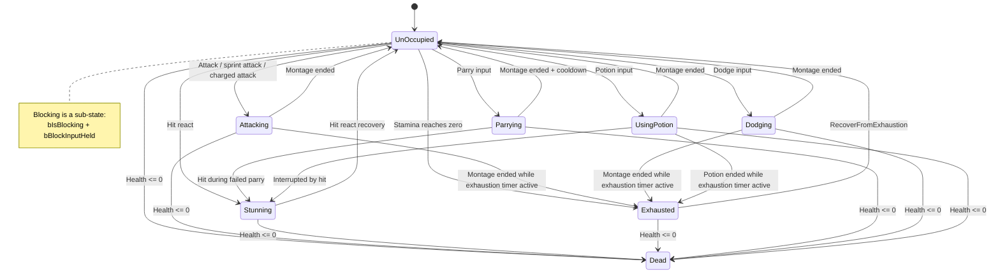
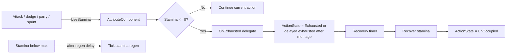
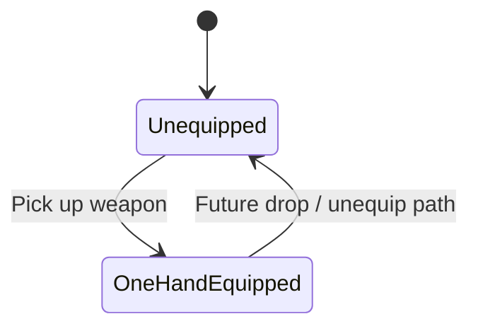
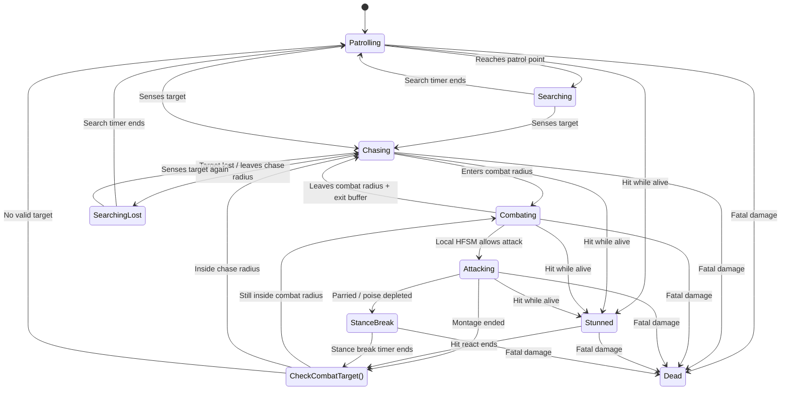
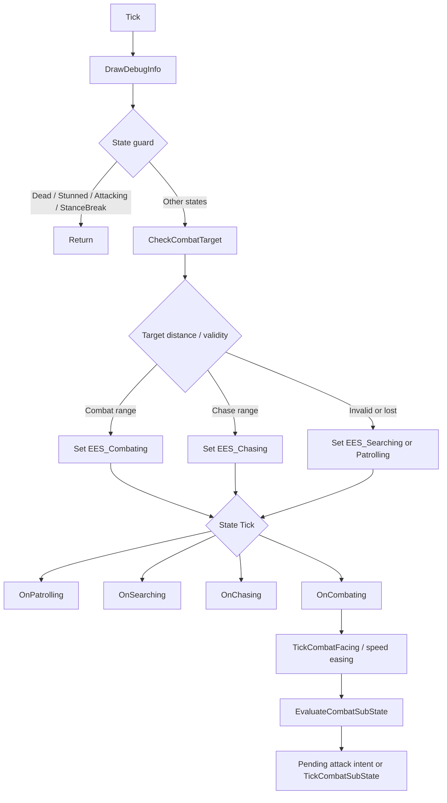
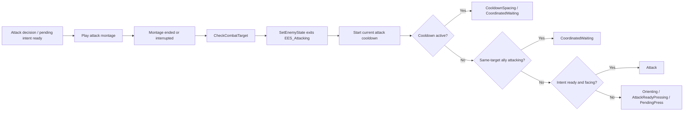

# ARCHITECTURE.md

**Shared architectural knowledge for all AI agents (Codex, Claude, Gemini) working in this repository.**

This file is the single source of truth for:
- State machine enums and transitions
- Class hierarchy and inheritance
- Combat pipeline and system interactions
- Key gameplay system boundaries

For agent-specific collaboration rules, see:
- `AGENTS.md` — Codex and general agent guidelines
- `CLAUDE.md` — Claude Code specific rules
- `GEMINI.md` — Gemini specific rules (if exists)

This file stores stable project architecture only. Agent workflow and documentation update rules belong in `AGENTS.md` / `CLAUDE.md` / `GEMINI.md`.

Stable HTML anchors are used by `README.md` deep links. When renaming or moving major sections, preserve existing anchors or update the README links in the same change.

Language policy: keep stable section titles and HTML anchors in English; use Chinese for detailed explanations unless the content is primarily code/API terminology; keep C++ symbols, Unreal types, asset class names, enum values, function names, and config fields in English exactly as they appear in source; bilingual headings are allowed for major gameplay systems; do not split English/Chinese architecture files until the architecture stabilizes or the project is prepared for external presentation.

---

<a name="project-overview"></a>
## Project Overview

- **Unreal Engine 5.7** project, **Windows only**, **Visual Studio 2022** required
- Runtime module: `Test`
- Local editor plugins in this checkout: `SmartBPCreator`, `UnrealBridge`
- Targets: `TestEditor` (Editor), `Test` (Game)
- Build.cs dependencies: `Core`, `CoreUObject`, `Engine`, `InputCore`, `EnhancedInput`, `AnimGraphRuntime`, `Niagara`, `GeometryCollectionEngine`, `PCG`, `UMG`, `AIModule`, `Slate`, `SlateCore`, `MotionWarping`

<a name="state-machine-system"></a>
## State Machine System (`CharacterTypes.h`)

Core character/combat state-machine enums and small shared combat-flow enums are defined as `UENUM` enums in `CharacterTypes.h`. This is the single source of truth for player, weapon, enemy outer state flow, and shared character combat helpers. System-local enums such as `EItemState` (`Items/item.h`) and `ESpecialAttackType` (`AttackConfigDataAsset.h`) stay near their owning systems.

| Enum | States | Used By |
|------|--------|---------|
| `EWeaponState` | Unequipped, OneHandEquipped, TwoHandEquipped | `AMyCharacter`, `USlashAnimInstance` |
| `EActionState` | UnOccupied, Attacking, Stunning, Exhausted, Parrying, Dodging, UsingPotion, Dead | `AMyCharacter` |
| `EComboPlaybackMode` | NewPlayback, Continuation | `AMyCharacter` light combo playback helper |
| `EPlayerActionType` | None, Attack, Dodge, Block, Parry, Potion, HitReact, Death | `AMyCharacter::TryStartAction` non-attack action entry, future action priority/cancel windows |
| `EEnemyState` | UnOccupied, Patrolling, Searching, Chasing, Combating, Attacking, Stunned, StanceBreak, Dead | `AEnemy` |

**State transition pattern**: Mixed C++ + AnimNotify driven. Entry states are set directly in C++ (`Attack()`, `GetHit_Implementation()`, `Die()`). Recovery transitions use `FOnMontageEnded` delegates with `bInterrupted` guards as primary path. `UAnimNotify_CharacterHitReactEnd` is the exception — used for player hit react recovery so designers can tune stun duration in the animation editor. Enemy recovery has double coverage (delegate + AnimNotify with state guards).

<a name="player-state-machine-flow"></a>
## Player State Machine Flow

### Action States (`EActionState`)

| State | Meaning |
|------|---------|
| `EAS_UnOccupied` | Normal state. Movement, attack, jump, sprint, block, parry, dodge, and potion entry are handled through guards. Blocking is a sub-state via `bIsBlocking`. |
| `EAS_Attacking` | Attack montage is playing. Used by normal combo, sprint attack, and charged attack. |
| `EAS_Stunning` | Player hit react / short stun. |
| `EAS_Exhausted` | Stamina exhausted. Player can only walk until timed recovery. |
| `EAS_Parrying` | Parry montage is playing. `bParryActive` marks the active parry window. |
| `EAS_Dodging` | Dodge montage is playing. Invulnerability is driven by `UAnimNotifyState_DodgeInvulnerable`. |
| `EAS_UsingPotion` | Potion montage is playing. Movement remains allowed at walk speed. |
| `EAS_Dead` | Death state. Collision and movement are disabled. |



### Stamina / Exhaustion Flow



- The project intentionally allows stamina overdraft for a final committed action.
- Montage end handlers must check the exhaustion timer before restoring `EAS_UnOccupied`.
- Attack recovery uses `ShouldRecoverToExhausted_Attack()` because attack has the extra `bPendingExhaustedAfterAttack` flag.
- Dodge / parry / potion use `RecoverActionStateAfterMontage(...)` and the generic exhaustion check.

### Weapon State (`EWeaponState`)



<a name="enemy-state-machine-flow"></a>
## Enemy State Machine Flow

### Enemy States (`EEnemyState`)

| State | Meaning |
|------|---------|
| `EES_UnOccupied` | Initial state, quickly transitions into patrol behavior. |
| `EES_Patrolling` | Moves between patrol targets. |
| `EES_Searching` | Looks around at patrol points or at the last known target position. |
| `EES_Chasing` | Chases a valid combat target. |
| `EES_Combating` | Target is inside combat range. Local combat substate controls facing, pressing, waiting, and spacing. |
| `EES_Attacking` | Attack montage is playing. Movement is locked. |
| `EES_Stunned` | Normal hit react / short stun. |
| `EES_StanceBreak` | Long poise-break stun from parry or poise depletion. |
| `EES_Dead` | Death state. Timers, movement, collision, and combat state are cleared. |



<a name="enemy-tick-flow"></a>
### Enemy Tick Flow



<a name="combat-cooldown-coordination-flow"></a>
### Combat Cooldown / Coordination Flow



<a name="key-enemy-method-responsibilities"></a>
### Key Enemy Method Responsibilities

| Method | Called From | Responsibility |
|--------|-------------|----------------|
| `Tick()` | Every frame | Calls debug info, applies state guard, target recheck, and state tick dispatch. |
| `CheckCombatTarget()` | Tick / montage recovery | Validates target and chooses patrol/chase/combat state by distance. |
| `SetEnemyState()` | State transition | Old-state cleanup and new-state initialization. |
| `EvaluateCombatSubState(...)` | `OnCombating()` | Chooses local combat substate. |
| `SetCombatSubState(...)` | Combat substate transition | One-shot entry / exit behavior, including coordinated wait cooldown. |
| `TickCombatFacing(...)` | Combat tick | Smoothly faces the target. |
| `TickCombatSubState(...)` | Combat tick | Dispatches orienting, pressing, coordinated wait, and cooldown spacing behavior. |
| `Attack()` | Combat substate / fallback attack decision | Executes DataAsset-driven attack selection, switches to attacking, and plays attack montage. Cooldown starts when `SetEnemyState()` exits `EES_Attacking`. |
| `DrawDebugInfo()` | Tick | Assembles enemy debug text/shapes before AI state work, keeping debug output out of gameplay decision branches. |
| `TakeDamage()` | Damage pipeline | Applies health damage and enters death if needed. |
| `ApplyPoiseDamage()` | Weapon hit feedback | Reduces poise and sets `bPendingStanceBreak` when poise reaches zero. |
| `ApplyStanceBreak()` | After `GetHit()` checks pending flag | Stops montage, sets `EES_StanceBreak`, plays slow hit react, starts recovery timer. |
| `RecoverFromStanceBreak()` | Stance break timer | Restores montage play rate and delegates next state choice to `CheckCombatTarget()`. |
| `Die()` | Fatal damage | Clears timers, movement, collision, poise state, and combat substate. |

<a name="class-hierarchy"></a>
## Class Hierarchy

```
AActor
├── Aitem (base: parabolic spawning, floating animation, overlap events)
│   ├── AWeapon (box-trace sweep collision, hit-stop, camera shake)
│   ├── AShield (off-hand equip, block parameters: angle/damage/stamina/speed)
│   └── ATreasure (gold value, initialized from UTreasureData asset)
├── ABreakAbleActor + IHitInterface (static mesh → GeometryCollection swap on hit)
├── Interfaces: IHitInterface (GetHit — hit reaction), IBlockableInterface (TryBlockHit — angle/stamina block check)
├── AArenaGenerator (USplineComponent + UPCGComponent for PCG-based arena spawning)
└── ABird (APawn subclass, flyable spectator)

ACharacter
├── AMyCharacter (UAttributeComponent, spring arm + camera, weapon equipping, lock-on targeting)
└── AEnemy + IHitInterface (AI patrol/search/chase/combat state machine, directional hit react)

APlayerController → ACharacterController (Enhanced Input actions for movement, combat, lock-on, pause, and potion)
UActorComponent → UAttributeComponent (health, gold, OnHealthChanged delegate)
UActorComponent → UPlayerLockOnComponent (lock-on state, target search/scoring, lock-on parameters)
UWidgetComponent → UHealthBarComponent
UUserWidget → UBaseHealthBarWidget (PB_Health + PB_Buffer progress bars, buffer delay logic)
UUserWidget → UPlayerHUDWidget (health/stamina/potion HUD, damage vignette, debug text paint)
UUserWidget → UPauseMenuWidget (resume delegate, pause keyboard handling, debug checkbox controls)
UAnimInstance → USlashAnimInstance (exposes GroundSpeed, Direction, bIsBlocking, bIsStunning, state enums to anim graph)
UAnimNotifyState → UAnimNotifyState_ParryActive (marks parry active window in animation)
UAnimNotifyState → UAnimNotifyState_ComboWindow (marks combo input window in animation)
UAnimNotifyState → UAnimNotifyState_DodgeInvulnerable (marks dodge invulnerability window)
UAnimNotifyState → UAnimNotifyState_WeaponCollision (drives weapon trace window + player attack hyper armor)
UAnimNotify → UAnimNotify_ComboBranchPoint (consumes buffered combo input and branches to next attack section)
UAnimNotify → UAnimNotify_PotionHeal (montage-driven partial potion healing)
UDataAsset → UTreasureData (static mesh, gold value, pickup sound, scale)
UDataAsset → UPlayerCharacterProfileDataAsset (single player character config entry: AttackConfig + ActionConfig)
UDataAsset → UPlayerActionConfigDataAsset (player-only non-attack action montages and priority config: dodge, block, parry, optional potion)
UDataAsset → UComboDataAsset (combo chain: SectionName, DamageMultiplier, StaminaCost, PoiseDamageMultiplier per segment)
UDataAsset → UAttackConfigDataAsset (LightAttackCombo + SpecialAttacks for sprint/jump-style specials + ChargedAttack)
UDataAsset → UEnemyAttackConfigDataAsset (Enemy attacks: montage, section, post-attack cooldown (v1.5: excludes montage duration and starts after attack end/interruption), MinDistance/MaxDistance, weight, damage/block-stamina multipliers, optional Motion Warping target config)
```

<a name="debug-output-system"></a>
## Debug Output System

- `FDebugDrawHelper` is the shared debug output channel for runtime text entries and simple world shapes. It owns collection/gating, not gameplay state.
- CVar gates: `test.Debug.Enable` controls project debug output routed through `FDebugDrawHelper`; `test.Debug.Player` controls player text; `test.Debug.Enemy` controls enemy text; `test.Debug.Ranges` controls range/world shapes. `IsShapesEnabled()` remains a C++ compatibility wrapper for `IsRangesEnabled()`.
- `UPauseMenuWidget` exposes a Debug Settings subpage that controls those CVars through `FDebugDrawHelper` raw getters/setters. UI checkbox state reads raw CVar values, while actual output still uses effective gated checks such as `IsPlayerEnabled()`, `IsEnemyEnabled()`, and `IsRangesEnabled()`.
- `UPlayerHUDWidget::NativePaint()` renders `FDebugDrawEntry` text from `FDebugDrawHelper::GetEntries()`.
- Actor/system classes own debug content assembly: current examples are `AMyCharacter::DrawDebugInfo()` and `AEnemy::DrawDebugInfo()`. Keep gameplay-specific strings and field choices in the owning class, then emit through `FDebugDrawHelper`.
- Do not move gameplay knowledge into `FDebugDrawHelper`; it should not depend on `AEnemy`, `AMyCharacter`, combat state enums, or asset classes.
- Temporary direct `DrawDebug*` / `GEngine->AddOnScreenDebugMessage(...)` calls are outside the CVar gate until promoted into UI or wrapped by the helper.

<a name="combat-pipeline"></a>
## Combat Pipeline

1. `ACharacterController` splits attack input: `Started` → `Input_AttackPressed()`, `Completed` / `Canceled` → `Input_AttackReleased()`
2. **Attack Priority**: combo window buffer first → sprint attack (if sprinting + moving + weapon equipped) → charged decision timer → short release falls back to combo/normal `Attack()`
3. **Sprint Attack**: Independent system, triggers when sprinting + moving + weapon equipped + grounded. Uses `AttackConfig->FindSpecialAttack(ESpecialAttackType::SprintAttack)`, faces movement direction, stops sprinting after attack, does not use ComboWindow, and reuses `OnAttackMontageEnded`.
4. **Charged Attack**: Holding past `ChargeInputThreshold` enters `ChargedAttack.Montage` section `Default`; releasing while charging jumps to section `Release` and applies charged damage/poise multipliers.
5. **Combo System**: `Attack()` queries `UComboDataAsset` for current segment config (SectionName, DamageMultiplier, StaminaCost); `UAnimNotify_ComboBranchPoint` increments `ComboCounter` only when buffered input successfully branches to the next segment
6. `PlayAttackMontage(SectionName)` plays normal/combo attack animation from `AttackConfig->LightAttackCombo->ComboMontage` with `UAnimNotifyState_WeaponCollision` + `UAnimNotifyState_ComboWindow` baked in
7. **NotifyBegin** → `AWeapon::StartWeaponTrace()` (records old box positions) + `SetAttackHyperArmor(true)` (player only)
8. **NotifyTick** → `AWeapon::ExecuteWeaponTrace()` (sweeps from old→new center to prevent ghost swings)
9. On hit:
   - 同阵营命中：不 `ApplyDamage`，但仍走 `GetHit` 路径（击退、命中反馈、相机晃动）。同阵营判定通过 `FCombatTeamHelper::ShareTeamTag()`（Weapon + Enemy 共用）
   - 跨阵营命中：`IBlockableInterface::TryBlockHit()` 在 `ApplyDamage` 前拦截；格挡成功：减伤 + 跳过硬直；弹反成功：瞬间清空攻击方韧性触发破防
   - `ExecuteWeaponTrace()` 通过 `FPendingHitContext` 写入每命中的上下文（instigator、knockback scale、blocked flag、stun flag），然后调用 `GetHit()`
   - `ABaseCharacter::GetHit_Implementation()` 消费 context 驱动击退/受击反应，子类（`AMyCharacter`、`AEnemy`）在各自硬直逻辑后清空 context
   - `ExecuteWeaponTrace()` 分解为 `BuildIgnoreList()`、`ResolveHit()`、`DispatchHitFeedback()` 三步，不要膨胀为通用战斗管线
   - **韧性伤害应用**：`DispatchHitFeedback()` 在 `GetHit()` 之前对敌人应用韧性伤害（`Enemy->ApplyPoiseDamage(Attacker->GetCurrentPoiseDamage(), Attacker)`），韧性归零时设置 `bPendingStanceBreak` flag
   - **弹反分支**：弹反成功时对攻击方敌人调用 `ApplyPoiseDamage(GetCurrentPoise())`（瞬间清空韧性），然后在 `GetHit()` 之后检查 `ShouldTriggerStanceBreak()` 触发破防
   - **破防触发**：`GetHit()` 之后检查 `bPendingStanceBreak` flag，弹反路径对攻击方（`GetOwner()`）触发，普通命中对受击方（`HitActor`）触发
   - **Damage / Block Stamina Multipliers**: `ResolveHit()` 在格挡判定前应用 `BaseCharacter->GetAttackDamageMultiplier()` 计算实际伤害；格挡耗体不再按伤害缩放，而由 `AShield::BlockStaminaCost × Attacker->GetBlockStaminaDamageMultiplier()` 决定，让盾牌类型和敌人招式分别控制防御压力
   - **Poise Damage Multiplier**: 连招系统同时计算 `CurrentPoiseDamage = BasePoiseDamage × PoiseDamageMultiplier`，冲刺攻击使用独立倍率，蓄力攻击按持有时长在 1.0 到 `ChargedAttack.MaxPoiseDamageMultiplier` 间插值
10. HitStop + CameraShake（所有命中都触发）
11. **NotifyEnd** → clears `IgnoreActors` blacklist + `SetAttackHyperArmor(false)` (player only)
12. **Combo Window**: `AnimNotifyState_ComboWindow` marks input-buffer timing; `Input_AttackPressed()` sets `bComboInputReceived` during the window before any charged timer starts
13. **Combo Branch Point**: `UAnimNotify_ComboBranchPoint` is the single normal continuation point. It closes the current combo window, consumes `bComboInputReceived`, and if a next segment exists and the player is not entering exhaustion, jumps to the next attack section without restarting the montage. If no input is buffered, the montage continues into the current section's `end` recovery.
14. `OnAttackMontageEnded` delegate fires → recovery helpers clear charged input / restore rotation / handle delayed exhaustion → `ResetCombo()`, restore `EAS_UnOccupied` or `EAS_Exhausted`, resume stamina regen

<a name="player-action-recovery-helpers"></a>
## Player Action Recovery Helpers

- `AMyCharacter` keeps `EActionState` as the public action state and uses private recovery helpers instead of a full HFSM.
- **架构目标**：收敛重复的蒙太奇结束恢复逻辑，降低后续处决/背刺等新动作的接入成本。不引入完整 HFSM，保持现有 `EActionState` + delegate + AnimNotify 边界。
- **体力耗尽判断分离**：
  - `ShouldRecoverToExhausted_Generic() const` — 只检查 `IsExhaustionTimerActive()`，用于 dodge/parry/potion 等非攻击动作
  - `ShouldRecoverToExhausted_Attack() const` — 额外检查 `bPendingExhaustedAfterAttack`，攻击路径专用，防止延迟耗尽 flag 被通用恢复逻辑误消费
  - `EnsureExhaustionRecoveryTimer()` — 统一启动疲惫恢复计时器的 helper
- **通用恢复路径**：`RecoverActionStateAfterMontage(ExpectedState, bResumeStaminaRegen)` 处理 parry/dodge/potion 的蒙太奇结束恢复，返回最终 `EActionState`。调用方如有动作专属尾部逻辑必须使用返回值；`OnDodgeMontageEnded()` 在恢复到 `EAS_Exhausted` 时提前 return，保持旧版"耗尽后不重启移动噪音"行为。
- **攻击专属清理**：`CleanupInterruptedAttack()` 处理攻击打断路径：恢复旋转、取消蓄力输入、重置连招、解决攻击耗尽、清除 `bPendingExhaustedAfterAttack`、恢复体力恢复。攻击恢复保持独立，不与通用恢复路径混用。
- **扩展指引**：添加新的蒙太奇驱动动作时，优先复用这些 helper，再考虑新增 `EActionState` 或更广 HFSM。

<a name="player-action-start-entry"></a>
## Player Action Start Entry

- **统一入口**：`AMyCharacter::TryStartAction(EPlayerActionType)` 是 Dodge / Block / Parry / Potion 的统一启动入口；公开输入函数 `Dodge()`、`Input_Parry()`、`UsePotion()` 只转发到该入口，`TryResumeBlock()` 也通过该入口恢复举盾。
- **当前范围**：阶段 2 已加入动作优先级数据和只读查询，行为保持等价；不接入普通攻击 / 蓄力 / 冲刺攻击，不实现 CancelWindow，不允许 Dodge / Block 取消攻击后摇。
- **分发结构**：`TryStartAction()` 调用现有 `CanDodge()` / `CanStartBlock()` / `CanStartParry()` / `CanUsePotion()`，再分发到 `StartDodgeAction()`、`StartBlockAction()`、`StartParryAction()`、`StartPotionAction()`。这些 `Start*Action()` 返回 `bool`，资源缺失或配置缺失时必须在副作用前失败。
- **Block 语义**：Block 是按住型动作。`TryStartAction(Block)` 内部同时检查 `bIsBlocking` 幂等和 `bBlockInputHeld` 输入意图；`ReleaseBlockInput()` 保持独立，负责松开、清理 `bIsBlocking` 和停止防御蒙太奇。
- **副作用顺序**：消耗体力、消耗药瓶、设置状态、绑定 montage delegate 都必须发生在资源检查之后。`StartPotionAction()` 在 `Attributes->UsePotion()` 后没有失败返回路径；`StartBlockAction()` 先确认 `BlockMontage` / `AnimInstance` 可用，再设置 `bIsBlocking = true`。
- **优先级数据**：`UPlayerActionConfigDataAsset::PriorityConfig` 保存 `Attack` / `Dodge` / `Block` / `Parry` / `Potion` / `HitReact` / `Death` 的动作优先级，数值越大优先级越高；`None` 不在 struct 字段中，由 `GetActionPriority(None)` 返回 `MIN_int32`。
- **优先级查询**：`GetActionPriority()` 是唯一 priority switch 源，故意不写 `default` 以保留枚举新增时的 `-Wswitch` 漂移提示；`IsStrictlyHigherPriority()` 使用 `>`，`IsAtLeastSamePriority()` 使用 `>=`。`AMyCharacter` 只 forward 到 `ActionConfig`，不复制 switch。
- **占位类型**：`Attack` / `HitReact` / `Death` 已在 `EPlayerActionType` 中占位，但 `TryStartAction()` 当前明确返回 `false`，等待后续 CancelWindow 阶段决定是否接入。`ActionConfig == nullptr` 时 player-side priority helper 返回安全 fallback（`MIN_int32` / false）。

## Hit Knockback（受击后退）

- `ABaseCharacter` 通过 `FPendingHitContext` + `BaseHitKnockbackDistance` + `HitKnockbackDuration` + `TickHitKnockback()` 共享短距离武器命中击退。
- 击退是**武器命中反馈**，非通用伤害反馈：陷阱/DOT 只调 `TakeDamage()` 不自动触发。
- 默认值：`AMyCharacter` 10cm，`AEnemy` 5cm。
- 运动曲线：quadratic ease-out，通过 `AddActorWorldOffset(..., true, &Hit)` sweep 位移，可被墙挡住。
- 新命中覆盖旧击退；零缩放命中（如满格挡）清除进行中的击退。
- 格挡成功按减伤比例缩放击退距离（`DamageAfterBlock / Damage`）。
- 友方武器命中也触发击退和命中反馈，但不造成伤害。

## Attack Hyper Armor System（攻击霸体系统）

- **架构**：玩家专属，武器碰撞窗口期间（`AnimNotifyState_WeaponCollision`）获得霸体效果。
- **生命周期**：`NotifyBegin` 调用 `SetAttackHyperArmor(true)`，`NotifyEnd` 调用 `SetAttackHyperArmor(false)`，与武器碰撞检测窗口完全同步。
- **霸体效果**：受击时仍然扣血、击退、相机晃动、播放音效粒子，但不播放受击蒙太奇、不进入硬直状态（`EAS_Stunning`），攻击动画继续播放。
- **实现细节**：`GetHit_Implementation()` 在调用 `Super` 之前检查 `bAttackHyperArmor`，霸体分支手动复制必要逻辑（击退、音效、相机晃动），跳过 `DirectionalHitReact()`。
- **中断恢复**：`OnAttackMontageEnded(bInterrupted=true)` 确保恢复 `ActionState`，防止卡在 `EAS_Attacking` 状态。
- **优先级**：翻滚无敌帧（`bDodgeInvulnerable`）优先级高于霸体，完全免疫 vs 部分免疫。

<a name="enemy-ai"></a>
## Enemy AI (`AEnemy`)

- Controlled by `AAIController` via `EEnemyState` FSM.
- `CheckCombatTarget()` runs before per-state Tick logic: invalid **or dead** targets return to `EES_Patrolling`（via `IsValidCombatTarget()` helper）。**战斗退出滞后**：已在战斗族状态（`EES_Combating`/`EES_Attacking`/`EES_Stunned`）时，退出半径使用 `CombatingRadius + CombatExitBuffer`（默认 350），防止边界每帧在 Chasing/Combating 间抖动。
- **Patrolling / Searching**: `OnPatrolling()` moves between `PatrolTargets`; once inside `PatrolRadius`, the enemy switches to `EES_Searching`. `OnSearching()` stops movement, starts `PatrolTimer` plus repeating `LookTimer`, and rotates toward `GenerateNewLookRotation()`.
- **Chasing / Combating**: `OnChasing()` is `virtual`，派生类可覆写追逐行为。`OnCombating()` 保留公共流程（距离/朝向计算、转身、速度缓动更新），战斗决策委托给局部 Combat 子状态和 3 个 `protected virtual` 钩子。
- **Combat Local HFSM**: `EES_Combating` 拥有私有 `AEnemy::EEnemyCombatSubState` 枚举（`None`, `Orienting`, `AttackReadyPressing`, `CoordinatedWaiting`, `CooldownSpacing`），显式化原先隐藏在 `OnCombating()` 中的战斗子状态。
  - **作用域**：私有 `enum class`，不放入 `CharacterTypes.h`，不暴露 Blueprint/AnimBP
  - **子状态语义**：
    - `None` — 非 `EES_Combating` 或刚进入时的默认值
    - `Orienting` — 已在攻击距离内但未转正，停止移动等待朝向满足攻击阈值
    - `AttackReadyPressing` — 攻击未冷却但距离未进 `CombatAttackMaxRadius`，使用 `MoveToCombatTarget()` 动态追踪
    - `CoordinatedWaiting` — 因附近友军正在攻击而主动等待，复用 attack cooldown timer
    - `CooldownSpacing` — 攻击冷却中，执行后撤/侧移/前压的 spacing 行为
  - **方法职责**：`EvaluateCombatSubState(...)` 判定应进入的子状态，`SetCombatSubState(...)` 执行一次性进入/退出清理，`TickCombatFacing(...)` 处理平滑面向，`TickCombatSubState(...)` 分发到各子状态 Tick 行为
  - **转换模型**：当前局部 HFSM 有意采用“每帧轻量评估 + 集中切换 + 少量事件入口”的混合模式，而不是纯事件驱动。距离、朝向、导航和目标移动属于连续变化条件，适合在 `OnCombating()` 中通过 `EvaluateCombatSubState(...)` 评估；`SetCombatSubState(...)` 收敛进入/退出副作用；`OnAttackCooldownEnd()` 等 timer 回调处理事件型入口。除非敌人数量或行为复杂度让轮询成本变成可测问题，否则不要为了形式纯事件化引入事件总线。
- **战斗决策钩子（Virtual Seam）**：`ShouldTriggerAttack()`、`HandleAttackReadyPositioning()`、`HandleCooldownPositioning()` 三个 `protected virtual` 钩子供派生类覆写。所有战斗决策入口都必须保持在局部 HFSM / 钩子边界内。
- **Combat Spacing**: `UpdateCombatMovement()` 按距离分 Retreat/BackDiag/Strafe/Press 四种策略，通过 `MoveToCombatLocation()` 发起导航请求。
- **Attack Coordination**: Prevents multiple enemies from attacking simultaneously. Before attacking, enemies check if nearby allies (within `AttackCoordinationRange`, default 800cm) **chasing the same target** (`ChasingTarget` match) are in `EES_Attacking` state. Only allies attacking the same target participate in coordination. If allies are attacking, the enemy enters local combat substate `CoordinatedWaiting`, with suggested wait time from fixed `AttackCoordinationBuffer` (clamped by `SetCombatSubState()` to `MaxAttackCoordinationWait`).
- **Attack Configuration**: 敌人攻击行为由 `UEnemyAttackConfigDataAsset` 驱动，条目描述 montage / section、post-attack cooldown、`MinDistance` / `MaxDistance`、weight、damage multiplier、block-stamina multiplier、是否不可弹反、可选 Motion Warping 配置。缺少 DataAsset 时不会攻击，并输出配置警告；不再保留旧 `AttackMontage + Attack1` 硬编码回退。配置校验区分 DataAsset 自身校验与 `AEnemy` 边界校验（`CombatAttackMaxRadius`）。
  - **Cooldown Semantics**: v1.5 后敌人攻击 DataAsset 的 `MinCooldown` / `MaxCooldown` 不包含蒙太奇播放时长；攻击自然结束或被打断并退出 `EES_Attacking` 后才开始计时。
  - **Attack Selection**: `ChooseAttackIndex(float DistanceToTarget)` 按距离过滤候选招式后加权随机，用于距离筛选/兜底路径；`ChooseAttackIntentIndex(int32 ExcludedAttackIndex)` 忽略距离、只按权重抽取，并可排除一个 index，用于 pending intent + retry block 路径。
  - **Pending Attack Intent**: 未冷却且未协调等待时，`OnCombating()` 先缓存一个 pending attack intent，再尝试执行。抽中近距离攻击但当前距离大于该招式有效 `MaxDistance` 时，敌人使用 `MoveToCombatTarget(AcceptanceRadiusOverride)` 动态追踪目标并继续前压，直到进入该招式距离内再出手。
  - **Pending Cleanup**: pending intent 在攻击成功开始、目标丢失、进入 `CooldownSpacing` / `CoordinatedWaiting`、或离开 `EES_Combating` / `EES_Attacking` 到受击、破防、死亡、脱战等状态时清理。
  - **Distance Contract**: 执行距离上限为 `Min(Entry.MaxDistance, CombatAttackMaxRadius)`。`CombatAttackMaxRadius` 仍表示最大可出手距离，不是 cooldown spacing 距离；调大它时必须同步保持 `CombatAttackMaxRadius <= CombatPreferredMinRadius <= CombatPreferredMaxRadius < CombatingRadius`。
  - **Retry Block**: pending intent 超时或目标距离小于该招式 `MinDistance` 时，清理 pending 并短暂屏蔽同一招式，防止每帧反复抽中同一条不可执行攻击。
  - **Retry Block Lifetime**: retry block 通常不随 pending 清理主动清零，而是短时间自然过期；死亡路径会清空 `LastBlockedPendingAttackIndex` / `PendingAttackRetryBlockUntil`，避免死亡对象保留过期调试/状态。
  - **Cooldown Idempotency**: `bCurrentAttackCooldownStarted` 防止同一次攻击重复启动 cooldown。攻击开始时重置为 `false`，`StartCurrentAttackCooldownIfNeeded()` 检查后置为 `true`；即使 `OnAttackEnd()` 和 `OnAttackMontageEnded()` 都请求 `CheckCombatTarget()`，cooldown 也只应通过 `SetEnemyState()` 的退出攻击路径启动一次。
  - **Non-goal**: 当前不实现“抽中远距离/跳劈招式但距离太近 -> 先拉远再出手”。太近时依靠 `MinDistance` + retry block 重抽，而不是主动创造距离。

<a name="enemy-attack-motion-warping"></a>
### Enemy Attack Motion Warping

- **Scope**: 仅用于 `UEnemyAttackConfigDataAsset` 中显式开启 `bUseMotionWarping` 的跃进/跳劈类 root motion 攻击；普通轻攻击和未勾选条目不写入 WarpTarget，即使蒙太奇里放了 Motion Warping NotifyState 也不会得到有效目标。
- **Runtime owner**: `AEnemy` 持有 `UMotionWarpingComponent`。`PerformConfiguredAttackByIndex()` 在 `SetEnemyState(EES_Attacking)` 后、`PlayEnemyAttackMontage(Entry)` 前调用 `UpdateAttackMotionWarpTarget(Entry)`，为当前招式写入一次固定 `FTransform` WarpTarget。
- **Target calculation**: v1 使用攻击开始瞬间的固定目标点，不做空中持续追踪玩家当前位置。`WarpLocation = TargetLocation - ToTarget * Entry.WarpStopDistance`，`WarpRotation = ToTarget.Rotation()`。Motion Warping NotifyState 在窗口内持续修正 root motion，但追的是这次写入的固定 `AttackTarget`。
- **Data fields**:
  - `bUseMotionWarping` — 每招式开关。
  - `WarpTargetName` — 必须与蒙太奇 Motion Warping NotifyState 的 `Warp Target Name` 一致，默认 `AttackTarget`。
  - `WarpStopDistance` — 落点距离目标保留的前方距离，避免跳进玩家身体中心。必须小于该招式 `MaxDistance`。
  - `MaxWarpDistance` — 从敌人当前位置到 `WarpLocation` 的最大允许 root motion 修正距离；这是保险阈值，不参与攻击选择。
- **Tuning rule**: `MaxWarpDistance` 不等同于攻击释放距离。初值按 `Entry.MaxDistance - WarpStopDistance + 30~60cm buffer` 起调；例如 `MaxDistance=220`、`WarpStopDistance=70` 时先试 `180~210`。
- **Cleanup**: `ClearCurrentAttackConfig()` 在 `CurrentAttackIndex = INDEX_NONE` 前调用 `ClearAttackMotionWarpTarget(Entry)`，使用 `UMotionWarpingComponent::RemoveWarpTarget(...)` 清理当前招式目标。该路径覆盖 montage 播放失败、攻击结束、打断、硬直/破防/死亡切出攻击态，避免下一次 NotifyState 复用 stale target。
- **Montage contract**: 跳劈蒙太奇需要有效 root motion，并在起跳/飞行前冲段放置 Motion Warping NotifyState。窗口决定哪段 root motion 被修正，不会重新计算目标；如需分阶段调参，可用同一个 `AttackTarget` 拆成 rotation-only 和 translation/rotation 窗口，但不要让平移窗口覆盖落地后的收招恢复。

## Stamina & Exhaustion System

- `UAttributeComponent` manages stamina: `UseStamina()`, `AddStamina()`, `CheckStamina()`.
- Stamina can temporarily go negative (e.g. 5 stamina → attack costs 15 → -10) to allow "last action" before exhaustion.
- When stamina hits 0, `OnExhausted` broadcasts → `HandleExhausted()` sets `EAS_Exhausted` + starts 5s timer.
- During Exhausted: player can only walk. `RecoverFromExhaustion()` resets state to `EAS_UnOccupied` with state guard.
- **"最后一击"设计**：透支时允许播放动画，蒙太奇结束回调中检查 `IsExhaustionTimerActive()`，如果计时器活跃则恢复到 `EAS_Exhausted`。

<a name="shield-blocking-system"></a>
## Shield & Blocking System

- `IBlockableInterface` + `FBlockResult` — 纯 C++ virtual interface，独立于 `IHitInterface`，通过 `Cast<IBlockableInterface>(HitActor)` 调用。
- `AShield` — 副手装备，参数载体：`BlockHalfAngleDegrees`(角度)、`BlockedDamageMultiplier`(减伤)、`BlockStaminaCost`(每次格挡基础耗体)、`BlockMoveSpeedMultiplier`(移速)。
- 按住防御：`bBlockInputHeld` + `bIsBlocking` 双标志，不新增 `EActionState`，防御中 `ActionState` 保持 `EAS_UnOccupied`。
- `TryBlockHit()` 判定链：存活 → 方向(`DotProduct` vs `Cos(HalfAngle)`) → 体力成本检查 → 扣体力 + 减伤。
- 格挡拦截点：`Weapon::ExecuteWeaponTrace()` 命中后、`ApplyDamage()` 前，仅跨阵营触发。格挡成功时 `bPlayNormalHitReact = false` 跳过受击硬直。

<a name="poise-stance-break-system"></a>
## Poise & Stance Break System (韧性与破防系统)

- **架构**：Dark Souls 风格的隐藏韧性条系统，统一弹反和韧性破防到 `EES_StanceBreak` 状态。
- **韧性机制**：敌人持有隐藏韧性条（`MaxPoise` 默认 10，`CurrentPoise` 运行时值），每次受击扣除韧性伤害（`BasePoiseDamage × PoiseDamageMultiplier`），韧性归零触发破防硬直（`EES_StanceBreak`）。
- **破防触发**：
  - **延迟触发机制**：`ApplyPoiseDamage()` 韧性归零时设置 `bPendingStanceBreak` flag，不立即触发破防
  - **触发时机**：`DispatchHitFeedback()` 在 `GetHit()` 之后检查 flag，避免 `EES_StanceBreak` 被 `EES_Stunned` 覆盖
  - **弹反路径**：弹反成功时调用 `ApplyPoiseDamage(GetCurrentPoise())`（瞬间清空韧性），对攻击方敌人（`GetOwner()`）触发破防
  - **普通路径**：普通命中累积韧性伤害，对受击方敌人（`HitActor`）触发破防
- **破防效果**：停止当前蒙太奇，设置 `EES_StanceBreak` 状态，播放方向性受击反应，慢放蒙太奇（使用敌人自己的参数，默认 0.3x），启动恢复计时器（默认 2.0s）。

<a name="parry-system"></a>
## Parry System (弹反系统)

- **架构**：基于盾牌的主动防御机制，独立于格挡系统。弹反成功时瞬间清空攻击方韧性触发破防。
- **状态管理**：`bIsParrying`（蒙太奇播放中）、`bParryActive`（激活窗口开启，由 `UAnimNotifyState_ParryActive` 控制）、`bParryOnCooldown`（冷却期）
- **判定流程**：敌人攻击命中玩家 → `TryBlockHit()` 检查 `bParryActive` + 方向 + 攻击方当前招式是否允许弹反 → 弹反成功扣除 `ParryStaminaCost`，返回 `bParried=true` → 对攻击方调用 `ApplyPoiseDamage(GetCurrentPoise())` → 触发破防。`FEnemyAttackEntry::bCannotBeParried` 只禁止主动弹反成功，不禁止普通举盾格挡；不可弹反招式命中弹反窗口时按失败弹反处理。

<a name="lock-on-system"></a>
## Lock-On System (`AMyCharacter` + `UPlayerLockOnComponent`)

- **组件架构**：`UPlayerLockOnComponent` 拥有锁定状态、目标搜索/评分逻辑、所有 `LockOn*` 参数。`AMyCharacter` 保留 facade + 旋转/相机实际写入。
- **目标搜索**：`FindBestTarget()` 遍历所有 `AEnemy`，`ScoreTarget()` 按 `IsAlive()` + 距离 + Camera forward 视角角度评分。
- **旋转模式切换**：开启时缓存 `bOrientRotationToMovement` / `bUseControllerRotationYaw` / `bUsePawnControlRotation`，切换到锁定模式。
- **锁定冲刺 Free-Run**：`ShouldUseLockOnFreeRun()` 条件 = `bIsLockingOn && bIsSprinting && EAS_UnOccupied && !IsFalling && 有移动输入`。满足时角色临时恢复自由移动语义，控制器/相机继续盯敌人。

<a name="combo-system"></a>
## Combo System（连招系统）

- **架构**：数据驱动 + AnimNotifyState 驱动窗口。`UAttackConfigDataAsset` 统一管理 `LightAttackCombo`（连招链）、`SpecialAttacks`（冲刺/跳跃）、`ChargedAttack`（蓄力）
- **配置入口**：主角 Blueprint 只配置 `PlayerProfile`；`AMyCharacter` 通过 `PlayerProfile->AttackConfig` 读取主角攻击配置，通过 `PlayerProfile->ActionConfig` 读取 Dodge / Block / Parry / Potion Montage。主角攻击 Montage 只走 `UAttackConfigDataAsset`；敌人攻击 Montage 只走 `UEnemyAttackConfigDataAsset`。旧 `ABaseCharacter::AttackMontage` 字段已删除；`ABaseCharacter::PlayAttackMontage()` 仅保留为 protected 旧路径报警，不再播放基类攻击 Montage。
- **配置校验**：`UAttackConfigDataAsset`、`UComboDataAsset`、`UEnemyAttackConfigDataAsset` 在资产加载后和编辑器属性变更后输出配置 warning，用于定位缺失 Montage、空连招段、无效权重、Motion Warping 配置缺口等问题；这些 warning 不改变主角攻击选择规则。敌人攻击配置仍会 normalize 距离、冷却、倍率和 Motion Warping 数值下限。
- **续接时序关键**：`AnimNotifyState_ComboWindow` 只缓存输入；`UAnimNotify_ComboBranchPoint` 才消费输入并跳到下一段攻击 Section。续接时 montage 已经在播放，只能 `Montage_JumpToSection()`，不能重新 `Montage_Play()`。`OnAttackMontageEnded()` 不再负责正常连招续接，只负责最终恢复/疲惫处理。
- **蒙太奇契约**：`ComboChain` 只配置攻击 Section（例如 `Attack1/Attack2/Attack3`）；`end1/end2/end3` 是 montage 内部不接招时的收招 Section，不进入 `ComboChain`。
- **中断清理**：所有中断点（`GetHit`、`Die`、`HandleExhausted`、`Dodge`）必须调用 `ResetCombo()`

<a name="player-character-profile"></a>
## Player Character Profile

- **入口职责**：`UPlayerCharacterProfileDataAsset` 是主角 Blueprint 的单一配置入口，只引用子 DataAsset，不复制所有字段，不持有 runtime state。
- **当前子配置**：`AttackConfig` 指向现有 `UAttackConfigDataAsset`；`ActionConfig` 指向 `UPlayerActionConfigDataAsset`。
- **ActionConfig 范围**：`UPlayerActionConfigDataAsset` 保存主角专属非攻击动作 Montage：`DodgeMontage`、`BlockMontage`、`ParryMontage`、可选 `PotionMontage`，并保存玩家动作优先级配置。`HitReactMontage` / `DeathMontage` 仍留在 `ABaseCharacter`，因为玩家和敌人共用。
- **行为所有权**：`AMyCharacter` 仍负责状态切换、Montage 播放、打断清理和恢复；DataAsset 只提供配置。
- **配置失败语义**：未设置 `PlayerProfile`、`AttackConfig` 或 `ActionConfig` 时输出 warning 并让对应动作失败。`PotionMontage` 为空不是错误配置，喝药会立即回血并进入冷却。

<a name="charged-attack-system"></a>
## Charged Attack System（蓄力攻击系统）

- **优先级**：连招窗口缓存 > 冲刺攻击 > 蓄力。持有超过 `ChargeInputThreshold` 进入蓄力，释放时跳到 `Release` Section
- **职责分离**：
  - `AMyCharacter::ChargeInputThreshold`（默认 0.2s）— 输入手感阈值，控制何时判定为"持有"
  - `FChargedAttackConfig::MinChargeHoldTime / MaxChargeHoldTime` — 伤害/韧性倍率插值区间
  - `FChargedAttackConfig` 位于 `UAttackConfigDataAsset::ChargedAttack`，**不属于** `SpecialAttacks` 数组
- **蒙太奇契约**：C++ 硬编码跳转 `Default` 和 `Release` Section。常见链接 `Default -> Loop -> Loop`，`Release` 作为 Loop 结束边界，实际进入靠 `Montage_JumpToSection("Release")`
- **动画约束**：Loop 段用无根运动定格/短循环，Release 段可保留根运动。`WeaponCollision` 放 Release 段，不放 `ComboWindow`

<a name="dodge-roll-system"></a>
## Dodge Roll System（翻滚系统）

- **状态**：`EAS_Dodging`，无敌帧由 `AnimNotifyState_DodgeInvulnerable` 覆盖全程
- **方向判定**：无输入时播 `Dodge_B`；非锁定 + 有输入时转向输入方向并播 `Dodge_F`；锁定 + 有输入时保持面向敌人，按角色本地输入方向切 8 个 45° 扇区（`Dodge_F` / `Dodge_FR` / `Dodge_R` / `Dodge_BR` / `Dodge_B` / `Dodge_BL` / `Dodge_L` / `Dodge_FL`）
- **蒙太奇契约**：`DodgeMontage` 必须提供上述 section；每个 section 都需要覆盖 `AnimNotifyState_DodgeInvulnerable`，否则该方向会缺失无敌帧
- **⚠️ 执行顺序约束**：`SelectDodgeSection()` 必须在 `FaceDirection2D()` 之前调用，否则 `UnrotateVector()` 参考系错误

## Hearing Perception System

- **架构**：Controller 管理 timer 生命周期，Character 执行噪音逻辑
- **三层移动噪音**：Walk 静音（潜行）、Run 500cm、Sprint 600cm
- **动作噪音**：Attack 800cm、Dodge 400cm（单次触发）

## Pause Menu System

- **架构**：Controller 级别管理暂停状态、Widget 缓存、输入模式切换，`AMyCharacter` 无感知
- **智能锁定处理**：暂停时检查锁定旋转完成度（角度差 < 1°保持，≥ 1°清除），必须先 `IsValid(LockedTarget)` 检查
- **死亡时序**：`Die()` 最前面调用 `ClearPauseIfActive()` + `SetCanPause(false)`，先恢复游戏状态再处理死亡演出

<a name="potion-system"></a>
## Potion System (药瓶系统)

- **恢复机制**：`PotionMontage` 配置在 `PlayerProfile->ActionConfig` 中；存在蒙太奇时，`UAnimNotify_PotionHeal` 从蒙太奇 notify 触发分段恢复，默认单次 `HealPercent = 0.25`。当前蒙太奇可通过放置多个 notify 形成分段回血；被打断只保留已触发部分。`PotionMontage` 为空时是合法 fallback：`UsePotion()` 立即回血并启动冷却。
- **状态管理**：新增 `EAS_UsingPotion` 状态，体力耗尽时可喝药，喝药期间可移动但速度降低到步行速度
- **HUD 反馈**：`AMyCharacter::UpdatePotionCooldownHUD()` 将 `PotionCooldownTimer` 剩余时间推给 `UPlayerHUDWidget::SetPotionCooldown()`。`WBP_PlayerHUD` 需要绑定 `Image_PotionIcon`、`Image_PotionCooldownOverlay`、`PB_PotionCooldown`、`Text_PotionCooldown` 和 `Text_PotionCount`；冷却期间显示遮罩、进度和倒计时，药瓶为空时降低图标透明度。
- **体力恢复**：喝药期间不暂停体力恢复（魂类设计：喝药是防御动作）
- **打断机制**：`GetHit()` 打断喝药，`HandleExhausted()` 不打断；`InterruptPotion()` 只有在当前确实处于喝药状态或喝药蒙太奇仍在播放时才启动冷却，避免无关中断误触发药瓶 cooldown。

## UE 5.7 API Notes

- `GetCurrentActiveMontage()` 可能返回 nullptr，即使 `IsAnyMontagePlaying()` 为 true。必须单独 null 检查。
- `FAIMoveRequest` 默认 `bReachTestIncludesAgentRadius(true)` + `bReachTestIncludesGoalRadius(true)`。短距离导航必须 `SetReachTestIncludesAgentRadius(false)` + `SetReachTestIncludesGoalRadius(false)`，否则胶囊体半径会被加进 AcceptanceRadius。
