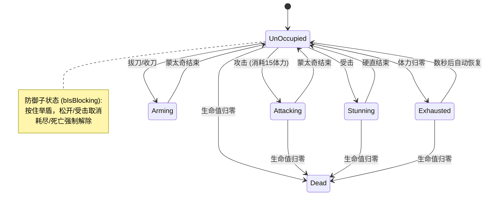
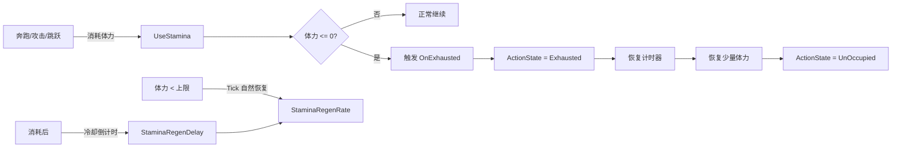
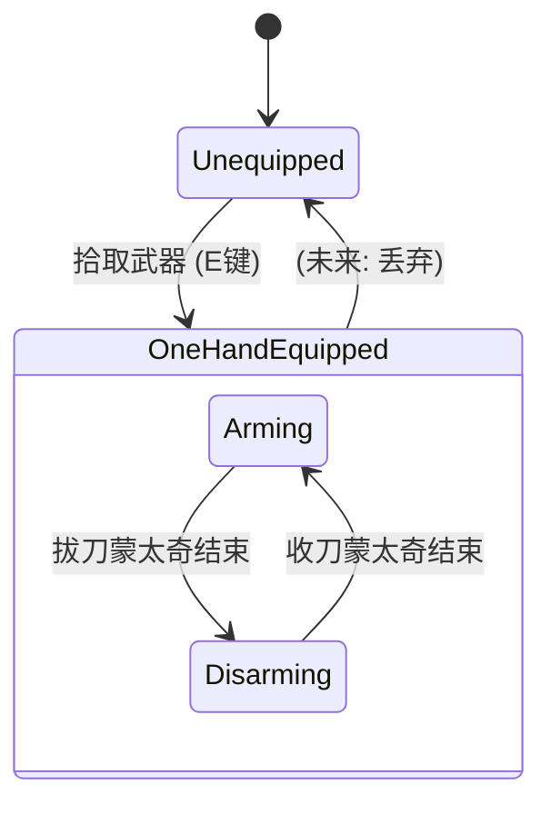
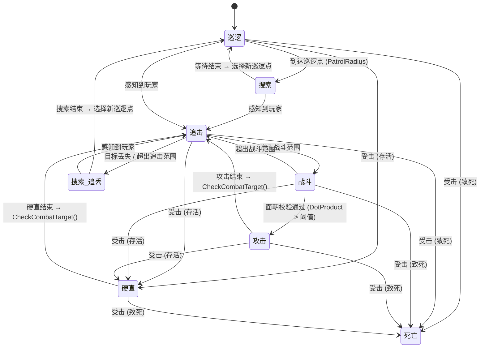
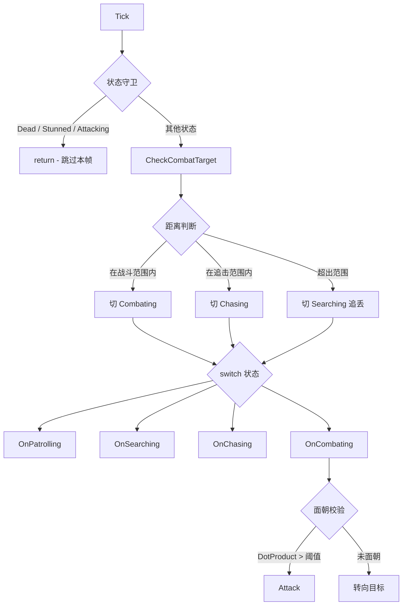
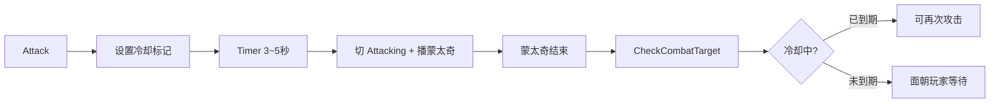

# Test: UE5 Action Combat Prototype

[English](#english) | [中文](#中文)

---

## English Version

An advanced Action-RPG prototype built with **Unreal Engine 5.7** and **C++**, focusing on high-performance character movement, state-driven combat, and modular gameplay systems.

### 🏗 Project Architecture
The project follows a decoupled, component-based architecture to ensure scalability and maintainability.

1. **Core Gameplay Framework**
   - **Character Layer**: Custom `AMyCharacter` implementing complex locomotion and combat states.
   - **Controller Layer**: Enhanced Input driven `ACharacterController` managing mapping contexts and action triggers.
   - **Attribute System**: A standalone `UAttributeComponent` managing health, stamina, and progression data.

2. **Interaction & Combat**
   - **Weapon System**: Frame-accurate collision detection using sweep-based box tracing. Supports `EquipRotationOffset` for weapon model orientation correction.
   - **Interface-Driven Interaction**: Uses `IHitInterface` to handle combat interactions across different actor types.
   - **Enemy AI**: Full `EEnemyState` FSM with perception, facing verification before attack, attack cooldown system, and 2D BlendSpace-driven locomotion. See [State Machine Flow](#state-machine-flow) below.
   - **Combat Distance System**: Three radii (`ChasingRadius`/`CombatingRadius`/`PatrolRadius`) control AI behavior transitions, with `AcceptanceRadius` compensating for target capsule radius.
   - **Shield Blocking System**: Hold-to-block defense via `IBlockableInterface`. DotProduct angle check (default ±60°) determines if an incoming attack is within block arc. Successful block reduces damage by configurable percentage (default 80% via `BlockedDamageMultiplier`), costs stamina, and skips hit-react. Supports auto-resume after interruption, air-block prevention, and exhaustion-forced unblock.
   - **Hit Feedback System**: Two-layer victim-side feedback: (1) Screen edge red vignette flash — programmatic 256x256 texture generated via edge-distance formula with smoothstep, intensity scales with damage reduction rate (full flash on unblocked, scaled on partial block, none on 100% block). Fade-in + exponential decay curve for natural feel. (2) Camera shake on hit-react path via `ClientStartCameraShake`.
   - **Hit Knockback System**: Tick-driven displacement on hit, distance scaled by damage reduction rate (Player=10cm, Enemy=5cm). Uses `PendingHitContext` written by weapon hit chain to decouple knockback from stun/block state. Quadratic ease-out curve for natural deceleration. `AddActorWorldOffset` with sweep prevents wall penetration; actual displacement tracked to handle partial blocks. Same-team hits trigger knockback but no damage.

### 🧠 Key Technical & Algorithmic Highlights

- **Precise Collision Sweeping**: Implements **Box Trace Sweep** between `OldCenter` and `CurrentCenter` to prevent "ghost swings" at high speeds.
- **Directional Locomotion**: Uses `DotProduct(Velocity, ActorForward)` to scale speed: Forward (1.0x), Strafe (0.8x), Backwards (0.65x).
- **Health Buffer Visuals**: Implements a delayed buffer bar effect for better visual clarity on damage received.
- **Enemy Attack Pipeline**: Combat state facing verification (DotProduct ±15°) before attack, with full movement lock during attack montage.
- **Upper Body Animation Layering**: Layered Blend Per Bone + Slot node for weapon arming/disarming while moving, controlled by transient `bIsArming` state.
- **Shield Blocking Algorithm**: Block check executes after weapon trace hits but before damage is applied. Uses `DotProduct(character forward, to-attacker)` vs `Cos(BlockHalfAngleDegrees)` for arc detection. Stamina cost scales with damage. Successful block reduces damage by configurable percentage (default 80%) and suppresses hit-react. Exhaustion triggers synchronous block-break via `OnExhausted` delegate chain.
- **Hit Feedback Visuals**: Edge vignette uses `UTexture2D::CreateTransient` to procedurally generate a 256x256 RGBA texture. Alpha formula: `EdgeDist = Min(U, 1-U, V, 1-V)` (distance to nearest screen edge), then smoothstep interpolation within configurable `VignetteFadeWidth` (default 0.2 = outer 20%). Flash intensity scales via `LastDamageFlashScale` (set by `TryBlockHit`, consumed by `SetHealthPercent`, zero-damage fallback in `TakeDamage`). Decay uses exponential falloff `pow(0.01, dt/Duration)` for natural trailing.
- **Hit Knockback Algorithm**: Tick-driven `AddActorWorldOffset` with quadratic ease-out (`1 - (1-α)²`). Distance = `BaseHitKnockbackDistance * KnockbackScale` where Scale = `DamageAfterBlock / Damage`. Wall collision handled by tracking actual displacement via `FVector::Dist2D(OldLocation, NewLocation)` instead of target distance. `PendingHitContext` pattern: weapon writes context → `GetHit` consumes knockback → subclass reads bApplyStun → subclass clears context. Zero-scale hits clear active knockback state, ensuring new hits always override.

---

## 中文版本

这是一个基于 **Unreal Engine 5.7** 和 **C++** 开发的高级动作角色扮演游戏（ARPG）原型，核心侧重于高性能角色移动、状态驱动战斗系统以及模块化玩法架构。

### 🏗 项目架构
项目采用解耦的组件化架构，以确保系统的可扩展性和可维护性。

1. **核心玩法框架**
   - **角色层 (Character)**：自定义 `AMyCharacter` 类，实现了复杂的运动学逻辑与战斗状态机。
   - **控制器层 (Controller)**：基于增强输入（Enhanced Input）的 `ACharacterController`，管理映射上下文与动作触发。
   - **属性系统 (Attribute)**：独立的 `UAttributeComponent` 负责生命值、金币等数据管理，与表现层完全解耦。

2. **交互与战斗系统**
   - **武器系统**：通过记录前一帧位置并进行盒体扫掠（Box Trace Sweep），实现跨帧的精确碰撞检测，消除高速挥砍时的漏判。支持装备旋转偏移（`EquipRotationOffset`）修正不同武器模型的朝向差异。
   - **接口驱动交互**：利用 `IHitInterface` 统一处理不同类型 Actor（敌人、可破坏物）的受击效果、粒子与音效。
   - **敌人 AI**：基于 `EEnemyState` 状态机，支持完整的战斗流程：感知追击 → 面朝校验 → 攻击 → 冷却等待 → 硬直恢复。巡逻阶段使用平滑旋转张望，追击阶段使用 2D BlendSpace（Speed × Direction）驱动移动动画。攻击冷却从攻击开始计算，让追击时间重叠冷却，体感更紧凑。
   - **战斗距离系统**：三个半径（`ChasingRadius`/`CombatingRadius`/`PatrolRadius`）控制 AI 行为切换，`MoveToTarget` 的 `AcceptanceRadius` 补偿目标胶囊体半径以精确停在战斗范围内。
   - **盾牌防御系统**：基于 `IBlockableInterface` 的格挡判定，按住按键举盾，通过 DotProduct 角度检测判断攻击是否在格挡范围内（默认 ±60°），成功格挡按可配置比例减伤（默认 80%，`BlockedDamageMultiplier`）并消耗体力，跳过受击硬直。支持中断自动恢复、空中禁止防御、体力耗尽强制解除等边界处理。
   - **受击视觉反馈系统**：双层受击方反馈——(1) 屏幕边缘红晕闪烁，程序化生成 256×256 边缘距离渐变纹理（smoothstep），强度按减伤率缩放（未格挡=满闪，部分格挡=缩放，100%格挡=不闪），渐入 + 指数衰减曲线模拟自然冲击余韵；(2) 受击相机晃动，仅在 `GetHit` 受击反应路径触发，致死一击也有反馈。
   - **受击后退系统**：Tick 驱动位移，距离按减伤率缩放（玩家=10cm，敌人=5cm）。通过 `PendingHitContext` 模式将后退与硬直/格挡状态解耦——武器命中链写入上下文，`GetHit` 统一消费。Quadratic ease-out 曲线（`1 - (1-α)²`）实现先快后慢的自然减速。`AddActorWorldOffset` 带 sweep 防穿墙，撞墙时按实际位移累计保留剩余距离。同阵营命中触发后退但不扣血。

3. **环境与效果**
   - **破碎系统**：集成 Chaos 物理几何体集（Geometry Collections），实现环境的真实破坏效果。
   - **程序化生成 (PCG)**：利用 PCG 图表动态生成竞技场环境与地物布局。

### 🔄 主角状态机流转图 / Player State Machine Flow

**动作状态 (`EActionState`)**

| 状态 | 说明 |
|------|------|
| `EAS_UnOccupied` | 正常态，可移动/攻击/跳跃/奔跑/防御（防御为子状态，用 `bIsBlocking` 标志） |
| `EAS_Attacking` | 攻击蒙太奇播放中，锁定攻击输入 |
| `EAS_Arming` | 拔刀/收刀蒙太奇播放中 |
| `EAS_Stunning` | 受击硬直，短暂锁定 |
| `EAS_Exhausted` | 体力耗尽，只能行走，数秒后恢复 |
| `EAC_Dead` | 死亡，关闭碰撞与移动 |

**体力系统 (`Stamina`)**

**武器装备状态 (`EWeaponState` + `EArmWeaponState`)**

### 🧠 核心技术与算法亮点

- **精确碰撞扫掠 (Weapon System)**
  为了防止在低帧率或高速挥剑时武器穿模而不产生判定，系统实现了**盒体扫掠检测**。通过计算刀刃在相邻两帧之间的中心位移路径，进行 `BoxTraceSingle` 判定，确保 100% 的命中可靠性。

- **方向敏感型运动算法 (Directional Locomotion)**
  移动速度并非固定值，而是根据移动方向与角色正前方的夹角动态缩放：
  - **算法**：`FVector::DotProduct(速度, 角色前方)`。
  - **正向移动 (>0.8)**：全速运行 (默认 300 / 冲刺 450)。
  - **横向平移 (-0.2 到 0.2)**：速度降至基准的 80%。
  - **后退移动 (<-0.8)**：速度降至基准的 65%，模拟真实的负重感。

- **血条缓冲视觉逻辑 (Health Buffer)**
  UI 实现了现代动作游戏中常见的”残影血条”效果：受击时主血条立即扣除，缓冲条经过短暂延迟后通过 `FMath::FInterpTo` 平滑追随，增强了受击时的视觉冲击力。

- **敌人攻击流水线 (Enemy Attack Pipeline)**
  战斗状态下先通过 `DotProduct` 校验面朝角度（±15°），满足条件才触发攻击。攻击蒙太奇期间完全锁定移动与旋转，结束后回到追击状态重新逼近。

- **上半身动画分层 (Upper Body Animation Layering)**
  通过 Layered Blend Per Bone + Slot 节点实现移动中拔刀/收刀动画，由瞬态变量 `bIsArming` 控制混合权重，与持久状态 `ArmWeaponState` 分离。

- **盾牌格挡算法 (Shield Blocking)**
  防御判定在 `ExecuteWeaponTrace` 命中后、`ApplyDamage` 前执行。通过 `DotProduct(角色前方, 到攻击者方向)` 与 `Cos(BlockHalfAngleDegrees)` 比较判断角度范围，体力不足时格挡自动失败。成功格挡按可配置比例减伤（默认 80%）并跳过受击硬直，体力耗尽触发同步掉盾。

- **受击视觉反馈 (Hit Feedback Visuals)**
  边缘红晕通过 `UTexture2D::CreateTransient` 程序化生成 256×256 RGBA 纹理，Alpha 公式：`EdgeDist = Min(U, 1-U, V, 1-V)`（到最近屏幕边缘的距离），在可配置的 `VignetteFadeWidth`（默认 0.2 = 外围 20%）范围内 smoothstep 插值。闪烁强度通过 `LastDamageFlashScale` 缩放（`TryBlockHit` 设置 → `SetHealthPercent` 消费 → `TakeDamage` 零伤害兜底归位）。衰减采用指数曲线 `pow(0.01, dt/Duration)`，前快后慢自然拖尾。

- **受击后退算法 (Hit Knockback)**
  Tick 驱动 `AddActorWorldOffset`，使用 quadratic ease-out 曲线（`1 - (1-α)²`）实现先快后慢位移。距离 = `BaseHitKnockbackDistance × KnockbackScale`，其中 Scale = `DamageAfterBlock / Damage`。撞墙处理：通过 `FVector::Dist2D(OldLocation, NewLocation)` 累计实际位移而非目标位移，保留剩余距离。`PendingHitContext` 模式：武器写入上下文 → `GetHit` 消费后退 → 子类读取 bApplyStun → 子类清理上下文。零缩放命中清空旧 knockback 状态，确保新命中总是覆盖旧的。

---

## 🔄 敌人状态机流转图 / Enemy State Machine Flow

### 状态总览 / States

| 状态 | 说明 |
|------|------|
| `EES_UnOccupied` | 初始状态，第一帧自动转为 Patrolling |
| `EES_Patrolling` | 在巡逻点之间移动，到达后进入 Searching |
| `EES_Searching` | 到达巡逻点后张望等待，或追丢目标后到最后已知位置搜索 |
| `EES_Chasing` | 追击玩家，持续导航 |
| `EES_Combating` | 进入战斗范围，面朝校验后攻击 |
| `EES_Attacking` | 攻击蒙太奇播放中，锁定移动 |
| `EES_Stunned` | 受击硬直，锁定移动 |
| `EES_Dead` | 死亡演出，清理所有资源 |

### 流转图 / Flow Diagram

### Tick 每帧流程

### 攻击冷却机制

### 关键方法职责 / Key Method Responsibilities

| 方法 | 调用时机 | 职责 |
|------|----------|------|
| `Tick()` | 每帧 | 守卫 + CheckCombatTarget + 状态 Tick |
| `CheckCombatTarget()` | Tick / 蒙太奇结束 | 根据距离决定 Patrolling/Chasing/Combating |
| `SetEnemyState()` | 状态切换时 | 退出旧状态清理 + 进入新状态初始化 |
| `Attack()` | Combating 状态下面朝目标 | 启动冷却 + 切 Attacking + 播蒙太奇 |
| `TakeDamage()` | 被攻击时 | 扣血 + 切 Dead（硬直由 GetHit 按 bApplyStun 控制） |
| `Die()` | 进入 Dead 状态 | 清 Timer + 停移动 + 关碰撞 + 播死亡动画 |

---

## 🚀 快速上手 / Getting Started

### 环境要求 (Requirements)
- **Unreal Engine 5.7+**
- **Visual Studio 2022** (需安装 C++ 游戏开发负载)

### 安装步骤 (Installation)
1. 将仓库克隆至你的虚幻项目文件夹。
2. 右键点击 `Test.uproject` -> **Generate Visual Studio project files**。
3. 打开 `Test.sln` 并编译 (Development Editor 模式)。
4. 通过 `Test.uproject` 启动编辑器。
