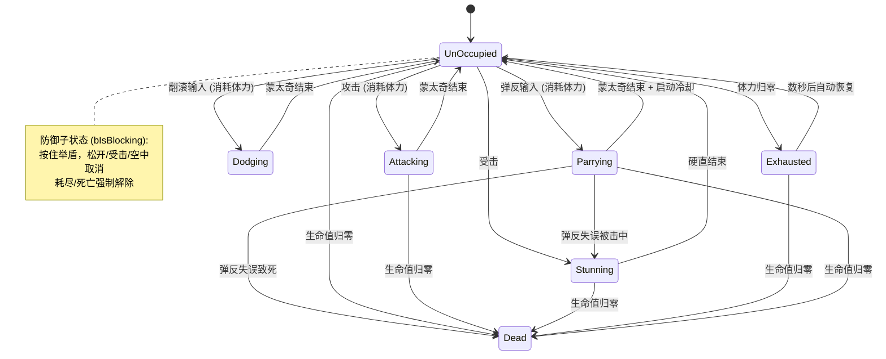
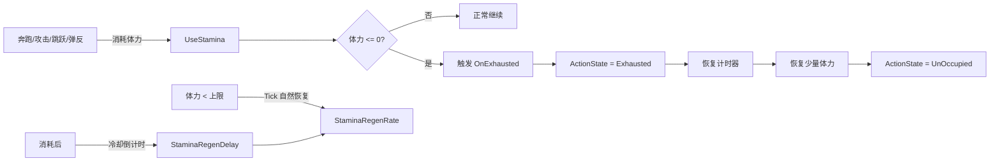
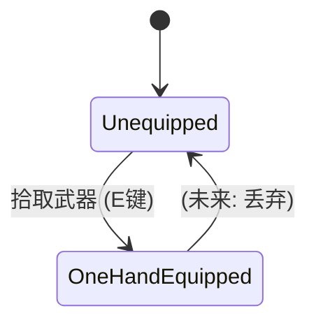
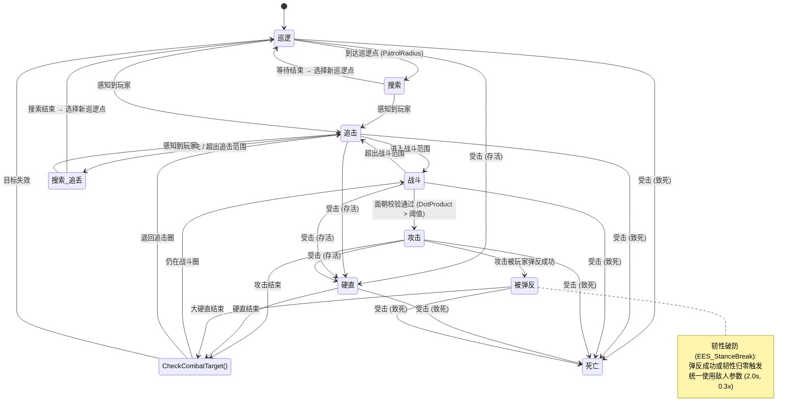
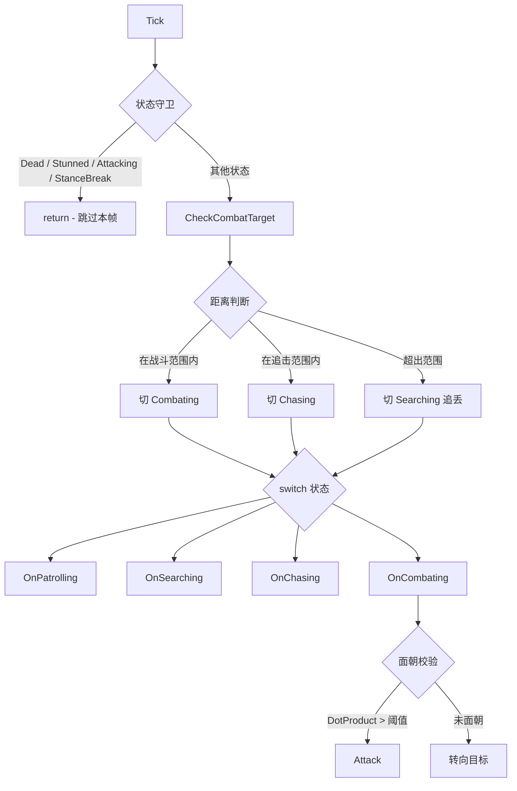
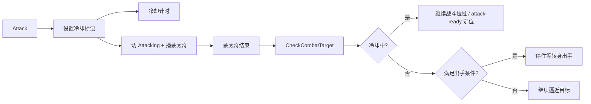

# UE5-Soulslike-Combat

[English](#english) | [中文](#中文)

---

## English Version

An advanced Action-RPG prototype built with **Unreal Engine 5.7** and **C++**, focusing on high-performance character movement, state-driven combat, and modular gameplay systems.

### 🏗 Project Architecture
The project follows a decoupled, component-based architecture to ensure scalability and maintainability.

1. **Core Gameplay Framework**
   - **Character Layer**: Custom `AMyCharacter` implementing complex locomotion and combat states.
   - **Controller Layer**: Enhanced Input driven `ACharacterController` managing mapping contexts and action triggers.
   - **Attribute System**: A standalone `UAttributeComponent` managing health, stamina, gold, and regen-related runtime data.

2. **Interaction & Combat**
   - **Weapon System**: Frame-accurate collision detection using sweep-based box tracing. Supports `EquipRotationOffset` for weapon model orientation correction.
   - **Interface-Driven Interaction**: Uses `IHitInterface` to handle combat interactions across different actor types.
   - **Enemy AI**: Full `EEnemyState` FSM with perception, facing verification before attack, attack cooldown system, and 2D BlendSpace-driven locomotion. During attack cooldown, enemies actively manage spacing — retreating when too close, strafing laterally within the preferred ring, and pressing forward when at the edge. Attack-ready pursuit uses dynamic `SetGoalActor` tracking to continuously follow the moving player, while cooldown spacing uses static point MoveTo with randomized intervals. See [State Machine Flow](#state-machine-flow) below.
   - **Hearing Perception System**: AI enemies can detect player movement and actions through sound. Walk is silent (stealth), Run emits 500cm range noise, Sprint emits 600cm range noise. Attack (800cm) and Dodge (400cm) emit single-shot noise events. Movement noise uses a 0.5s looping timer managed by the Controller, automatically stopped during stun/dodge/death and resumed after recovery. Enemy `HearingRange` is configurable per-instance (default 800cm). Debug visualization shows orange spheres at noise emission points.
   - **Enemy Attack Coordination System**: Prevents multiple enemies from attacking simultaneously, creating a strategic "take turns" combat feel. Before attacking, enemies check if nearby allies (within `AttackCoordinationRange`, default 800cm) are in `EES_Attacking` state. If allies are attacking, the enemy extends its own attack cooldown to "max ally remaining time + buffer time" (clamped to `MaxAttackCoordinationWait`, default 3s). Uses traversal-based detection (`GetAllActorsOfClass`) suitable for small-scale demos (< 50 enemies). Coordination checks occur at two entry points: `OnCombating()` Tick (when `!bAttackOnCooldown`) and `OnAttackCooldownEnd()` callback (prevents small-window simultaneous attacks). Returns the **maximum remaining time** from all attacking allies to ensure 3+ enemy scenarios don't attack simultaneously. Coordinated waiting reuses the CD path, automatically triggering `HandleCooldownPositioning` spacing behavior. Debug visualization shows yellow "WaitAlly" text. Parameters: `AttackCoordinationRange` (800cm), `AttackCoordinationBuffer` (0.5s, 0.3=tight/0.5=natural/0.8=loose), `MaxAttackCoordinationWait` (3s, semantically distinct from `MaxAttackInterval`).
   - **Combat Distance System**: Enemy behavior is controlled by layered combat radii. Current default relationship is `CombatTooCloseRadius(90) < CombatAttackMaxRadius(170) <= CombatPreferredMinRadius(210) <= CombatPreferredMaxRadius(270) < CombatingRadius(300) < ChasingRadius(1000)`. `CombatAttackMaxRadius` is the real attack-start distance; `CombatPreferredMinRadius` / `CombatPreferredMaxRadius` define the cooldown spacing ring. Keep `CombatPreferredMaxRadius` below `CombatingRadius` so retreat/strafe targets do not immediately push the enemy back into `EES_Chasing`. Keep `CombatPressMargin(25)` greater than `CombatRepositionAcceptanceRadius(12)` so press movement cannot stop just outside attack range. Combat state exit uses hysteresis (`CombatingRadius + CombatExitBuffer`) to prevent boundary oscillation between Chasing and Combating.
   - **Lock-On System**: Middle-mouse lock-on built on Enhanced Input (`IA_LockOn` + `IMC_CharacterInput`). `UPlayerLockOnComponent` owns lock-on state, target scoring, and camera tunables, while `AMyCharacter` keeps all direct writes to control rotation, `CharacterMovement`, and `SpringArm`. Target selection filters living `AEnemy` actors by radius and camera-facing angle, then prefers the candidate closest to view center. While locked, look input is suppressed, enemy health bars stay visible, and the camera shifts into an over-the-shoulder view through `SpringArm->SocketOffset` interpolation. Normal lock-on movement keeps the character facing the target; holding Sprint with movement input enters a temporary free-run mode where the target and camera stay locked, but the character body faces the movement direction. During that free-run, the camera also adds a small movement-direction framing offset: strafe input shifts the shoulder laterally, backward input raises the camera, and backward pull-back remains available as an optional arm-length bonus with a default of `0`.
   - **Pause Menu System**: P-key pause menu (configurable to ESC) managed entirely at the Controller level. `ACharacterController` owns pause state (`bIsPaused`/`bCanPause`), widget cache, and input mode switching. `AMyCharacter` remains unaware of pause state. Widget uses `TSubclassOf<UPauseMenuWidget>` to support Blueprint subclass UI layouts. Focus management (`SetIsFocusable(true)` + `SetKeyboardFocus()`) ensures `NativeOnKeyDown` receives keyboard input under `FInputModeUIOnly`. Smart lock-on handling on pause: checks rotation completion (angle delta < 1° keeps lock, ≥ 1° clears lock) with `IsValid()` guard to prevent `pendingKill` target crashes. Death timing: `Die()` calls `ClearPauseIfActive()` + `SetCanPause(false)` at the very beginning to restore game state before death presentation. `MyCharacter::Tick()` guards with `CC->IsPaused()` early-return to skip all gameplay logic. Recovery path unified via `ClearPauseIfActive()` calling `TogglePause()` to avoid duplicate restoration logic.
   - **Shield Blocking & Parry System**: Hold-to-block defense and timed parry via `IBlockableInterface`. **Blocking**: DotProduct angle check (default ±45°) determines if an incoming attack is within block arc. Successful block reduces damage by configurable percentage (default 95% via `BlockedDamageMultiplier`), costs stamina proportional to damage, and skips hit-react. Supports auto-resume after interruption, air-block prevention, and exhaustion-forced unblock. **Parrying**: Separate input triggers a short animation with an active window marked by `UAnimNotifyState_ParryActive`. Successful parry within the window (same angle check as blocking) costs fixed stamina (default 15), grants 100% damage immunity, and instantly depletes the attacker's poise to trigger stance break (`EES_StanceBreak`) with slowed animation playback (using enemy parameters: default 0.3x speed for 2.0s). Parry has a hidden cooldown (default 0.4s) after animation ends to prevent spam.
   - **Poise & Stance Break System**: Dark Souls-style hidden poise bar system. Enemies have a poise pool (default 10 points) that depletes on each hit. Poise damage follows the same multiplier pattern as regular damage: `BasePoiseDamage × Multiplier` (combo 1st: 1.0x, 2nd: 1.5x, 3rd: 2.0x; sprint attack: 2.0x). When poise reaches zero, the enemy enters `EES_StanceBreak` state — a long stagger with slowed animation (using enemy parameters: default 0.3x speed for 2.0s). Poise auto-resets to full after not being hit for `PoiseResetDelay` seconds (default 5s). Successful parry instantly depletes attacker poise to trigger stance break. Uses deferred flag-based triggering (`bPendingStanceBreak`) to prevent state overwrites: poise damage is applied before `GetHit()`, flag is checked after `GetHit()`, ensuring `EES_StanceBreak` correctly overrides `EES_Stunned`. Stance break parameters (duration/playrate) are unified — both parry and normal poise break use enemy's own parameters, allowing different enemy types to have different stance break characteristics.
   - **Dodge Roll System**: Space-key dodge with root motion-driven displacement and full invulnerability frames. **Unlocked**: character turns toward input direction, always plays `Dodge_F` forward roll. **Lock-On**: directional dodge using section selection — forward (`Dodge_F`), left (`Dodge_L`), right (`Dodge_R`), or backward (180° turn + `Dodge_F`). Section selection converts world-space movement input to character-local space via `UnrotateVector`, with a 0.3 threshold to prevent diagonal misclassification. Dodge costs 15 stamina, interrupts block/parry, and locks rotation during playback. Invulnerability is driven by `UAnimNotifyState_DodgeInvulnerable` covering the full montage, with guards in both `GetHit_Implementation()` and `TakeDamage()`. Rotation mode is restored via `RestoreRotationMode()` on montage end.
   - **Sprint Attack System**: Dedicated high-damage attack triggered during sprint + movement input + weapon equipped + grounded. Configured via `UAttackConfigDataAsset`. Uses independent sprint montage with configurable damage multiplier (default 1.8x), poise damage multiplier (default 2.0x), and stamina cost (default 25). Supports both locked and unlocked states, always attacks toward movement direction. Sprint attack has priority over normal/charged attack input, does not chain into combo system, reuses `OnAttackMontageEnded`, stops sprinting after attack, clears stale combo state, and supports stamina overdraft.
   - **Charged Attack System**: Hold attack input past `ChargeInputThreshold` (default 0.2s) to enter a charged montage, release to jump to the hard-coded `Release` section. Charged attack data lives in `UAttackConfigDataAsset::ChargedAttack` (`FChargedAttackConfig`), separate from `SpecialAttacks`, with montage, stamina cost, max damage/poise multipliers, and min/max charge hold times. The charged montage must preserve section names `Default` and `Release`; a common setup is `Default -> Loop`, `Loop -> Loop`, `Release -> None`. UE Montage sections are start markers, so `Release` can bound the loop without being entered until C++ calls `Montage_JumpToSection("Release")`. Use in-place/no-root-motion hold clips for the loop and put weapon collision notifies on the release section.
   - **Data-Driven Combo System**: Multi-segment light attack combo chain configured via `UComboDataAsset`, managed by `UAttackConfigDataAsset` for unified attack configuration. The input window is driven by `UAnimNotifyState_ComboWindow` in the animation montage. If the attack key is pressed inside the active window, the input is buffered before charged-attack timing starts, and the next segment triggers automatically on montage end with scaled stamina costs, damage multipliers (e.g. 1.0x → 1.2x → 1.5x), and poise damage multipliers (e.g. 1.0x → 1.5x → 2.0x). Any interruption (getting hit, death, exhaustion, dodging) immediately resets the combo chain and multipliers. `AttackConfigDataAsset` uses `TArray<FSpecialAttackConfig>` with `enum class ESpecialAttackType` for sprint/jump-style special attacks, while charged attack uses the dedicated `FChargedAttackConfig`.
   - **Attack Hyper Armor System**: During the weapon collision window (`AnimNotifyState_WeaponCollision`), the player gains hyper armor — incoming hits still deal damage, apply knockback, trigger camera shake, and play hit effects, but do not interrupt the attack animation or force stun state. The `bAttackHyperArmor` flag is set on `NotifyBegin` and cleared on `NotifyEnd`. `GetHit_Implementation()` checks this flag before calling `Super`, manually replicating necessary logic (knockback, effects, camera shake) while skipping `DirectionalHitReact()` to prevent hit-react montage from overriding the attack montage. If the attack montage is interrupted by other means (e.g., death), `OnAttackMontageEnded(bInterrupted=true)` ensures `ActionState` is restored to prevent being stuck in `EAS_Attacking`.
   - **Hit Feedback System**: Two-layer victim-side feedback: (1) Screen edge red vignette flash — programmatic 256x256 texture generated via edge-distance formula with smoothstep, intensity scales with damage reduction rate (full flash on unblocked, scaled on partial block, none on 100% block). Fade-in + exponential decay curve for natural feel. (2) Camera shake on hit-react path via `ClientStartCameraShake`.
   - **Hit Knockback System**: Tick-driven displacement on hit, distance scaled by damage reduction rate (Player=10cm, Enemy=5cm). Uses `PendingHitContext` written by weapon hit chain to decouple knockback from stun/block state. Quadratic ease-out curve for natural deceleration. `AddActorWorldOffset` with sweep prevents wall penetration; actual displacement tracked to handle partial blocks. Same-team hits trigger knockback but no damage.

### 🧠 Key Technical & Algorithmic Highlights

- **Precise Collision Sweeping**: Implements **Box Trace Sweep** between `OldCenter` and `CurrentCenter` to prevent "ghost swings" at high speeds.
- **Directional Locomotion**: Free movement uses the base walk/run/sprint speeds directly. Ordinary lock-on combat steps use `DotProduct(Velocity, ActorForward)` to interpolate from forward speed through configurable strafe/back multipliers (`LockOnStrafeSpeedMultiplier`, `LockOnBackSpeedMultiplier`). Lock-on Sprint free-run bypasses that combat-step slowdown so any movement direction can sprint while the camera remains locked to the enemy.
- **Health Buffer Visuals**: Implements a delayed buffer bar effect for better visual clarity on damage received.
- **Lock-On Camera Framing**: Uses `SpringArm->SocketOffset` interpolation to shift the camera into a right-shoulder view while preserving the existing controller-driven yaw lock. Non-lock camera offset and arm length are both cached from the live SpringArm values at `BeginPlay()`, so Blueprint overrides remain the source of truth. Lock-on Sprint free-run layers a small controller-local input driven camera offset on top of the base shoulder framing, with optional backward arm-length pull-back left at `0` by default.
- **Enemy Attack Pipeline**: Combat state facing verification (DotProduct ±15°) before attack, with full movement lock during attack montage.
- **Shield Blocking Algorithm**: Block check executes after weapon trace hits but before damage is applied. Uses `DotProduct(character forward, to-attacker)` vs `Cos(BlockHalfAngleDegrees)` for arc detection. Stamina cost scales with damage. Successful block reduces damage by configurable percentage (default 95%) and suppresses hit-react. Exhaustion triggers synchronous block-break via `OnExhausted` delegate chain.
- **Parry & Poise Break Algorithm**: Parry success instantly depletes attacker poise via `ApplyPoiseDamage(GetCurrentPoise())`, triggering stance break. Normal hits accumulate poise damage using `BasePoiseDamage × Multiplier` pattern (combo 1st: 1.0x, 2nd: 1.5x, 3rd: 2.0x). Poise depletion sets `bPendingStanceBreak` flag; flag is checked after `GetHit()` to trigger `ApplyStanceBreak()`, preventing `EES_StanceBreak` from being overwritten by `EES_Stunned`. Stance break parameters (duration/playrate) are unified — both parry and normal poise break use enemy's own parameters (`Enemy->StanceBreakDuration/PlayRate`), allowing different enemy types to have different stance break characteristics. Poise auto-resets to full after `PoiseResetDelay` seconds (default 5s) of not being hit.
- **Directional Dodge Section Selection**: During lock-on, `SelectDodgeSection()` converts world-space movement input to character-local space (`GetActorRotation().UnrotateVector()`) and selects the montage section: `|Y| > |X|` and `|Y| > 0.3` → `Dodge_L`/`Dodge_R` (side), `X > 0.3` → `Dodge_F` (forward), otherwise → `Dodge_B` (backward, converts to 180° turn + `Dodge_F`). Non-lock-on always uses `Dodge_F`. Section selection runs **before** `FaceDirection2D()` to avoid corrupting the local-space reference frame.
- **Hit Feedback Visuals**: Edge vignette uses `UTexture2D::CreateTransient` to procedurally generate a 256x256 RGBA texture. Alpha formula: `EdgeDist = Min(U, 1-U, V, 1-V)` (distance to nearest screen edge), then smoothstep interpolation within configurable `VignetteFadeWidth` (default 0.2 = outer 20%). Flash intensity scales via `LastDamageFlashScale` (set by `TryBlockHit`, pushed by `TakeDamage()` through `SetPendingDamageFlashScale(...)`, and consumed only when `SetHealthPercent()` sees a real health drop). Decay uses exponential falloff `pow(0.01, dt/Duration)` for natural trailing.
- **Hit Knockback Algorithm**: Tick-driven `AddActorWorldOffset` with quadratic ease-out (`1 - (1-α)²`). Distance = `BaseHitKnockbackDistance * KnockbackScale` where Scale = `DamageAfterBlock / Damage`. Wall collision handled by tracking actual displacement via `FVector::Dist2D(OldLocation, NewLocation)` instead of target distance. `PendingHitContext` pattern: weapon writes context → `GetHit` consumes knockback → subclass reads bApplyStun → subclass clears context. Zero-scale hits clear active knockback state, ensuring new hits always override.

---

## 中文版本

这是一个基于 **Unreal Engine 5.7** 和 **C++** 开发的高级动作角色扮演游戏（ARPG）原型，核心侧重于高性能角色移动、状态驱动战斗系统以及模块化玩法架构。

### 🏗 项目架构
项目采用解耦的组件化架构，以确保系统的可扩展性和可维护性。

1. **核心玩法框架**
   - **角色层 (Character)**：自定义 `AMyCharacter` 类，实现了复杂的运动学逻辑与战斗状态机。
   - **控制器层 (Controller)**：基于增强输入（Enhanced Input）的 `ACharacterController`，管理映射上下文与动作触发。
   - **属性系统 (Attribute)**：独立的 `UAttributeComponent` 负责生命值、体力、金币与恢复状态等运行时数据管理，与表现层完全解耦。

2. **交互与战斗系统**
   - **武器系统**：通过记录前一帧位置并进行盒体扫掠（Box Trace Sweep），实现跨帧的精确碰撞检测，消除高速挥砍时的漏判。支持装备旋转偏移（`EquipRotationOffset`）修正不同武器模型的朝向差异。
   - **接口驱动交互**：利用 `IHitInterface` 统一处理不同类型 Actor（敌人、可破坏物）的受击效果、粒子与音效。
   - **敌人 AI**：基于 `EEnemyState` 状态机，支持完整的战斗流程：感知追击 → 面朝校验 → 攻击 → 冷却等待 → 硬直恢复。巡逻阶段使用平滑旋转张望，追击阶段使用 2D BlendSpace（Speed × Direction）驱动移动动画。攻击冷却从攻击开始计算，让追击时间重叠冷却，体感更紧凑。冷却期间敌人主动管理距离——过近时后撤，合适距离时侧移绕位，边缘时前压逼近。攻击就绪时改用动态 `SetGoalActor` 追踪持续逼近移动中的玩家，冷却期拉扯则使用静态点位 MoveTo + 随机间隔节流。
   - **听觉感知系统**：AI 敌人可通过声音感知玩家移动和动作。步行静音（潜行），跑步发出 500cm 范围噪音，冲刺发出 600cm 范围噪音。攻击（800cm）和翻滚（400cm）发出单次噪音事件。移动噪音使用 0.5 秒循环定时器，由 Controller 管理，硬直/翻滚/死亡时自动停止，恢复后重启。敌人 `HearingRange` 可按实例配置（默认 800cm）。调试可视化在噪音发射点显示橙色球体。
   - **敌人攻击协调系统**：防止多个敌人同时攻击，实现策略性的"轮流攻击"战斗体验。敌人攻击前检查附近队友（`AttackCoordinationRange` 范围内，默认 800cm）是否处于 `EES_Attacking` 状态。如果有队友正在攻击，则延长自己的攻击冷却到"队友最大剩余时间 + 缓冲时间"（截断到 `MaxAttackCoordinationWait`，默认 3 秒）。使用遍历检测（`GetAllActorsOfClass`），适合小规模 demo（< 50 个敌人）。协调检查发生在两个入口：`OnCombating()` Tick（当 `!bAttackOnCooldown` 时）和 `OnAttackCooldownEnd()` 回调（防止小窗口同时攻击）。返回**所有攻击中队友的最大剩余时间**，确保 3+ 敌人场景不会同时攻击。协调等待复用 CD 路径，自动触发 `HandleCooldownPositioning` 拉扯行为。调试可视化显示黄色 "WaitAlly" 文字。参数：`AttackCoordinationRange`（800cm）、`AttackCoordinationBuffer`（0.5s，0.3=紧凑/0.5=自然/0.8=宽松）、`MaxAttackCoordinationWait`（3s，与 `MaxAttackInterval` 语义不同）。
   - **战斗距离系统**：敌人战斗距离由多层半径控制。当前默认关系是 `CombatTooCloseRadius(90) < CombatAttackMaxRadius(170) <= CombatPreferredMinRadius(210) <= CombatPreferredMaxRadius(270) < CombatingRadius(300) < ChasingRadius(1000)`。`CombatAttackMaxRadius` 是真正允许出手的距离；`CombatPreferredMinRadius` / `CombatPreferredMaxRadius` 是攻击冷却期想保持的距离环。`CombatPreferredMaxRadius` 必须小于 `CombatingRadius`，否则敌人后撤或侧移到目标距离后会立刻离开 `EES_Combating`，切回 `EES_Chasing`。`CombatPressMargin(25)` 必须大于 `CombatRepositionAcceptanceRadius(12)`，否则前压可能停在攻击范围边缘外。战斗状态退出使用滞后半径（`CombatingRadius + CombatExitBuffer`）防止 Chasing/Combating 边界抖动。
   - **锁定系统**：基于增强输入的中键锁定（`IA_LockOn` + `IMC_CharacterInput`）。`UPlayerLockOnComponent` 持有锁定状态、目标评分和相机调参，`AMyCharacter` 继续负责控制旋转、`CharacterMovement` 和 `SpringArm` 的实际写入。目标搜索会按半径、相机前方夹角过滤存活的 `AEnemy`，再优先选择更靠近视野中心的目标。锁定期间会屏蔽自由视角输入、保持敌人血条显示，并通过 `SpringArm->SocketOffset` 插值切到越肩视角。普通锁定移动让角色朝向目标；按住 Sprint 并有移动输入时进入临时 free-run，目标和相机仍锁敌，但角色身体朝移动方向奔跑。free-run 期间相机也会做小幅的运动方向构图补偿：侧移时横向挪肩，后撤时轻微抬高视角，后撤拉远作为可调项保留但默认 `0`。
   - **暂停菜单系统**：P 键暂停菜单（可配置为 ESC），完全由 Controller 级别管理。`ACharacterController` 持有暂停状态（`bIsPaused`/`bCanPause`）、Widget 缓存、输入模式切换，`AMyCharacter` 无感知。Widget 使用 `TSubclassOf<UPauseMenuWidget>` 支持蓝图子类 UI 布局。焦点管理（`SetIsFocusable(true)` + `SetKeyboardFocus()`）确保 `FInputModeUIOnly` 下 `NativeOnKeyDown` 能收到键盘输入。暂停时智能锁定处理：检查旋转完成度（角度差 < 1° 保持锁定，≥ 1° 清除锁定），带 `IsValid()` 守卫防止 `pendingKill` 目标崩溃。死亡时序：`Die()` 最前面调用 `ClearPauseIfActive()` + `SetCanPause(false)`，先恢复游戏状态再处理死亡演出。`MyCharacter::Tick()` 用 `CC->IsPaused()` 早退守卫跳过所有 gameplay 逻辑。恢复路径统一：`ClearPauseIfActive()` 调用 `TogglePause()` 避免重复恢复逻辑。
   - **药瓶/回复道具系统**：R 键喝药，出生自带 3 个药瓶，恢复 50% 生命值，2 秒冷却。使用 AnimNotify 驱动的两段式恢复（动画开头 25% + 中间 25%），被打断只保留已触发部分。无蒙太奇时 fallback 到立即恢复 50%。新增 `EAS_UsingPotion` 状态，体力耗尽时可喝药（`CanUsePotion` 允许 `EAS_Exhausted`）。喝药期间可移动但速度降低到步行速度 200，不暂停体力恢复（与攻击/翻滚区分，魂类设计：喝药是防御动作）。`HealFromPotion()` 带状态守卫防止蒙太奇被打断后残留 AnimNotify 触发恢复。`OnPotionMontageEnded()` 检查 `IsExhaustionTimerActive()` 恢复到正确状态。受击打断喝药（`GetHit` 调用 `InterruptPotion()`），`HandleExhausted()` 不打断喝药。喝药发出噪音（`PotionNoiseLoudness=0.5`, `PotionNoiseRange=500cm`）通知附近敌人。`UAttributeComponent` 管理药瓶数量并广播 `OnPotionCountChanged` delegate。HUD 左下角显示 "3/3" 格式，绑定 delegate 自动更新。
   - **盾牌防御与弹反系统**：基于 `IBlockableInterface` 的双层防御机制。**普通格挡**：按住按键举盾，成功格挡按可配置比例减伤（默认 95%）并按伤害比例消耗体力，跳过受击硬直。支持空中中断、体力耗尽强制解除、落地自动恢复。**弹反（Parrying）**：独立按键触发短暂动画，通过 `UAnimNotifyState_ParryActive` 标记激活窗口。窗口期内成功拦截且面向攻击者（DotProduct 检测，默认 ±45°）即可触发弹反，固定消耗体力（默认 15），实现 100% 免伤并瞬间清空攻击方韧性触发破防（`EES_StanceBreak` 状态，使用敌人参数：默认 2.0 秒，动画播放速率 0.3 倍慢放）。弹反动画结束后有隐形冷却（默认 0.4 秒）防止连续点按。
   - **韧性与破防系统**：类魂隐藏韧性条系统。敌人拥有韧性池（默认 10 点），每次受击扣除韧性伤害。韧性伤害遵循与普通伤害相同的倍率模式：`武器基础韧性伤害 × 倍率`（连招第 1 段 1.0x，第 2 段 1.5x，第 3 段 2.0x；冲刺攻击 2.0x）。韧性归零时敌人进入 `EES_StanceBreak` 状态——长时间硬直并慢放动画（使用敌人参数：默认 0.3x 速度持续 2.0 秒）。韧性在未受击 `PoiseResetDelay` 秒后自动恢复满值（默认 5 秒）。弹反成功会瞬间清空攻击方韧性触发破防。使用延迟 flag 触发机制（`bPendingStanceBreak`）防止状态覆盖：韧性伤害在 `GetHit()` 之前应用，flag 在 `GetHit()` 之后检查，确保 `EES_StanceBreak` 正确覆盖 `EES_Stunned`。破防参数统一——弹反和普通韧性破防都使用敌人自己的参数，允许不同敌人类型有不同的破防特性。
   - **翻滚闪避系统**：Space 键翻滚，根运动驱动位移，全程无敌帧覆盖。**非锁定**：角色转向输入方向，统一播放 `Dodge_F` 前滚。**锁定**：方向性翻滚 Section 选择——前滚（`Dodge_F`）、左滚（`Dodge_L`）、右滚（`Dodge_R`）、后退（180° 转身 + `Dodge_F`）。Section 判定通过 `UnrotateVector` 将世界空间输入转换到角色局部空间，阈值 0.3 防止斜向误判。翻滚消耗 15 体力，打断格挡/弹反，播放期间锁定旋转。无敌帧由 `UAnimNotifyState_DodgeInvulnerable` 覆盖全程，`GetHit_Implementation()` 和 `TakeDamage()` 双守卫保证免疫一切伤害。旋转模式通过 `RestoreRotationMode()` 在蒙太奇结束时恢复。
   - **冲刺攻击系统**：冲刺状态下按攻击键触发的高伤害独立攻击（冲刺 + 移动输入 + 已装备武器 + 地面）。通过 `UAttackConfigDataAsset` 配置。使用独立冲刺攻击蒙太奇，可配置伤害倍率（默认 1.8x）、韧性伤害倍率（默认 2.0x）、体力消耗（默认 25）。锁定和非锁定都支持，统一朝移动方向攻击。冲刺攻击优先级高于普通/蓄力攻击输入，不接入连招系统，复用 `OnAttackMontageEnded`，攻击后停止冲刺，清理旧连招状态，并支持体力透支。
   - **蓄力攻击系统**：按住攻击键超过 `ChargeInputThreshold`（默认 0.2 秒）进入蓄力蒙太奇，松开后跳转到硬编码的 `Release` Section。蓄力攻击数据位于 `UAttackConfigDataAsset::ChargedAttack`（`FChargedAttackConfig`），与 `SpecialAttacks` 分离，包含蒙太奇、体力消耗、最大伤害/韧性倍率、最小/最大蓄力时长。蓄力蒙太奇必须保留 `Default` 和 `Release` Section 名；常见配置是 `Default -> Loop`、`Loop -> Loop`、`Release -> None`。UE Montage Section 是起点标记，所以 `Release` 可以作为循环段边界，只有 C++ 调用 `Montage_JumpToSection("Release")` 时才会进入。蓄力循环建议使用无根运动的定格/短片段，武器碰撞 Notify 放在 Release 段。
   - **数据驱动连招系统**：多段轻攻击连招链通过 `UComboDataAsset` 定义，由 `UAttackConfigDataAsset` 统一管理攻击配置。连招输入有效窗口由动画蒙太奇中的 `UAnimNotifyState_ComboWindow` 标记。在窗口内按下攻击键时，输入会先被缓存，不会启动蓄力计时，并在当前动作播放完毕后自动衔接下一段。每段具有独立体力消耗、伤害倍率（如 1.0x → 1.2x → 1.5x）和韧性伤害倍率（如 1.0x → 1.5x → 2.0x）。受击、死亡、精疲力竭和翻滚等中断会重置连招和倍率。`AttackConfigDataAsset` 使用 `TArray<FSpecialAttackConfig>` 配合 `enum class ESpecialAttackType` 管理冲刺/跳跃类特殊攻击，蓄力攻击使用专用 `FChargedAttackConfig`。
   - **攻击霸体系统**：武器碰撞窗口期间（`AnimNotifyState_WeaponCollision`），玩家获得霸体效果——受击仍然扣血、击退、相机晃动、播放音效粒子，但不会打断攻击动画或进入硬直状态。`bAttackHyperArmor` 标志在 `NotifyBegin` 开启，`NotifyEnd` 关闭。`GetHit_Implementation()` 在调用 `Super` 之前检查此标志，霸体分支手动复制必要逻辑（击退、音效、相机晃动），跳过 `DirectionalHitReact()` 避免受击蒙太奇覆盖攻击蒙太奇。如果攻击蒙太奇被其他方式打断（如死亡），`OnAttackMontageEnded(bInterrupted=true)` 确保恢复 `ActionState`，防止卡在 `EAS_Attacking` 状态。
   - **受击视觉反馈系统**：双层受击方反馈——(1) 屏幕边缘红晕闪烁，程序化生成 256×256 边缘距离渐变纹理（smoothstep），强度按减伤率缩放（未格挡=满闪，部分格挡=缩放，100%格挡=不闪），渐入 + 指数衰减曲线模拟自然冲击余韵；(2) 受击相机晃动，仅在 `GetHit` 受击反应路径触发，致死一击也有反馈。
   - **受击后退系统**：Tick 驱动位移，距离按减伤率缩放（玩家=10cm，敌人=5cm）。通过 `PendingHitContext` 模式将后退与硬直/格挡状态解耦——武器命中链写入上下文，`GetHit` 统一消费。Quadratic ease-out 曲线（`1 - (1-α)²`）实现先快后慢的自然减速。`AddActorWorldOffset` 带 sweep 防穿墙，撞墙时按实际位移累计保留剩余距离。同阵营命中触发后退但不扣血。

3. **环境与效果**
   - **破碎系统**：集成 Chaos 物理几何体集（Geometry Collections），实现环境的真实破坏效果。
   - **程序化生成 (PCG)**：利用 PCG 图表动态生成竞技场环境与地物布局。

### 🔄 主角状态机流转图 / Player State Machine Flow

**动作状态 (`EActionState`)**

| 状态 | 说明 |
|------|------|
| `EAS_UnOccupied` | 正常态，可移动/攻击/跳跃/奔跑/防御/弹反/翻滚（防御为子状态，用 `bIsBlocking` 标志） |
| `EAS_Attacking` | 攻击蒙太奇播放中，锁定攻击输入 |
| `EAS_Stunning` | 受击硬直，短暂锁定 |
| `EAS_Exhausted` | 体力耗尽，只能行走，数秒后恢复 |
| `EAS_Parrying` | 弹反蒙太奇播放中，`bParryActive` 标记激活窗口 |
| `EAS_Dodging` | 翻滚闪避中，全程无敌帧覆盖，根运动驱动位移 |
| `EAS_Dead` | 死亡，关闭碰撞与移动 |

**体力系统 (`Stamina`)**

* **透支与恢复守卫 (Overdraft & Recovery Guard)**: 系统允许体力透支，透支触发的“最后一击”会正常播放蒙太奇以提供视觉反馈。`EAS_Stunning` 等高优先级状态可打断 `EAS_Exhausted`。在任何动作或硬直蒙太奇结束时，系统会检查疲惫计时器 (`IsExhaustionTimerActive()`)，若仍在疲惫期内则恢复到 `EAS_Exhausted` 状态，并确保恢复体力自然增长，防止状态丢失或体力卡死。

**武器装备状态 (`EWeaponState`)**

### 🧠 核心技术与算法亮点

- **精确碰撞扫掠 (Weapon System)**
  为了防止在低帧率或高速挥剑时武器穿模而不产生判定，系统实现了**盒体扫掠检测**。通过计算刀刃在相邻两帧之间的中心位移路径，进行 `BoxTraceSingle` 判定，确保 100% 的命中可靠性。

- **方向敏感型运动算法 (Directional Locomotion)**
  自由移动直接使用基础走/跑/冲刺速度；普通锁定战斗步伐才根据移动方向与角色正前方的夹角动态缩放：
  - **算法**：`FVector::DotProduct(速度, 角色前方)`，并在前进、侧移、后退倍率之间连续插值。
  - **普通锁定前进**：基准速度 100%。
  - **普通锁定侧移/后退**：使用 `LockOnStrafeSpeedMultiplier` / `LockOnBackSpeedMultiplier` 调整，当前默认 0.95 / 0.9。
  - **锁定 Sprint free-run**：目标和相机仍锁敌，但角色朝移动方向奔跑，任意方向都可进入冲刺速度并正常消耗体力。

- **血条缓冲视觉逻辑 (Health Buffer)**
  UI 实现了现代动作游戏中常见的”残影血条”效果：受击时主血条立即扣除，缓冲条经过短暂延迟后通过 `FMath::FInterpTo` 平滑追随，增强了受击时的视觉冲击力。
  敌人头顶血条的重显路径则独立于缓冲逻辑：无论是受击还是锁定，都会先走统一的 reveal/recover 路径，显式恢复可见性、透明度并取消 fade-out。

- **锁定越肩相机构图 (Lock-On Camera Framing)**
  锁定相机通过 `SpringArm->SocketOffset` 的双向插值切换到右肩视角，并在 `BeginPlay()` 缓存实际 SpringArm 偏移和臂长作为非锁定基准，因此 Blueprint 覆盖值仍然是回正时的真实来源，不会被 C++ 写死。锁定 Sprint free-run 会在基础越肩构图上叠加一层按控制器局部输入计算的小幅相机偏移：侧移时横向挪肩，后撤时抬高视角；额外后拉臂长是独立可调项，默认保持 `0`。

- **敌人攻击流水线 (Enemy Attack Pipeline)**
  战斗状态下先通过 `DotProduct` 校验面朝角度（±15°），满足条件才触发攻击。攻击蒙太奇期间完全锁定移动与旋转，结束后回到追击状态重新逼近。

- **盾牌格挡与弹反算法 (Shield Blocking & Parrying)**
  防御判定在 `ExecuteWeaponTrace` 命中后、`ApplyDamage` 前执行。
  * **格挡**：通过 `DotProduct(角色前方, 到攻击者方向)` 与 `Cos(BlockHalfAngleDegrees)` 比较判断角度范围（默认 ±45°），体力不足时格挡自动失败。成功格挡按可配置比例减伤（默认 95%）并按伤害比例消耗体力，跳过受击硬直。
  * **弹反与韧性破防**：弹反成功时通过 `ApplyPoiseDamage(GetCurrentPoise())` 瞬间清空攻击方韧性，触发破防。普通命中累积韧性伤害，使用 `武器基础韧性伤害 × 倍率` 模式（连招第 1 段 1.0x，第 2 段 1.5x，第 3 段 2.0x）。韧性耗尽时设置 `bPendingStanceBreak` flag，在 `GetHit()` 之后检查 flag 触发 `ApplyStanceBreak()`，防止 `EES_StanceBreak` 被 `EES_Stunned` 覆盖。破防参数统一——弹反和普通韧性破防都使用敌人自己的参数（`Enemy->StanceBreakDuration/PlayRate`），允许不同敌人类型有不同的破防特性。韧性在未受击 `PoiseResetDelay` 秒后自动恢复满值（默认 5 秒）。

- **方向性翻滚 Section 选择算法 (Directional Dodge Section Selection)**
  锁定时 `SelectDodgeSection()` 将世界空间移动输入转换到角色局部空间（`GetActorRotation().UnrotateVector()`），按以下优先级选择蒙太奇 Section：`|Y| > |X|` 且 `|Y| > 0.3` → `Dodge_L`/`Dodge_R` 侧滚；`X > 0.3` → `Dodge_F` 前滚；其余 → `Dodge_B`（转化为 180° 转身 + `Dodge_F`）。非锁定状态始终使用 `Dodge_F`。**关键执行顺序**：Section 选择必须在 `FaceDirection2D()` 之前完成，否则角色转身后参考系发生变化，`UnrotateVector()` 将总是判为前滚。

- **受击视觉反馈 (Hit Feedback Visuals)**
  边缘红晕通过 `UTexture2D::CreateTransient` 程序化生成 256×256 RGBA 纹理，Alpha 公式：`EdgeDist = Min(U, 1-U, V, 1-V)`（到最近屏幕边缘的距离），在可配置的 `VignetteFadeWidth`（默认 0.2 = 外围 20%）范围内 smoothstep 插值。闪烁强度通过 `LastDamageFlashScale` 缩放（`TryBlockHit` 设置 → `TakeDamage()` 通过 `SetPendingDamageFlashScale(...)` 推送给 HUD → `SetHealthPercent()` 仅在真实掉血时消费）。衰减采用指数曲线 `pow(0.01, dt/Duration)`，前快后慢自然拖尾。

- **受击后退算法 (Hit Knockback)**
  Tick 驱动 `AddActorWorldOffset`，使用 quadratic ease-out 曲线（`1 - (1-α)²`）实现先快后慢位移。距离 = `BaseHitKnockbackDistance × KnockbackScale`，其中 Scale = `DamageAfterBlock / Damage`。撞墙处理：通过 `FVector::Dist2D(OldLocation, NewLocation)` 累计实际位移而非目标位移，保留剩余距离。`PendingHitContext` 模式：武器写入上下文 → `GetHit` 消费后退 → 子类读取 bApplyStun → 子类清理上下文。零缩放命中清空旧 knockback 状态，确保新命中总是覆盖旧的。

---

## 🔄 敌人状态机流转图 / Enemy State Machine Flow

### 状态总览 / States

| 状态 | 说明 |
|------|------|
| `EES_UnOccupied` | 初始状态，第一帧自动转为 Patrolling |
| `EES_Patrolling` | 在巡逻点之间移动，到达后进入 Searching |
| `EES_Searching` | 到达巡逻点后张望等待，或追丢目标后到最后已知位置搜索 |
| `EES_Chasing` | 追击玩家，持续导航 |
| `EES_Combating` | 进入战斗范围，面朝校验后攻击 |
| `EES_Attacking` | 攻击蒙太奇播放中，锁定移动 |
| `EES_Stunned` | 受击硬直，锁定移动 |
| `EES_StanceBreak` | 韧性破防大硬直（弹反或韧性归零触发），锁定移动 |
| `EES_Dead` | 死亡演出，清理所有资源 |

### 流转图 / Flow Diagram

### Tick 每帧流程

### 攻击冷却机制

### 关键方法职责 / Key Method Responsibilities

| 方法 | 调用时机 | 职责 |
|------|----------|------|
| `Tick()` | 每帧 | 守卫 + CheckCombatTarget + 状态 Tick |
| `CheckCombatTarget()` | Tick / 蒙太奇结束 | 根据距离决定 Patrolling/Chasing/Combating |
| `SetEnemyState()` | 状态切换时 | 退出旧状态清理 + 进入新状态初始化 |
| `Attack()` | Combating 状态下面朝目标 | 启动冷却 + 切 Attacking + 播蒙太奇 |
| `TakeDamage()` | 被攻击时 | 扣血 + 切 Dead（硬直由 GetHit 按 bApplyStun 控制） |
| `ApplyPoiseDamage()` | 武器命中时 | 扣韧性 + 韧性归零时设置 bPendingStanceBreak flag |
| `ApplyStanceBreak()` | GetHit 之后检查 flag | 停蒙太奇 + 切 StanceBreak + 播方向受击 + 慢放 + 启动恢复计时器 |
| `RecoverFromStanceBreak()` | 破防计时器到期 | 恢复蒙太奇速率 + 委托 CheckCombatTarget 判定下一状态 |
| `Die()` | 进入 Dead 状态 | 清 Timer + 停移动 + 关碰撞 + 播死亡动画 |

---

## 🚀 快速上手 / Getting Started

### 环境要求 (Requirements)
- **Unreal Engine 5.7+**
- **Visual Studio 2022** (需安装 C++ 游戏开发负载)

### 安装步骤 (Installation)
1. 将仓库克隆至你的虚幻项目文件夹。
2. 右键点击 `Test.uproject` -> **Generate Visual Studio project files**。
3. 打开 `Test.sln` 并编译 (Development Editor 模式)。
4. 通过 `Test.uproject` 启动编辑器。
