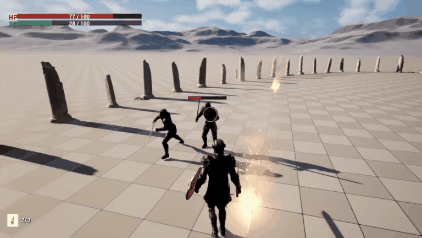

# UE5-Soulslike-Combat

[English](#english) | [中文](#中文)

---

## English

An Unreal Engine 5.7 C++ Action-RPG prototype focused on responsive character control, state-driven melee combat, lock-on movement, shield defense, enemy combat AI, and data-driven attack configuration.

This README is a project overview. For implementation details, state machines, combat pipeline, class boundaries, 和 agent-facing architecture notes, see [ARCHITECTURE.md](ARCHITECTURE.md).

## QuickDemo

https://github.com/user-attachments/assets/fdd9304c-a7ea-4185-bfa1-09df583fa784

### Highlights

- **State-driven player combat**: light combos, sprint attack, charged attack, dodge, parry, block, potion use, stamina exhaustion, hit stun, and death all flow through explicit action-state guards.
- **Data-driven attack setup**: `UAttackConfigDataAsset` owns player light combo, special attack, and charged attack data; `UEnemyAttackConfigDataAsset` owns enemy attack entries, including optional Motion Warping for leap attacks.
- **Precise weapon hit detection**: weapons use swept box traces between previous and current positions to reduce missed hits during fast animation frames.
- **Shield block and parry**: block checks attack direction and stamina before damage is applied; successful parries deplete enemy poise and trigger stance break.
- **Poise and stance break**: enemies have a hidden poise pool. Normal hits drain it over time, while parry can instantly break stance.
- **Lock-on movement**: target selection, centered high camera framing, strafing, and sprint free-run are handled while keeping target focus.
- **Enemy combat AI**: enemies patrol, search, chase, fight, stagger, and die through an outer FSM. Combat behavior inside `EES_Combating` is organized by a private local substate layer.
- **Motion-warped leap attacks**: selected enemy attacks can use a fixed per-attack WarpTarget so leap/root-motion attacks correct toward the target without becoming continuous homing.
- **Attack coordination**: nearby enemies chasing the same target avoid attacking simultaneously by entering a coordinated waiting substate.
- **Hit feedback**: health buffers, camera shake, hit knockback, and player damage vignette provide readable combat response.
- **Hyper Armor**: anim-notify driven hyper armor gives characters uninterruptible poise during heavy attacks while remaining susceptible to stance breaks and parries.
- **In-game debug controls**: the pause menu exposes a Debug Settings page for toggling project debug panel, player, enemy, and range output without touching console commands.
- **UE systems integration**: Enhanced Input, UMG HUD, Niagara feedback, Chaos destruction, PCG arena generation, and AI navigation are used across the prototype.

### Gameplay Systems

| Area | Summary |
|------|---------|
| Player Character | Movement, lock-on, stamina, attacks, dodge, block, parry, potion, hit reaction, death |
| Combat Data | Player combo/special/charged attack config, enemy attack entries, damage/block/poise multipliers, optional enemy Motion Warping |
| Weapons | Box trace collision, same-team filtering, block interception, hit feedback dispatch |
| Enemies | Patrol, search, chase, combat local HFSM, cooldown spacing, attack coordination, motion-warped leap attacks |
| Defense & Hyper Armor | Directional shield block, timed parry, stamina cost, stance break integration, uninterruptible attack hyper armor |
| Feedback | Health bars, delayed buffer bars, hit knockback, camera shake, damage vignette |
| Debug & UI | Pause menu, debug settings page, HUD-rendered debug text, range/debug panel toggles |
| Environment | Breakable actors and PCG-supported arena generation |

### Demo Clips

### Extension Points

- **Enemy variants**: enemy behavior is split between runtime FSM logic and `UEnemyAttackConfigDataAsset` entries. New enemy types can reuse patrol/chase/combat flow while changing attack montages, distance bands, weights, cooldowns, parry rules, and optional Motion Warping settings through data assets.
- **Weapon variants**: weapon runtime logic is shared through `AWeapon`, including swept box traces, ignore-list handling, team filtering, block interception, hit feedback, base damage, and poise damage. Different weapon models can be configured through sockets, trace box dimensions, base values, and attack config references instead of rewriting hit resolution.
- **Playable character profiles**: `UPlayerCharacterProfileDataAsset` acts as the single editable entry point for a playable character, referencing attack, action, and hit-reaction config assets. This keeps character setup modular and allows multiple playable profiles to share or swap subsets of combat data.
- **DataAsset reuse**: combo chains, special attacks, charged attacks, enemy attack tables, action montages, and hit reactions are separated into focused data assets. The C++ layer owns state changes and combat rules; assets own tunable values and animation references.
- **Future scaling path**: if the prototype grows into a larger RPG system, the current data-driven combat layer can be extended toward equipment-specific attack sets, enemy archetype libraries, richer hit-reaction tables, or a GAS-based ability/status layer without discarding the current combat pipeline.

### Architecture Deep Dives

- [Player State Machine Flow](ARCHITECTURE.md#player-state-machine-flow)
- [Enemy State Machine Flow](ARCHITECTURE.md#enemy-state-machine-flow)
- [Combat Pipeline](ARCHITECTURE.md#combat-pipeline)
- [Player Action Recovery Helpers](ARCHITECTURE.md#player-action-recovery-helpers)
- [Enemy AI and Combat Local HFSM](ARCHITECTURE.md#enemy-ai)
- [Enemy Attack Motion Warping](ARCHITECTURE.md#enemy-attack-motion-warping)
- [Combat Cooldown / Coordination Flow](ARCHITECTURE.md#combat-cooldown-coordination-flow)
- [Shield and Blocking System](ARCHITECTURE.md#shield-blocking-system)
- [Parry System](ARCHITECTURE.md#parry-system)
- [Poise and Stance Break System](ARCHITECTURE.md#poise-stance-break-system)
- [Combo System](ARCHITECTURE.md#combo-system)
- [Charged Attack System](ARCHITECTURE.md#charged-attack-system)
- [Dodge Roll System](ARCHITECTURE.md#dodge-roll-system)
- [World Interaction / Breakable System](ARCHITECTURE.md#world-interaction-breakable-system)
- [Lock-On System](ARCHITECTURE.md#lock-on-system)
- [Hyper Armor System](ARCHITECTURE.md#hyper-armor-system)
- [Debug Output System](ARCHITECTURE.md#debug-output-system)

### Current Architecture Files

- [ARCHITECTURE.md](ARCHITECTURE.md): shared implementation architecture, state flows, combat pipeline, and system boundaries.
- [AGENTS.md](AGENTS.md): general agent workflow rules for this repository.
- [CLAUDE.md](CLAUDE.md): Claude-specific collaboration notes.
- `plan.md`: temporary multi-agent planning and review handoff file, ignored by git.

### Requirements

- Unreal Engine 5.7+
- Windows
- Visual Studio 2022 with C++ game development workload

### Getting Started

1. Clone the repository into your Unreal projects folder.
2. Right-click `Test.uproject` and choose **Generate Visual Studio project files**.
3. Open `Test.sln`.
4. Build the `TestEditor` target in **Development Editor** configuration.
5. Open `Test.uproject` to launch the editor.

---

## 中文

这是一个基于 Unreal Engine 5.7 和 C++ 的动作角色扮演原型，重点是响应迅速的角色控制、状态驱动近战、锁定移动、盾牌防御、敌人战斗 AI，以及数据驱动攻击配置。

本文档只作为项目首页介绍。实现细节、状态机、战斗管线、类职责边界和 agent 共用架构说明见 [ARCHITECTURE.md](ARCHITECTURE.md)。

### 核心亮点

- **状态驱动的主角战斗**：轻攻击连招、冲刺攻击、蓄力攻击、翻滚、格挡、弹反、喝药、体力耗尽、受击硬直和死亡都通过明确的动作状态守卫组织。
- **数据驱动攻击配置**：`UAttackConfigDataAsset` 管理主角轻攻击连招、特殊攻击和蓄力攻击；`UEnemyAttackConfigDataAsset` 管理敌人招式条目，并支持为跳劈类攻击单独开启 Motion Warping。
- **精确武器命中检测**：武器使用前一帧到当前帧的盒体扫掠，降低高速动画中的漏判。
- **盾牌格挡与弹反**：伤害结算前先检查防御角度和体力；弹反成功会清空敌人韧性并触发破防。
- **韧性与破防**：敌人拥有隐藏韧性条，普通命中逐步削减韧性，弹反可瞬间触发大硬直。
- **锁定移动**：支持目标筛选、居中后上方相机构图、锁定绕行和锁定冲刺 free-run。
- **敌人战斗 AI**：敌人通过外层 FSM 管理巡逻、搜索、追击、战斗、硬直和死亡，`EES_Combating` 内部再用私有局部子状态组织战斗行为。
- **跳劈 Motion Warping**：指定敌人招式可写入一次固定 WarpTarget，让跃进/root motion 攻击向目标修正，但不做持续追踪。
- **敌人攻击协调**：追击同一目标的附近敌人不会同时出手，会进入协调等待子状态。
- **霸体系统**：通过动画通知驱动的绝对霸体机制，允许角色在特定出招阶段硬扛常规攻击，但仍受破防与弹反机制制约。
- **受击反馈**：血条缓冲、相机晃动、短距离击退和玩家受击红晕让战斗反馈更清晰。
- **游戏内调试开关**：暂停菜单提供 Debug Settings 子页，可直接切换项目调试面板、主角、敌人和范围输出，不需要手动输入控制台命令。
- **UE 系统整合**：项目使用 Enhanced Input、UMG HUD、Niagara 反馈、Chaos 破碎、PCG 竞技场生成和 AI 导航等 UE 系统。

### 玩法系统概览

| 模块 | 简述 |
|------|------|
| 主角 | 移动、锁定、体力、攻击、翻滚、格挡、弹反、喝药、受击、死亡 |
| 战斗数据 | 主角连招/特殊/蓄力攻击配置，敌人招式条目，伤害/格挡耗体/韧性倍率，可选敌人 Motion Warping |
| 武器 | 盒体扫掠、同阵营过滤、格挡拦截、命中反馈派发 |
| 敌人 | 巡逻、搜索、追击、战斗局部 HFSM、冷却拉扯、攻击协调、跳劈 Motion Warping |
| 防御与霸体 | 方向性盾牌格挡、时机弹反、体力消耗、破防集成、动作防打断霸体 |
| 反馈 | 血条、缓冲血条、受击后退、相机晃动、伤害红晕 |
| 调试与 UI | 暂停菜单、调试设置页、HUD 调试文本、范围/调试面板开关 |
| 环境 | 可破坏物和 PCG 辅助竞技场生成 |

### 演示片段

### 扩展性设计

- **敌人种类扩展**：敌人行为拆成运行时 FSM 逻辑和 `UEnemyAttackConfigDataAsset` 招式配置。新增敌人可以复用巡逻、追击、战斗、硬直和死亡流程，只替换攻击蒙太奇、距离区间、权重、冷却、是否可弹反和可选 Motion Warping 参数。
- **武器种类扩展**：`AWeapon` 统一处理盒体扫掠、忽略列表、阵营过滤、格挡拦截、命中反馈、基础伤害和韧性伤害。不同武器可以通过挂点、Trace 盒体尺寸、基础数值和攻击配置引用扩展，不需要重写命中结算。
- **可玩角色配置扩展**：`UPlayerCharacterProfileDataAsset` 作为主角蓝图的单一配置入口，引用攻击、动作和受击反应配置。多个可玩角色可以共享或替换部分 DataAsset，例如共用受击反应，但使用不同连招和动作资源。
- **DataAsset 复用性**：连招链、特殊攻击、蓄力攻击、敌人招式表、玩家动作和受击反应拆成独立数据资产。C++ 负责状态切换和战斗规则，DataAsset 负责可调数值和动画资源引用。
- **后续演进路径**：如果原型继续扩展，可以在当前数据驱动战斗层上增加武器专属攻击集、敌人 archetype 配置库、更丰富的受击反应表，或在技能/状态效果复杂后迁移到 GAS，而不需要推翻现有战斗管线。

### 架构细节入口

- [主角状态流转](ARCHITECTURE.md#player-state-machine-flow)
- [敌人状态流转](ARCHITECTURE.md#enemy-state-machine-flow)
- [战斗管线](ARCHITECTURE.md#combat-pipeline)
- [主角动作恢复 Helper](ARCHITECTURE.md#player-action-recovery-helpers)
- [敌人 AI 与 Combat 局部 HFSM](ARCHITECTURE.md#enemy-ai)
- [敌人跳劈 Motion Warping](ARCHITECTURE.md#enemy-attack-motion-warping)
- [战斗冷却与攻击协调流程](ARCHITECTURE.md#combat-cooldown-coordination-flow)
- [盾牌格挡系统](ARCHITECTURE.md#shield-blocking-system)
- [弹反系统](ARCHITECTURE.md#parry-system)
- [韧性与破防系统](ARCHITECTURE.md#poise-stance-break-system)
- [连招系统](ARCHITECTURE.md#combo-system)
- [蓄力攻击系统](ARCHITECTURE.md#charged-attack-system)
- [翻滚系统](ARCHITECTURE.md#dodge-roll-system)
- [环境交互与破坏物系统](ARCHITECTURE.md#world-interaction-breakable-system)
- [锁定系统](ARCHITECTURE.md#lock-on-system)
- [霸体系统](ARCHITECTURE.md#hyper-armor-system)
- [调试输出系统](ARCHITECTURE.md#debug-output-system)

### 当前文档职责

- [ARCHITECTURE.md](ARCHITECTURE.md)：共享实现架构、状态流转、战斗管线和系统边界。
- [AGENTS.md](AGENTS.md)：本仓库通用 agent 工作规则。
- [CLAUDE.md](CLAUDE.md)：Claude 专用协作说明。
- `plan.md`：临时多 agent 方案讨论与 review 交接文件，已被 git ignore。

### 环境要求

- Unreal Engine 5.7+
- Windows
- Visual Studio 2022，需要安装 C++ 游戏开发负载

### 快速上手

1. 将仓库克隆到你的 Unreal 项目目录。
2. 右键点击 `Test.uproject`，选择 **Generate Visual Studio project files**。
3. 打开 `Test.sln`。
4. 使用 **Development Editor** 配置编译 `TestEditor` 目标。
5. 打开 `Test.uproject` 启动编辑器。

